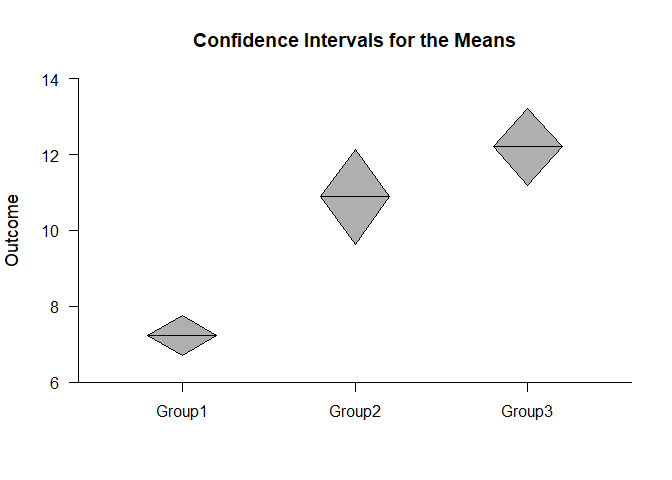
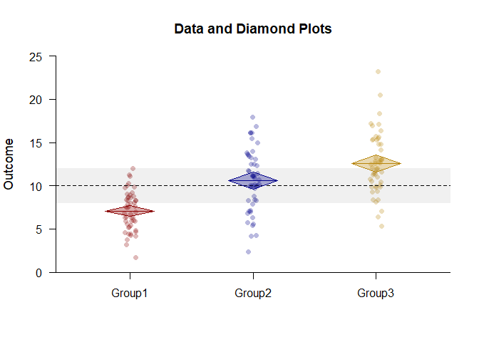
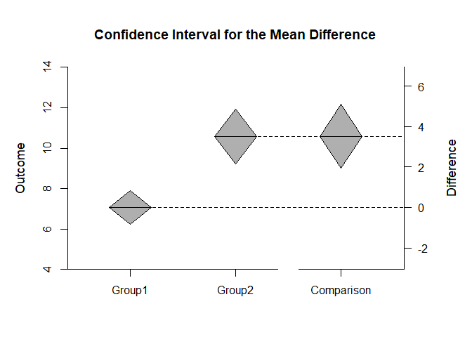
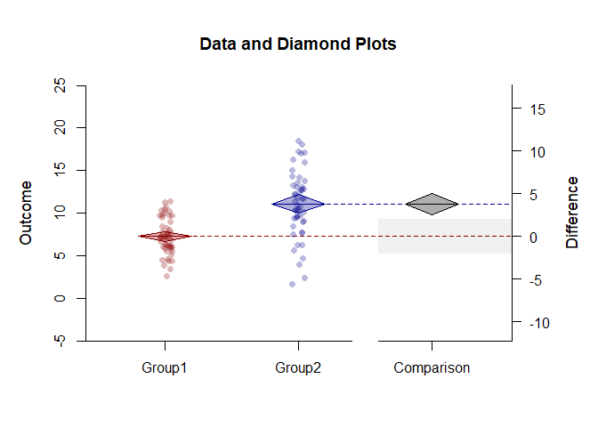

## Enhanced Plots OneWay Data Applications

### Data Management


```r
Factor <- c(rep(1,50),rep(2,50),rep(3,50))
Factor <- factor(Factor,levels=c(1,2,3),labels=c("Group1","Group2","Group3"))
Outcome <- c(rnorm(50,mean=7,sd=2),rnorm(50,mean=11,sd=4),rnorm(50,mean=12,sd=4))
```

### Analyses of the Means

Create a color theme for the mean plots

```r
colorTheme <- c("darkred","darkblue","darkgoldenrod")
```

Simple: Diamond Plots of the Confidence Intervals

```r
(Outcome~Factor) |> plotDiamonds()
```

<!-- -->

Enhanced: Data and Diamond Plots

```r
(Outcome~Factor) |> plotData(main="Data and Diamond Plots",offset=0,method="jitter",col=colorTheme)
(Outcome~Factor) |> plotDiamonds(add=TRUE,line=10,rope=c(8,12),col=colorTheme)
```

<!-- -->

Simple plot: Confidence Intervals

```r
(Outcome~Factor) |> plotIntervals()
```

<!-- -->

Enhanced plot: Data and Confidence Intervals with Plausibility Curves

```r
(Outcome~Factor) |> plotData(main="Data and Confidence Intervals with Plausibility Curves",offset=-.15,method="jitter",col=colorTheme)
(Outcome~Factor) |> plotIntervals(add=TRUE,values=FALSE,line=10,rope=c(8,12),col=colorTheme)
(Outcome~Factor) |> plotPlausible(add=TRUE,col=colorTheme)
```

<!-- -->

### Analyses of a Comparison

Create a comparison and its color theme

```r
Comparison <- factor(Factor,c("Group1","Group2"))
comparisonTheme <- c("darkred","darkblue","black")
```

Simple: Diamond Plots of the Confidence Intervals

```r
(Outcome~Comparison) |> plotDiamonds(conf.level=.99)
```

<!-- -->

Enhanced: Data and Diamond Plots

```r
(Outcome~Comparison) |> plotDiamonds(conf.level=.99,ylim=c(-5,25),rope=c(-2,2),col=comparisonTheme)
(Outcome~Comparison) |> plotData(add=TRUE,offset=0,method="jitter",col=comparisonTheme)
```

<!-- -->

Simple: Confidence Intervals

```r
(Outcome~Comparison) |> plotIntervals(conf.level=.99)
```

<!-- -->

Enhanced: Data and Confidence Intervals with Plausibility Curves

```r
(Outcome~Comparison) |> plotIntervals(conf.level=.99,ylim=c(-5,25),values=FALSE,rope=c(-2,2),col=comparisonTheme)
(Outcome~Comparison) |> plotPlausible(add=TRUE,conf.level=.99,type=c("none","none","right"),col=comparisonTheme)
(Outcome~Comparison) |> plotData(add=TRUE,method="jitter",col=comparisonTheme)
```

<!-- -->
