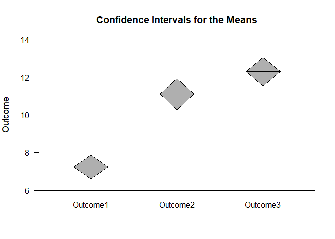
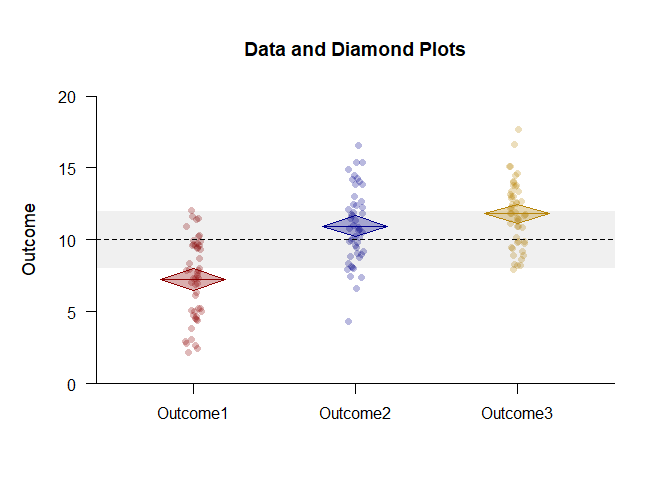
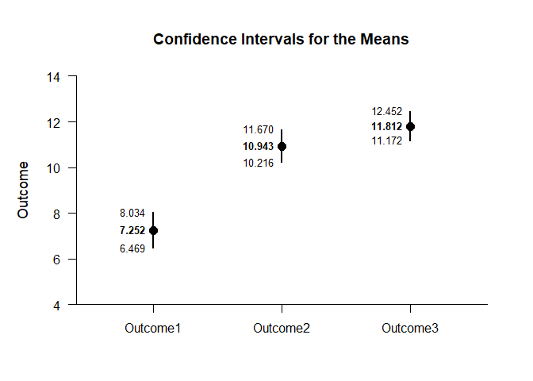
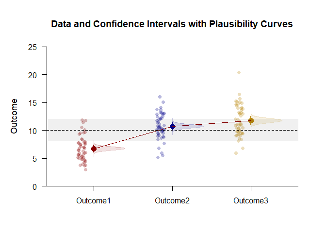
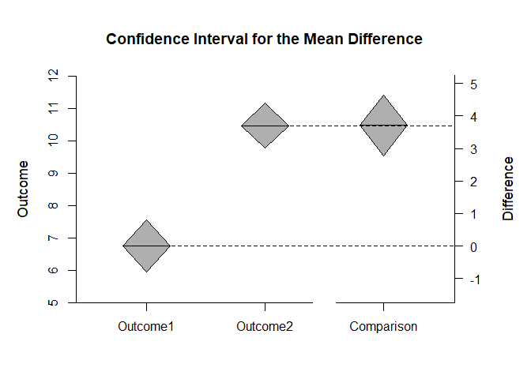
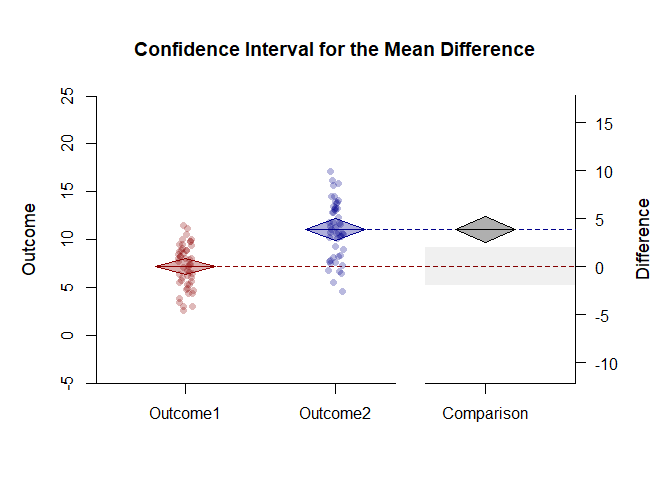
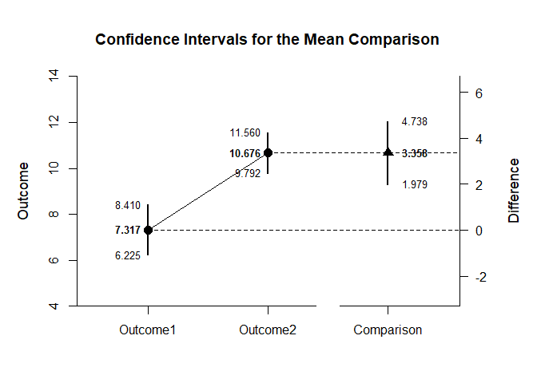
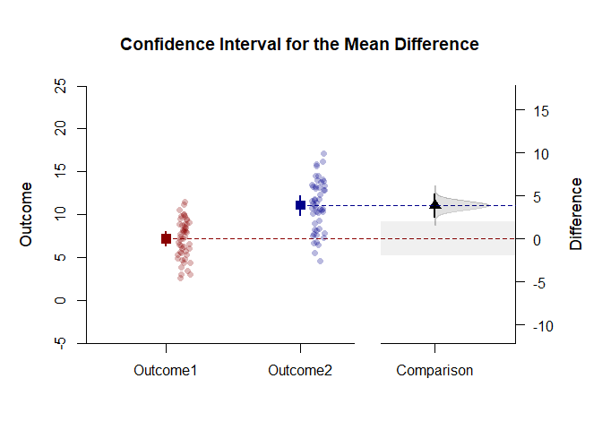

## Enhanced Plots Repeated Measures Data Applications

### Data Management

Enter the data.

```r
Outcome1 <- rnorm(50,mean=7,sd=2.5)
Outcome2 <- rnorm(50,mean=11,sd=2.5)
Outcome3 <- rnorm(50,mean=12,sd=2.5)
```

### Analyses of the Means

Create a color theme for the plots.

```r
colorTheme <- c("darkred","darkblue","darkgoldenrod")
```

#### Diamond Plots

Get a simple diamond plots of the confidence intervals.

```r
cbind(Outcome1,Outcome2,Outcome3) |> plotDiamonds()
```

<!-- -->

Get an enhanced plot combining data and diamond plots.

```r
cbind(Outcome1,Outcome2,Outcome3) |> plotData(main="Data and Diamond Plots",offset=0,method="jitter",col=colorTheme)
cbind(Outcome1,Outcome2,Outcome3) |> plotDiamonds(add=TRUE,line=10,rope=c(8,12),col=colorTheme)
```

<!-- -->

#### Confidence Interval Plots

Get a simple plot of the confidence intervals.

```r
cbind(Outcome1,Outcome2,Outcome3) |> plotIntervals()
```

<!-- -->

Get an enhanced plot of data and confidence intervals with plausibility curves.

```r
cbind(Outcome1,Outcome2,Outcome3) |> plotData(main="Data and Confidence Intervals with Plausibility Curves",offset=-.15,method="jitter",col=colorTheme)
cbind(Outcome1,Outcome2,Outcome3) |> plotIntervals(add=TRUE,values=FALSE,line=10,rope=c(8,12),col=colorTheme)
cbind(Outcome1,Outcome2,Outcome3) |> plotPlausible(add=TRUE,col=colorTheme)
```

<!-- -->

### Analyses of a Comparison

Create a comparison color theme

```r
comparisonTheme <- c("darkred","darkblue","black")
```

#### Diamond Plots

Get a simple diamond plots of the confidence intervals.

```r
cbind(Outcome1,Outcome2) |> plotDiamonds(conf.level=.99)
```

<!-- -->

Get an enhanced plot combining data and diamond plots.

```r
cbind(Outcome1,Outcome2) |> plotDiamonds(main="Data and Diamond Plots",conf.level=.99,ylim=c(-5,25),rope=c(-2,2),col=comparisonTheme)
cbind(Outcome1,Outcome2) |> plotData(add=TRUE,offset=0,method="jitter",col=comparisonTheme)
```

<!-- -->

#### Confidence Interval Plots

Get a simple plot of the confidence intervals.

```r
cbind(Outcome1,Outcome2) |> plotIntervals(conf.level=.99)
```

<!-- -->

Get an enhanced plot of data and confidence intervals with plausibility curves.

```r
cbind(Outcome1,Outcome2) |> plotIntervals(main="Data and Confidence Intervals with Plausibility Curves",conf.level=.99,ylim=c(-5,25),values=FALSE,rope=c(-2,2),col=comparisonTheme)
cbind(Outcome1,Outcome2) |> plotPlausible(add=TRUE,conf.level=.99,type=c("none","none","right"),col=comparisonTheme)
cbind(Outcome1,Outcome2) |> plotData(add=TRUE,method="jitter",col=comparisonTheme)
```

<!-- -->
