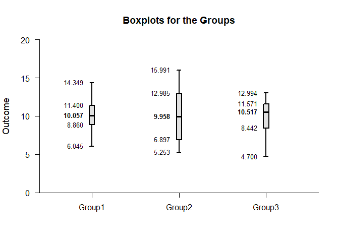
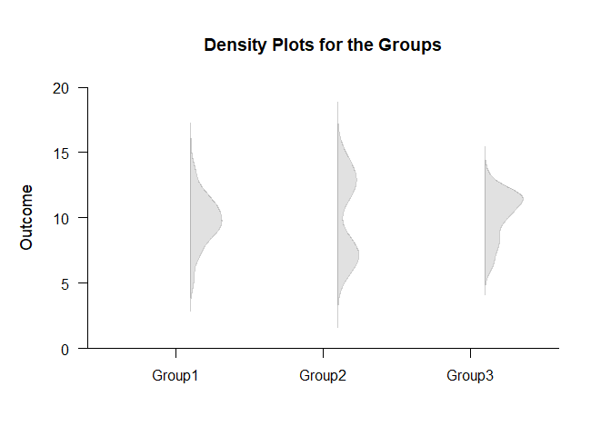
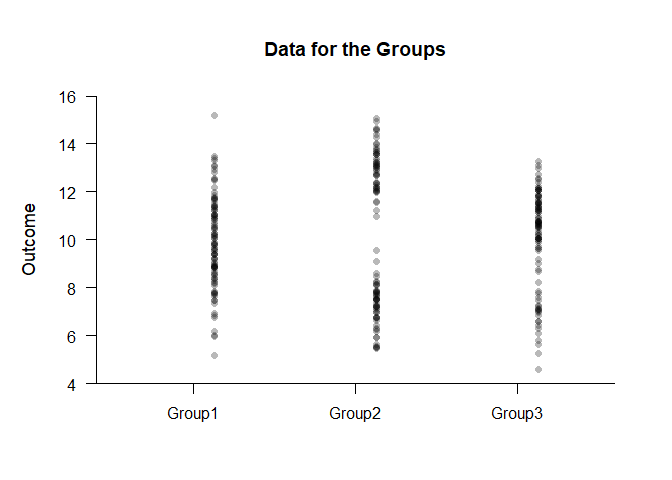
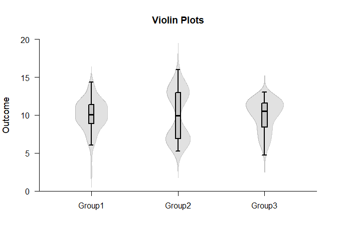
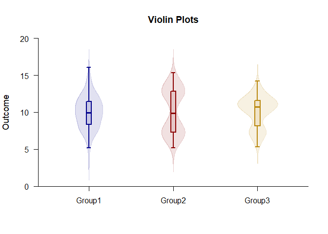
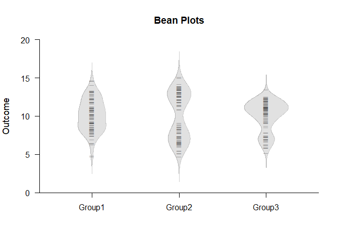
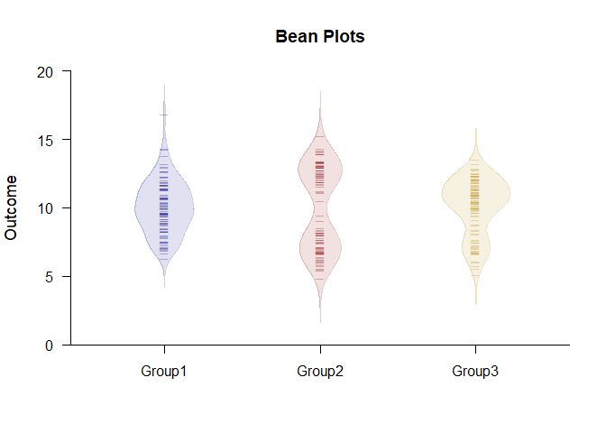
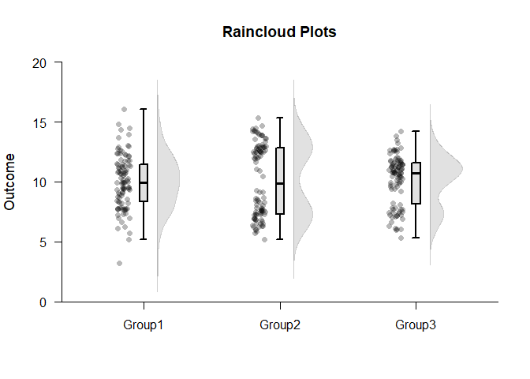
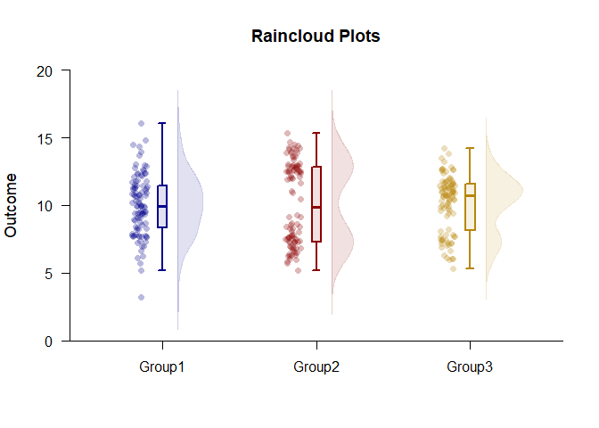
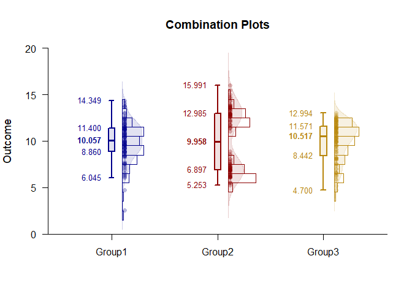

## Exploratory Analyses OneWay Data Applications

### Data Management

#### Data Entry


```r
Factor <- c(rep(1,100),rep(2,100),rep(3,100))
Factor <- factor(Factor,levels=c(1,2,3),labels=c("Group1","Group2","Group3"))
Group1 <- rnorm(100,10,2)
Group2 <- c(rnorm(50,7,1),rnorm(50,13,1))
Group3 <- c(rnorm(25,7,1),rnorm(75,11,1))
Outcome <- c(Group1,Group2,Group3)
```

#### Descriptive Statistics


```r
describePercentiles(Outcome~Factor)
```

```
## $`Percentiles for the Data`
##            Min     25%     50%     75%     Max
## Group1   6.271   8.705   9.995  11.408  16.838
## Group2   4.860   7.009   9.994  12.796  15.275
## Group3   5.136   8.664  10.534  11.599  13.581
```

### Standard Plots

#### Boxplots


```r
plotBoxes(Outcome~Factor)
```

<!-- -->

#### Density Plots


```r
plotDensity(Outcome~Factor)
```

<!-- -->

####  Data Plots


```r
plotData(Outcome~Factor)
```

<!-- -->

### Advanced Plots

#### Violin Plots


```r
plotBoxes(Outcome~Factor,values=FALSE,main="Violin Plots")
plotDensity(Outcome~Factor,add=TRUE,offset=0,type="full")
```

<!-- -->


```r
plotViolins(Outcome~Factor,col=c("darkblue","darkred","darkgoldenrod"))
```

<!-- -->

#### Bean Plots


```r
plotDensity(Outcome~Factor,type="full",offset=0,main="Bean Plots")
plotData(Outcome~Factor,add=TRUE,offset=0,pch=95)
```

<!-- -->


```r
plotBeans(Outcome~Factor,col=c("darkblue","darkred","darkgoldenrod"))
```

<!-- -->

#### Raincloud Plots


```r
plotBoxes(Outcome~Factor,values=FALSE,main="Raincloud Plots")
plotDensity(Outcome~Factor,add=TRUE,offset=.1)
plotData(Outcome~Factor,add=TRUE,method="jitter",offset=-.15)
```

<!-- -->


```r
plotRainclouds(Outcome~Factor,col=c("darkblue","darkred","darkgoldenrod"))
```

<!-- -->

#### Combination Plots


```r
plotBoxes(Outcome~Factor,main="Combination Plots")
plotDensity(Outcome~Factor,add=TRUE)
plotFrequencies(Outcome~Factor,add=TRUE)
plotData(Outcome~Factor,add=TRUE)
```

<!-- -->


```r
plotCombination(Outcome~Factor,col=c("darkblue","darkred","darkgoldenrod"))
```

<!-- -->
