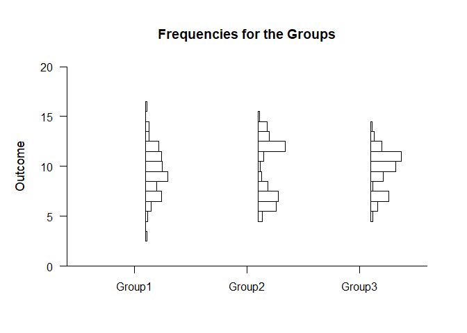

## Exploratory Analyses OneWay Data Applications

### Data Management

#### Data Entry

Simulate some data with various distributional shapes.

```r
Factor <- c(rep(1,100),rep(2,100),rep(3,100))
Factor <- factor(Factor,levels=c(1,2,3),labels=c("Group1","Group2","Group3"))
Group1 <- rnorm(100,10,2)
Group2 <- c(rnorm(50,7,1),rnorm(50,13,1))
Group3 <- c(rnorm(25,7,1),rnorm(75,11,1))
Outcome <- c(Group1,Group2,Group3)
```

#### Descriptive Statistics

Get basic percentile information for the groups.

```r
(Outcome~Factor) |> describePercentiles()
```

```
## $`Percentiles for the Data`
##            Min     25%     50%     75%     Max
## Group1   3.226   8.325   9.939  11.448  16.088
## Group2   5.167   7.299   9.870  12.845  15.306
## Group3   5.314   8.183  10.749  11.541  14.209
```

### Basic Plots

Obtain basic plots (histograms, boxplots, density plots, and data plots) using the default options.

#### Histograms


```r
(Outcome~Factor) |> plotFrequencies()
```

<!-- -->

#### Boxplots


```r
(Outcome~Factor) |> plotBoxes()
```

<!-- -->

#### Density Plots


```r
(Outcome~Factor) |> plotDensity()
```

<!-- -->

####  Data Plots


```r
(Outcome~Factor) |> plotData()
```

<!-- -->

### Advanced Plots

#### Violin Plots

Build violin plots using multiple basic plot calls.

```r
(Outcome~Factor) |> plotBoxes(values=FALSE,main="Violin Plots")
(Outcome~Factor) |> plotDensity(add=TRUE,offset=0,type="full")
```

<!-- -->

Obtain violin plots using one call (and enhance the plot).

```r
(Outcome~Factor) |> plotViolins(col=c("darkblue","darkred","darkgoldenrod"))
```

<!-- -->

#### Bean Plots

Build bean plots using multiple basic plot calls.

```r
(Outcome~Factor) |> plotDensity(type="full",offset=0,main="Bean Plots")
(Outcome~Factor) |> plotData(add=TRUE,offset=0,pch=95)
```

<!-- -->

Obtain bean plots using one call (and enhance the plot).

```r
(Outcome~Factor) |> plotBeans(col=c("darkblue","darkred","darkgoldenrod"))
```

<!-- -->

#### Raincloud Plots

Build raincloud plots using multiple basic plot calls.

```r
(Outcome~Factor) |> plotBoxes(values=FALSE,main="Raincloud Plots")
(Outcome~Factor) |> plotDensity(add=TRUE,offset=.1)
(Outcome~Factor) |> plotData(add=TRUE,method="jitter",offset=-.15)
```

<!-- -->

Obtain raincloud plots using one call (and enhance the plot).

```r
(Outcome~Factor) |> plotRainclouds(col=c("darkblue","darkred","darkgoldenrod"))
```

<!-- -->

#### Combination Plots

Build a plot that combines all of the basic plots using multiple calls.

```r
(Outcome~Factor) |> plotBoxes(main="Combination Plots")
(Outcome~Factor) |> plotDensity(add=TRUE)
(Outcome~Factor) |> plotFrequencies(add=TRUE)
(Outcome~Factor) |> plotData(add=TRUE)
```

<!-- -->

Build a plot that combines all of the basic plots using one call (and enhance the plot).

```r
(Outcome~Factor) |> plotCombination(col=c("darkblue","darkred","darkgoldenrod"))
```

<!-- -->
