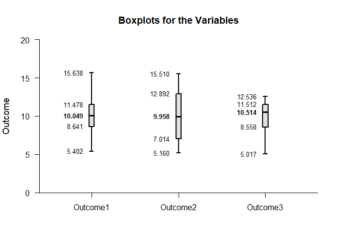
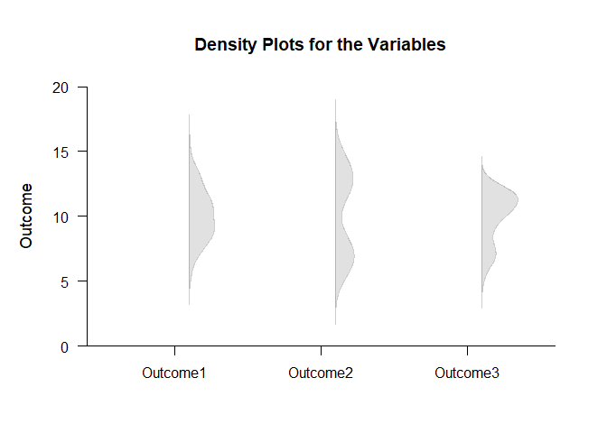
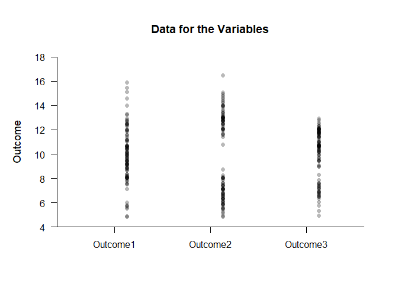
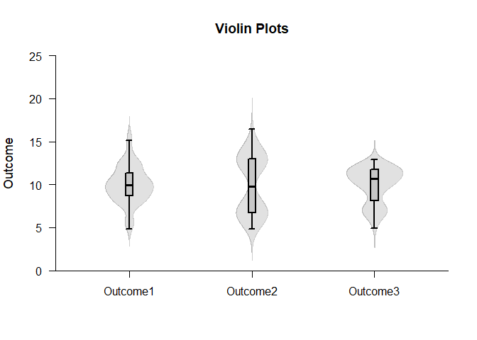
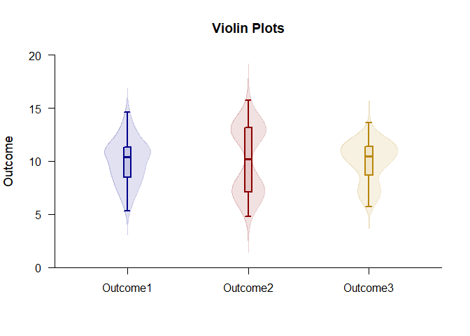
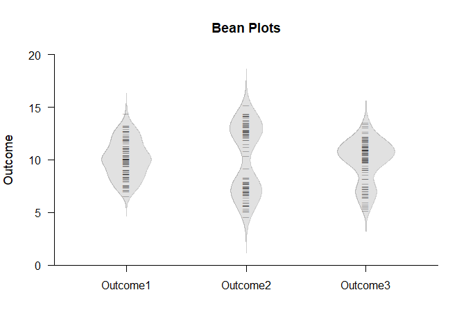
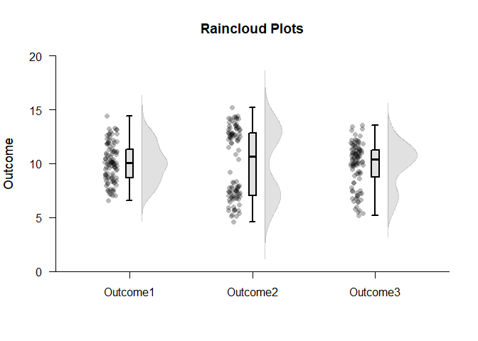
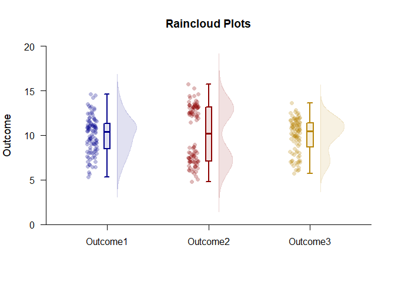
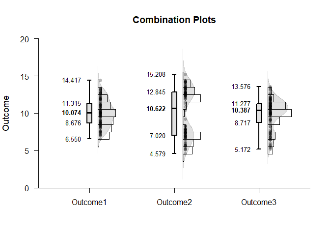
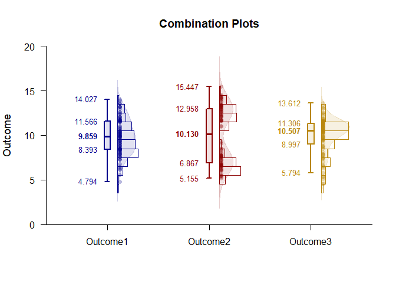

## Exploratory Analyses Repeated Measures Data Applications

### Data Management


```r
Outcome1 <- rnorm(100,10,2)
Outcome2 <- c(rnorm(50,7,1),rnorm(50,13,1))
Outcome3 <- c(rnorm(25,7,1),rnorm(75,11,1))
RepeatedData <- data.frame(Outcome1,Outcome2,Outcome3)
```

### Standard Plots

Boxplots

```r
plotBoxes(RepeatedData)
```

<!-- -->

Density Plots

```r
plotDensity(RepeatedData)
```

<!-- -->

Data Plots

```r
plotData(RepeatedData)
```

<!-- -->

### Advanced Plots

Violin Plots: Stacked and Modified Plots

```r
plotBoxes(RepeatedData,values=FALSE,main="Violin Plots")
plotDensity(RepeatedData,add=TRUE,offset=0,type="full")
```

<!-- -->

Violin Plots: Automated and Extended Plots

```r
plotViolins(RepeatedData,col=c("darkblue","darkred","darkgoldenrod"))
```

<!-- -->

Bean Plots: Stacked and Modified Plots

```r
plotDensity(RepeatedData,type="full",offset=0,main="Bean Plots")
plotData(RepeatedData,add=TRUE,offset=0,pch=95)
```

<!-- -->

Bean Plots: Automated and Extended Plots

```r
plotBeans(RepeatedData,col=c("darkblue","darkred","darkgoldenrod"))
```

<!-- -->

Raincloud Plots: Stacked and Modified Plots

```r
plotBoxes(RepeatedData,values=FALSE,main="Raincloud Plots")
plotDensity(RepeatedData,add=TRUE,offset=.1)
plotData(RepeatedData,add=TRUE,method="jitter",offset=-.15)
```

<!-- -->

Raincloud Plots: Automated and Extended Plots

```r
plotRainclouds(RepeatedData,col=c("darkblue","darkred","darkgoldenrod"))
```

<!-- -->

Combination Plots: Stacked and Modified Plots

```r
plotBoxes(RepeatedData,main="Combination Plots")
plotDensity(RepeatedData,add=TRUE)
plotFrequencies(RepeatedData,add=TRUE)
plotData(RepeatedData,add=TRUE)
```

<!-- -->

Combination Plots: Automated and Extended Plots

```r
plotCombination(RepeatedData,col=c("darkblue","darkred","darkgoldenrod"))
```

<!-- -->
