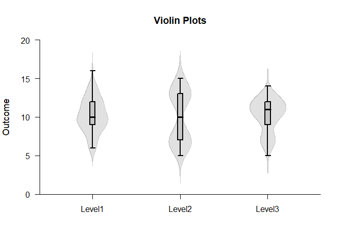
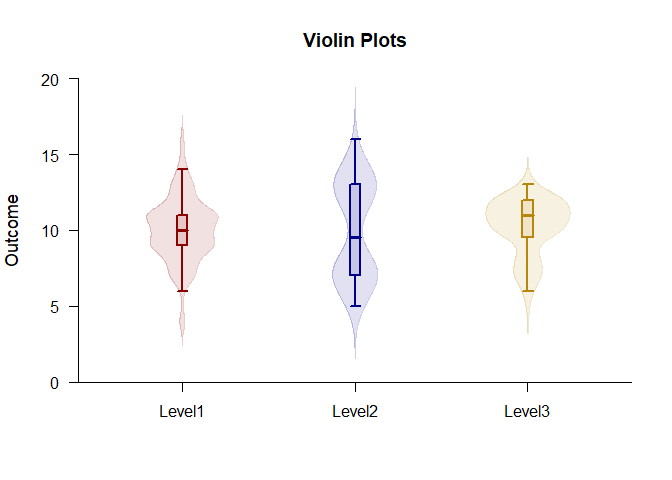
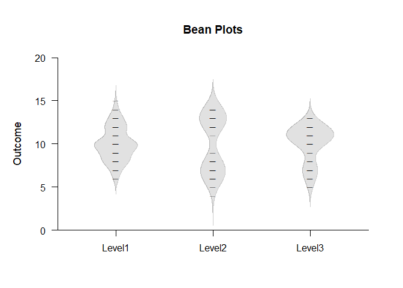
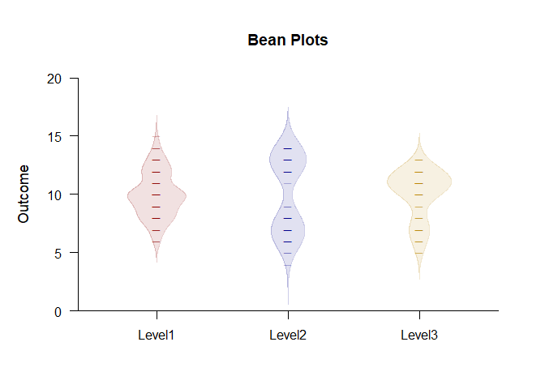
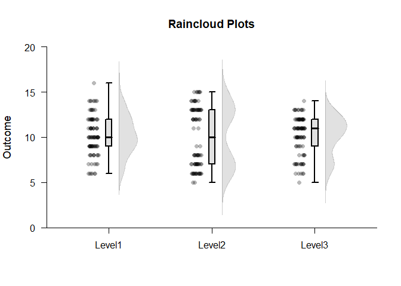
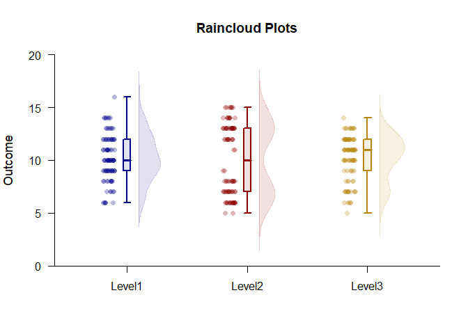

## Exploratory OneWay Data Application

### Data Management

Simulate some data with various distributional shapes.

```r
Factor <- c(rep(1,100),rep(2,100),rep(3,100))
Factor <- factor(Factor,levels=c(1,2,3),labels=c("Group1","Group2","Group3"))
Group1 <- round(rnorm(100,10,2),0)
Group2 <- c(round(rnorm(50,7,1),0),round(rnorm(50,13,1),0))
Group3 <- c(round(rnorm(25,7,1),0),round(rnorm(75,11,1),0))
Outcome <- c(Group1,Group2,Group3)
```

### Violin Plots

Build violin plots using multiple basic plot calls.

```r
(Outcome~Factor) |> plotBoxes(values=FALSE,main="Violin Plots")
(Outcome~Factor) |> plotDensity(add=TRUE,offset=0,type="full")
```

<!-- -->

Obtain violin plots using one call (and enhance the plot).

```r
(Outcome~Factor) |> plotViolins(col=c("darkblue","darkred","darkgoldenrod"))
```

<!-- -->

### Bean Plots

Build bean plots using multiple basic plot calls.

```r
(Outcome~Factor) |> plotDensity(type="full",offset=0,main="Bean Plots")
(Outcome~Factor) |> plotData(add=TRUE,offset=0,pch=95,method="overplot")
```

<!-- -->

Obtain bean plots using one call (and enhance the plot).

```r
(Outcome~Factor) |> plotBeans(col=c("darkblue","darkred","darkgoldenrod"))
```

<!-- -->

### Raincloud Plots

Build raincloud plots using multiple basic plot calls.

```r
(Outcome~Factor) |> plotBoxes(values=FALSE,main="Raincloud Plots")
(Outcome~Factor) |> plotDensity(add=TRUE,offset=.1)
(Outcome~Factor) |> plotData(add=TRUE,method="jitter",offset=-.15)
```

<!-- -->

Obtain raincloud plots using one call (and enhance the plot).

```r
(Outcome~Factor) |> plotRainclouds(col=c("darkblue","darkred","darkgoldenrod"))
```

<!-- -->
