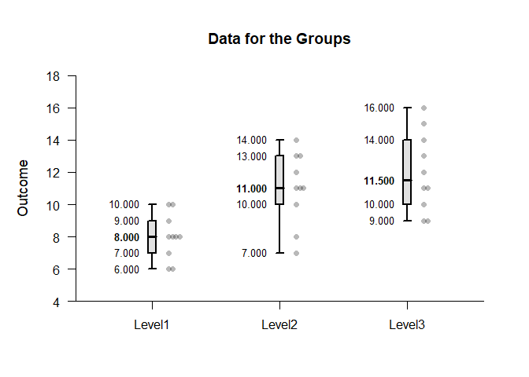
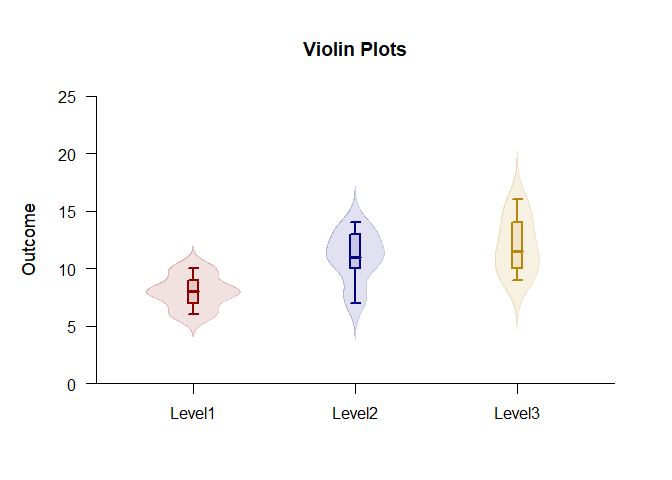
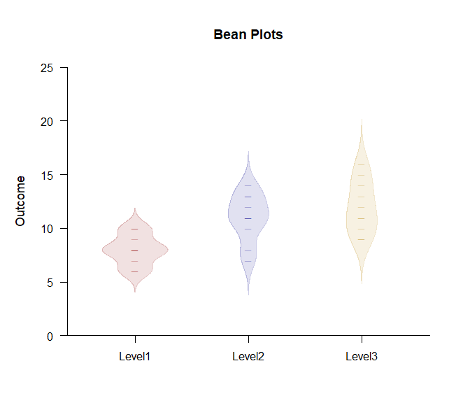
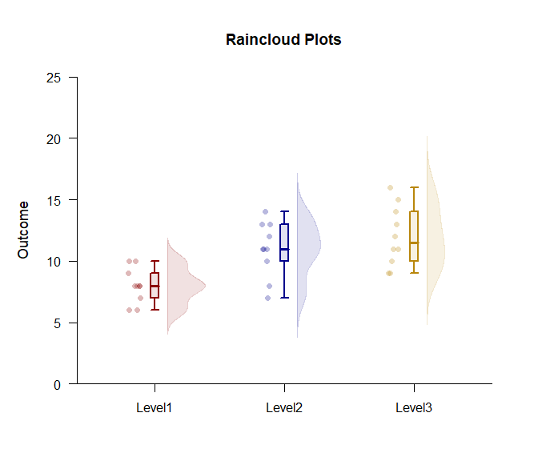

## Exploratory OneWay Data Application

This page utilize advanced methods to build plots that combine various
elements using one-way (between-subjects) data.

- [Data Management](#data-management)
- [Building Layers](#building-layers)
- [Common Layered Plots](#common-layered-plots)

------------------------------------------------------------------------

### Data Management

This code inputs the variable names and creates a viewable data frame.

``` r
Factor <- c(rep(1, 10), rep(2, 10), rep(3, 10))
Factor <- factor(Factor, levels = c(1, 2, 3), labels = c("Level1", "Level2", "Level3"))
Outcome <- c(6, 8, 6, 8, 10, 8, 10, 9, 8, 7, 7, 13, 11, 10, 13, 8, 11, 14, 12, 11, 9, 16, 11, 12, 15, 13, 9, 14, 11, 10)
OneWayData <- construct(Factor, Outcome)
```

### Building Layers

The typical way to build a plot is to use separate calls for each
plotting elements (e.g., data, boxplots) and using the “add” parameter
to put them on the same plot.

``` r
(Outcome ~ Factor) |> plotData()
(Outcome ~ Factor) |> plotBoxes(add = TRUE)
```

<!-- -->

This can be simplified by using an “add” version of the function call
instead of using the longer “add” parameter for the function call.

``` r
(Outcome ~ Factor) |> plotData()
(Outcome ~ Factor) |> addBoxes()
```

<!-- -->

Rather than separate lines for function calls, all plotting elements
have passthrough capabilities that allow the them to be placed on the
same line.

``` r
(Outcome ~ Factor) |> plotData() |> addBoxes()
```

<!-- -->

### Common Layered Plots

Obtain violin plots using one call (and enhance the plot).

``` r
(Outcome ~ Factor) |> plotViolins(col = c("darkred", "darkblue", "darkgoldenrod"))
```

<!-- -->

Obtain bean plots using one call (and enhance the plot).

``` r
(Outcome ~ Factor) |> plotBeans(col = c("darkred", "darkblue", "darkgoldenrod"))
```

<!-- -->

Obtain raincloud plots using one call (and enhance the plot).

``` r
(Outcome ~ Factor) |> plotRainclouds(col = c("darkred", "darkblue", "darkgoldenrod"))
```

<!-- -->
