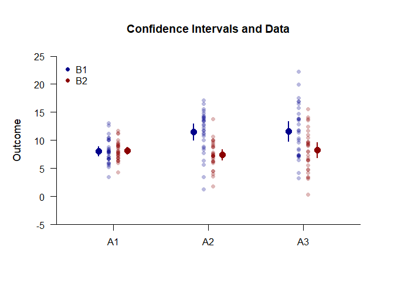

## Exposition Factorial Data Application

### Data Management

Simulate some data.

```r
FactorA <- c(rep(1,30),rep(2,30),rep(3,30),rep(1,30),rep(2,30),rep(3,30))
FactorB <- c(rep(1,90),rep(2,90))
FactorA <- factor(FactorA,levels=c(1,2,3),labels=c("A1","A2","A3"))
FactorB <- factor(FactorB,levels=c(1,2),labels=c("B1","B2"))
Outcome <- c(rnorm(30,mean=8,sd=2),rnorm(30,mean=11,sd=4),rnorm(30,mean=12,sd=4),rnorm(30,mean=8,sd=2),rnorm(30,mean=8,sd=3),rnorm(30,mean=7,sd=4))
FactorialData <- data.frame(FactorA,FactorB,Outcome)
```
Subset the data for each simple effect.

```r
FactorialB1 <- subset(FactorialData,FactorB=="B1")
FactorialB2 <- subset(FactorialData,FactorB=="B2")
```

### Analyses of the Means

Use the exposition pipe (%$>%) to identify the subset of interest, select the variables to analyzed, and use the native pipe to plot the means and the data.

```r
(FactorialB1) %$>% (Outcome~FactorA) |> plotData(main="Confidence Intervals and Data",ylim=c(-5,25),offset=-.05,method="overplot",col="darkblue")
(FactorialB2) %$>% (Outcome~FactorA) |> plotData(add=TRUE,offset=.05,method="overplot",col="darkred")
(FactorialB1) %$>% (Outcome~FactorA) |> plotMeans(add=TRUE,offset=-.15,col="darkblue",values=FALSE)
(FactorialB2) %$>% (Outcome~FactorA) |> plotMeans(add=TRUE,offset=.15,col="darkred",values=FALSE)
legend("topleft",inset=.01,box.lty=0,pch=16,legend=c("B1","B2"),col=c("darkblue","darkred"))
```

<!-- -->

Use a similar process to obtain the tables of confidence interval estimates.

```r
(FactorialB1) %$>% (Outcome~FactorA) |> estimateMeans()
```

```
## $`Confidence Intervals for the Means`
##          M      SE      df      LL      UL
## A1   8.458   0.322  29.000   7.800   9.117
## A2  10.575   0.659  29.000   9.227  11.922
## A3  11.384   0.806  29.000   9.734  13.033
```

```r
(FactorialB2) %$>% (Outcome~FactorA) |> estimateMeans()
```

```
## $`Confidence Intervals for the Means`
##          M      SE      df      LL      UL
## A1   8.118   0.362  29.000   7.378   8.859
## A2   8.853   0.512  29.000   7.806   9.899
## A3   7.034   0.756  29.000   5.488   8.581
```
### Analyses of the Simple Effects

Using the pipe operators, get the source table for each simple effect.

```r
(FactorialB1) %$>% (Outcome~FactorA) |> describeMeansOmnibus()
```

```
## $`Source Table for the Model`
##               SS      df      MS
## Between  136.906   2.000  68.453
## Within  1033.658  87.000  11.881
```

```r
(FactorialB2) %$>% (Outcome~FactorA) |> describeMeansOmnibus()
```

```
## $`Source Table for the Model`
##              SS      df      MS
## Between  50.204   2.000  25.102
## Within  839.001  87.000   9.644
```
Test each simple effect for statistical significance.

```r
(FactorialB1) %$>% (Outcome~FactorA) |> testMeansOmnibus()
```

```
## $`Hypothesis Test for the Model`
##              F     df1     df2       p
## Factor   5.762   2.000  87.000   0.004
```

```r
(FactorialB2) %$>% (Outcome~FactorA) |> testMeansOmnibus()
```

```
## $`Hypothesis Test for the Model`
##              F     df1     df2       p
## Factor   2.603   2.000  87.000   0.080
```
Obtain the proportion of variance accounted for by each simple effect.

```r
(FactorialB1) %$>% (Outcome~FactorA) |> estimateMeansOmnibus()
```

```
## $`Proportion of Variance Accounted For by the Model`
##            Est      LL      UL
## Factor   0.117   0.023   0.215
```

```r
(FactorialB2) %$>% (Outcome~FactorA) |> estimateMeansOmnibus()
```

```
## $`Proportion of Variance Accounted For by the Model`
##            Est      LL      UL
## Factor   0.056   0.000   0.137
```
