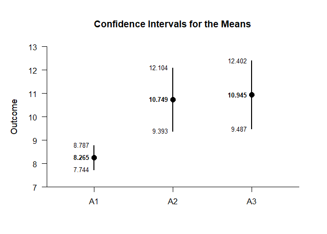
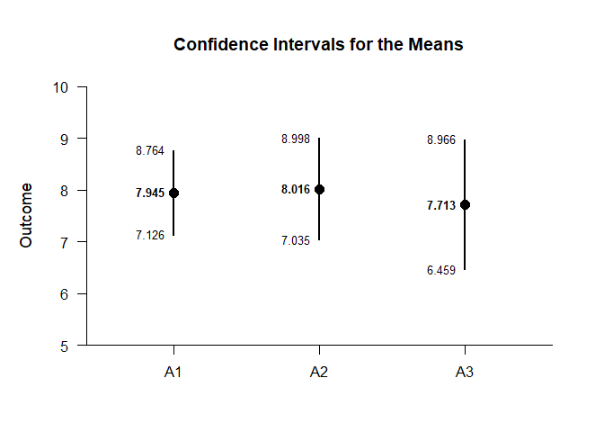
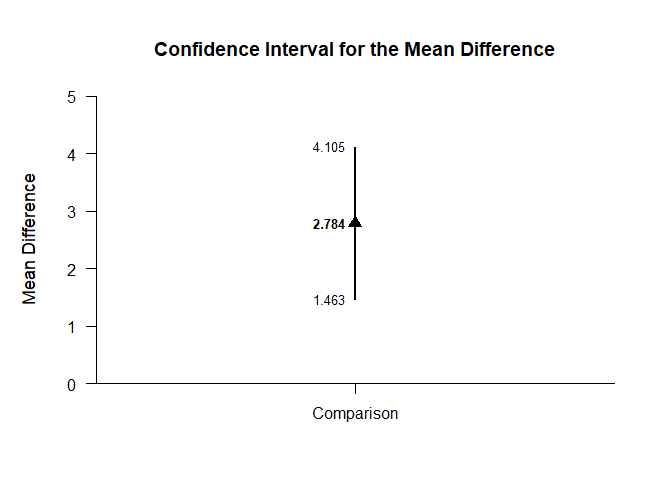
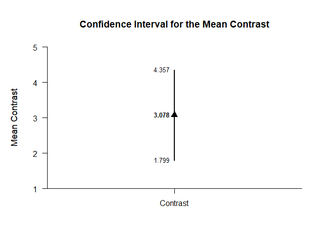
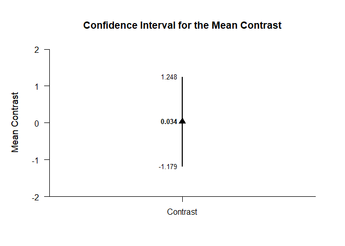

## Exposition Factorial Data Application

This page analyzes simple effects with an exposition pipe operator using
factorial (between-subjects) data.

- [Data Management](#data-management)
- [Descriptive Statistics](#descriptive-statistics)
- [Analyses of the Means](#analyses-of-the-means)
- [Analyses of a Comparison](#analyses-of-a-comparison)
- [Analyses of a Contrast](#analyses-of-a-contrast)

------------------------------------------------------------------------

### Data Management

Simulate some data.

``` r
FactorA <- c(rep(1,30),rep(2,30),rep(3,30),rep(1,30),rep(2,30),rep(3,30))
FactorB <- c(rep(1,90),rep(2,90))
FactorA <- factor(FactorA,levels=c(1,2,3),labels=c("A1","A2","A3"))
FactorB <- factor(FactorB,levels=c(1,2),labels=c("B1","B2"))
Outcome <- c(rnorm(30,mean=8,sd=2),rnorm(30,mean=11,sd=4),rnorm(30,mean=12,sd=4),rnorm(30,mean=8,sd=2),rnorm(30,mean=8,sd=3),rnorm(30,mean=7,sd=4))
FactorialData <- data.frame(FactorA,FactorB,Outcome)
```

Subset the data for each simple effect.

``` r
FactorialB1 <- subset(FactorialData,FactorB=="B1")
FactorialB2 <- subset(FactorialData,FactorB=="B2")
```

### Descriptive Statistics

Get descriptive statistics separately for each simple effect.

``` r
(FactorialB1) %$>% (Outcome~FactorA) |> describeMeans()
```

    ## $`Descriptive Statistics for the Data`
    ##          N       M      SD    Skew    Kurt
    ## A1  30.000   8.233   2.408  -0.718   1.881
    ## A2  30.000  11.633   3.586  -0.343  -0.365
    ## A3  30.000  10.988   3.677  -0.491  -0.594

``` r
(FactorialB2) %$>% (Outcome~FactorA) |> describeMeans()
```

    ## $`Descriptive Statistics for the Data`
    ##          N       M      SD    Skew    Kurt
    ## A1  30.000   7.945   2.193   0.275  -0.097
    ## A2  30.000   8.016   2.628  -0.326  -0.102
    ## A3  30.000   7.713   3.357  -0.438  -0.665

### Analyses of the Means

Estimate, plot, test, and standardize the means separately for each
simple effect.

``` r
(FactorialB1) %$>% (Outcome~FactorA) |> estimateMeans()
```

    ## $`Confidence Intervals for the Means`
    ##          M      SE      df      LL      UL
    ## A1   8.233   0.440  29.000   7.333   9.132
    ## A2  11.633   0.655  29.000  10.294  12.972
    ## A3  10.988   0.671  29.000   9.615  12.361

``` r
(FactorialB2) %$>% (Outcome~FactorA) |> estimateMeans()
```

    ## $`Confidence Intervals for the Means`
    ##          M      SE      df      LL      UL
    ## A1   7.945   0.400  29.000   7.126   8.764
    ## A2   8.016   0.480  29.000   7.035   8.998
    ## A3   7.713   0.613  29.000   6.459   8.966

``` r
(FactorialB1) %$>% (Outcome~FactorA) |> plotMeans()
```

<!-- -->

``` r
(FactorialB2) %$>% (Outcome~FactorA) |> plotMeans()
```

<!-- -->

``` r
(FactorialB1) %$>% (Outcome~FactorA) |> testMeansOmnibus()
```

    ## $`Hypothesis Test for the Model`
    ##              F     df1     df2       p
    ## Factor   9.122   2.000  87.000   0.000

``` r
(FactorialB2) %$>% (Outcome~FactorA) |> testMeansOmnibus()
```

    ## $`Hypothesis Test for the Model`
    ##              F     df1     df2       p
    ## Factor   0.099   2.000  87.000   0.906

``` r
(FactorialB1) %$>% (Outcome~FactorA) |> estimateStandardizedMeans()
```

    ## $`Confidence Intervals for the Standardized Means`
    ##          d      SE      LL      UL
    ## A1   3.419   0.472   2.468   4.359
    ## A2   3.244   0.452   2.334   4.143
    ## A3   2.988   0.422   2.138   3.828

``` r
(FactorialB2) %$>% (Outcome~FactorA) |> estimateStandardizedMeans()
```

    ## $`Confidence Intervals for the Standardized Means`
    ##          d      SE      LL      UL
    ## A1   3.623   0.496   2.623   4.613
    ## A2   3.051   0.430   2.186   3.905
    ## A3   2.298   0.346   1.603   2.981

### Analyses of a Comparison

Specify a comparison separately for each simple effect.

``` r
ComparisonB1 <- (FactorialB1) %$>% factor(FactorA,c("A1","A2"))
ComparisonB2 <- (FactorialB2) %$>% factor(FactorA,c("A1","A2"))
```

Estimate, plot, test, and standardize the comparison separately for each
simple effect.

``` r
(FactorialB1) %$>% (Outcome~ComparisonB1) |> estimateMeanDifference()
```

    ## $`Confidence Interval for the Mean Difference`
    ##               Diff      SE      df      LL      UL
    ## Comparison   3.401   0.789  50.732   1.817   4.984

``` r
(FactorialB2) %$>% (Outcome~ComparisonB2) |> estimateMeanDifference()
```

    ## $`Confidence Interval for the Mean Difference`
    ##               Diff      SE      df      LL      UL
    ## Comparison   0.071   0.625  56.202  -1.180   1.323

``` r
(FactorialB1) %$>% (Outcome~ComparisonB1) |> plotMeanDifference()
```

<!-- -->

``` r
(FactorialB2) %$>% (Outcome~ComparisonB2) |> plotMeanDifference()
```

<!-- -->

``` r
(FactorialB1) %$>% (Outcome~ComparisonB1) |> testMeanDifference()
```

    ## $`Hypothesis Test for the Mean Difference`
    ##               Diff      SE      df       t       p
    ## Comparison   3.401   0.789  50.732   4.312   0.000

``` r
(FactorialB2) %$>% (Outcome~ComparisonB2) |> testMeanDifference()
```

    ## $`Hypothesis Test for the Mean Difference`
    ##               Diff      SE      df       t       p
    ## Comparison   0.071   0.625  56.202   0.114   0.909

``` r
(FactorialB1) %$>% (Outcome~ComparisonB1) |> estimateStandardizedMeanDifference()
```

    ## $`Confidence Interval for the Standardized Mean Difference`
    ##                  d      SE      LL      UL
    ## Comparison   1.113   0.285   0.555   1.672

``` r
(FactorialB2) %$>% (Outcome~ComparisonB2) |> estimateStandardizedMeanDifference()
```

    ## $`Confidence Interval for the Standardized Mean Difference`
    ##                  d      SE      LL      UL
    ## Comparison   0.030   0.263  -0.485   0.544

### Analyses of a Contrast

Specify a contrast for a factor.

``` r
A1vsOthers <- c(-1,.5,.5)
```

Estimate, plot, test, and standardize the contrast separately for each
simple effect.

``` r
(FactorialB1) %$>% (Outcome~FactorA) |> estimateMeanContrast(contrast=A1vsOthers)
```

    ## $`Confidence Interval for the Mean Contrast`
    ##              Est      SE      df      LL      UL
    ## Contrast   3.078   0.643  80.430   1.799   4.357

``` r
(FactorialB2) %$>% (Outcome~FactorA) |> estimateMeanContrast(contrast=A1vsOthers)
```

    ## $`Confidence Interval for the Mean Contrast`
    ##              Est      SE      df      LL      UL
    ## Contrast  -0.080   0.558  74.508  -1.193   1.032

``` r
(FactorialB1) %$>% (Outcome~FactorA) |> plotMeanContrast(contrast=A1vsOthers)
```

<!-- -->

``` r
(FactorialB2) %$>% (Outcome~FactorA) |> plotMeanContrast(contrast=A1vsOthers)
```

<!-- -->

``` r
(FactorialB1) %$>% (Outcome~FactorA) |> testMeanContrast(contrast=A1vsOthers)
```

    ## $`Hypothesis Test for the Mean Contrast`
    ##              Est      SE      df       t       p
    ## Contrast   3.078   0.643  80.430   4.788   0.000

``` r
(FactorialB2) %$>% (Outcome~FactorA) |> testMeanContrast(contrast=A1vsOthers)
```

    ## $`Hypothesis Test for the Mean Contrast`
    ##              Est      SE      df       t       p
    ## Contrast  -0.080   0.558  74.508  -0.144   0.886

``` r
(FactorialB1) %$>% (Outcome~FactorA) |> estimateStandardizedMeanContrast(contrast=A1vsOthers)
```

    ## $`Confidence Interval for the Standardized Mean Contrast`
    ##              Est      SE      LL      UL
    ## Contrast   0.940   0.213   0.522   1.358

``` r
(FactorialB2) %$>% (Outcome~FactorA) |> estimateStandardizedMeanContrast(contrast=A1vsOthers)
```

    ## $`Confidence Interval for the Standardized Mean Contrast`
    ##              Est      SE      LL      UL
    ## Contrast  -0.029   0.205  -0.431   0.373
