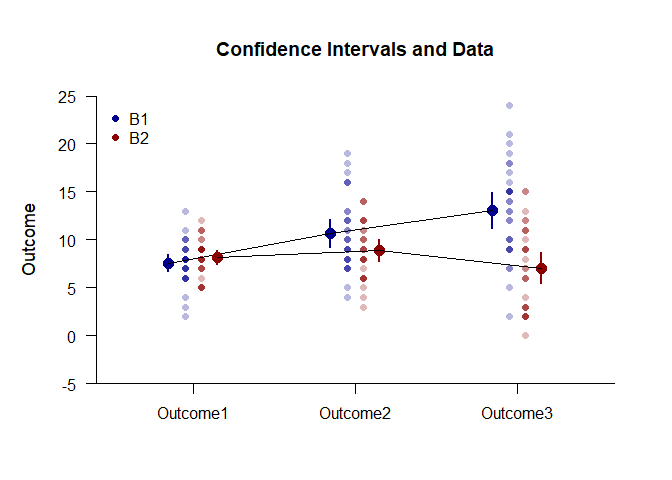

## Exposition Mixed Data Application

### Data Management

Simulate some data.

```r
Factor <- c(rep(1,30),rep(2,30))
Outcome1 <- c(rnorm(30,mean=8,sd=2),rnorm(30,mean=8,sd=2))
Outcome2 <- c(rnorm(30,mean=11,sd=4),rnorm(30,mean=8,sd=3))
Outcome3 <- c(rnorm(30,mean=12,sd=4),rnorm(30,mean=7,sd=4))
Factor <- factor(Factor,levels=c(1,2),labels=c("Level1","Level2"))
MixedData <- data.frame(Factor,Outcome1,Outcome2,Outcome3)
```
Subset the data for each simple effect.

```r
MixedB1 <- subset(MixedData,Factor=="Level1")
MixedB2 <- subset(MixedData,Factor=="Level2")
```

### Analyses of the Means

Use the exposition pipe (%$>%) to identify the subset of interest, select the variables to analyzed, and use the native pipe to plot the means and the data.

```r
(MixedB1) %$>% cbind(Outcome1,Outcome2,Outcome3) |> plotData(main="Confidence Intervals and Data",ylim=c(-5,25),offset=-.05,method="overplot",col="darkblue")
(MixedB2) %$>% cbind(Outcome1,Outcome2,Outcome3) |> plotData(add=TRUE,offset=.05,method="overplot",col="darkred")
(MixedB1) %$>% cbind(Outcome1,Outcome2,Outcome3) |> plotMeans(add=TRUE,offset=-.15,col="darkblue",values=FALSE)
(MixedB2) %$>% cbind(Outcome1,Outcome2,Outcome3) |> plotMeans(add=TRUE,offset=.15,col="darkred",values=FALSE)
legend("topleft",inset=.01,box.lty=0,pch=16,legend=c("B1","B2"),col=c("darkblue","darkred"))
```

<!-- -->

Use a similar process to obtain the tables of confidence interval estimates.

```r
(MixedB1) %$>% cbind(Outcome1,Outcome2,Outcome3) |> estimateMeans()
```

```
## $`Confidence Intervals for the Means`
##                M      SE      df      LL      UL
## Outcome1   7.747   0.351  29.000   7.030   8.465
## Outcome2  10.912   0.715  29.000   9.449  12.375
## Outcome3  12.937   0.566  29.000  11.780  14.094
```

```r
(MixedB2) %$>% cbind(Outcome1,Outcome2,Outcome3) |> estimateMeans()
```

```
## $`Confidence Intervals for the Means`
##                M      SE      df      LL      UL
## Outcome1   7.535   0.358  29.000   6.802   8.268
## Outcome2   7.360   0.474  29.000   6.391   8.329
## Outcome3   7.208   0.806  29.000   5.559   8.856
```

### Analyses of the Simple Effects

Using the pipe operators, get the source table for each simple effect.

```r
(MixedB1) %$>% cbind(Outcome1,Outcome2,Outcome3) |> describeMeansOmnibus()
```

```
## $`Source Table for the Model`
##               SS      df      MS
## Subjects 214.486  29.000   7.396
## Measures 410.476   2.000 205.238
## Error    616.129  58.000  10.623
```

```r
(MixedB2) %$>% cbind(Outcome1,Outcome2,Outcome3) |> describeMeansOmnibus()
```

```
## $`Source Table for the Model`
##               SS      df      MS
## Subjects 208.622  29.000   7.194
## Measures   1.615   2.000   0.807
## Error    663.701  58.000  11.443
```
Test each simple effect for statistical significance.

```r
(MixedB1) %$>% cbind(Outcome1,Outcome2,Outcome3) |> testMeansOmnibus()
```

```
## $`Hypothesis Test for the Model`
##                F     df1     df2       p
## Measures  19.320   2.000  58.000   0.000
```

```r
(MixedB2) %$>% cbind(Outcome1,Outcome2,Outcome3) |> testMeansOmnibus()
```

```
## $`Hypothesis Test for the Model`
##                F     df1     df2       p
## Measures   0.071   2.000  58.000   0.932
```
Obtain the proportion of variance accounted for by each simple effect.

```r
(MixedB1) %$>% cbind(Outcome1,Outcome2,Outcome3) |> estimateMeansOmnibus()
```

```
## $`Proportion of Variance Accounted For by the Model`
##              Est      LL      UL
## Measures   0.400   0.224   0.513
```

```r
(MixedB2) %$>% cbind(Outcome1,Outcome2,Outcome3) |> estimateMeansOmnibus()
```

```
## $`Proportion of Variance Accounted For by the Model`
##              Est      LL      UL
## Measures   0.002   0.000   0.010
```
