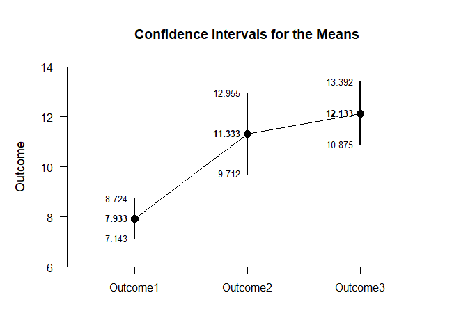
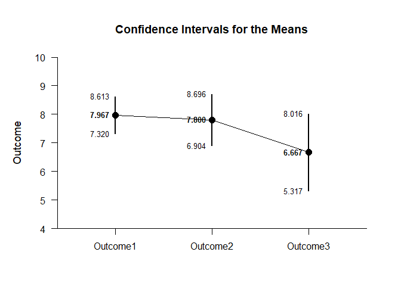
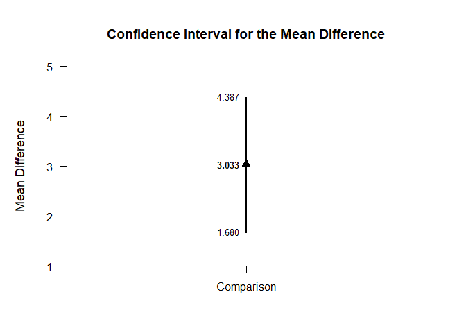
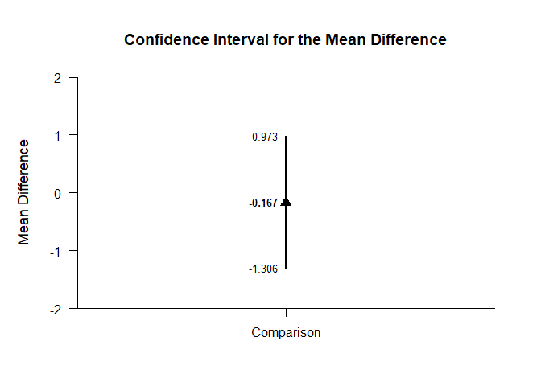
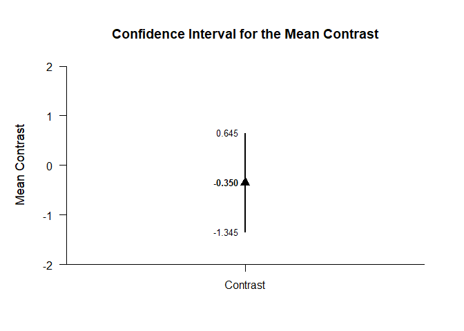

## Exposition Mixed Data Application

This page analyzes simple effects with an exposition pipe operator using mixed design (between-subjects and within-subjects) data.

### Data Management

Simulate some data.

```r
Factor <- c(rep(1,30),rep(2,30))
Outcome1 <- c(round(rnorm(30,mean=8,sd=2),0),round(rnorm(30,mean=8,sd=2),0))
Outcome2 <- c(round(rnorm(30,mean=11,sd=4),0),round(rnorm(30,mean=8,sd=3),0))
Outcome3 <- c(round(rnorm(30,mean=12,sd=4),0),round(rnorm(30,mean=7,sd=4),0))
Factor <- factor(Factor,levels=c(1,2),labels=c("Level1","Level2"))
MixedData <- data.frame(Factor,Outcome1,Outcome2,Outcome3)
```
Subset the data for each simple effect.

```r
MixedB1 <- subset(MixedData,Factor=="Level1")
MixedB2 <- subset(MixedData,Factor=="Level2")
```

#### Descriptive Statistics

Get the descriptive statistics separately for each simple effect.

```r
(MixedB1) %$>% cbind(Outcome1,Outcome2,Outcome3) |> describeMeans()
```

```
## $`Descriptive Statistics for the Data`
##                N       M      SD    Skew    Kurt
## Outcome1  30.000   7.933   1.780   0.068  -0.766
## Outcome2  30.000  10.967   2.723  -0.676   0.041
## Outcome3  30.000  11.567   3.298  -0.182   0.001
```

```r
(MixedB2) %$>% cbind(Outcome1,Outcome2,Outcome3) |> describeMeans()
```

```
## $`Descriptive Statistics for the Data`
##                N       M      SD    Skew    Kurt
## Outcome1  30.000   7.867   1.676  -0.387   2.140
## Outcome2  30.000   7.933   3.151   1.242   1.554
## Outcome3  30.000   7.100   3.680  -0.445   0.554
```

### Analyses of the Means

Use a similar process to obtain the tables of confidence interval estimates.

```r
(MixedB1) %$>% cbind(Outcome1,Outcome2,Outcome3) |> estimateMeans()
```

```
## $`Confidence Intervals for the Means`
##                M      SE      df      LL      UL
## Outcome1   7.933   0.325  29.000   7.269   8.598
## Outcome2  10.967   0.497  29.000   9.950  11.983
## Outcome3  11.567   0.602  29.000  10.335  12.798
```

```r
(MixedB2) %$>% cbind(Outcome1,Outcome2,Outcome3) |> estimateMeans()
```

```
## $`Confidence Intervals for the Means`
##                M      SE      df      LL      UL
## Outcome1   7.867   0.306  29.000   7.241   8.493
## Outcome2   7.933   0.575  29.000   6.757   9.110
## Outcome3   7.100   0.672  29.000   5.726   8.474
```

```r
(MixedB1) %$>% cbind(Outcome1,Outcome2,Outcome3) |> plotMeans()
```

<!-- -->

```r
(MixedB2) %$>% cbind(Outcome1,Outcome2,Outcome3) |> plotMeans()
```

<!-- -->

```r
(MixedB1) %$>% cbind(Outcome1,Outcome2,Outcome3) |> testMeansOmnibus()
```

```
## $`Hypothesis Test for the Model`
##                F     df1     df2       p
## Measures  15.035   2.000  58.000   0.000
```

```r
(MixedB2) %$>% cbind(Outcome1,Outcome2,Outcome3) |> testMeansOmnibus()
```

```
## $`Hypothesis Test for the Model`
##                F     df1     df2       p
## Measures   0.654   2.000  58.000   0.524
```

```r
(MixedB1) %$>% cbind(Outcome1,Outcome2,Outcome3) |> estimateStandardizedMeans()
```

```
## $`Confidence Intervals for the Standardized Means`
##                d      SE      LL      UL
## Outcome1   4.457   0.596   3.256   5.649
## Outcome2   4.028   0.544   2.931   5.115
## Outcome3   3.508   0.483   2.535   4.470
```

```r
(MixedB2) %$>% cbind(Outcome1,Outcome2,Outcome3) |> estimateStandardizedMeans()
```

```
## $`Confidence Intervals for the Standardized Means`
##                d      SE      LL      UL
## Outcome1   4.694   0.624   3.435   5.943
## Outcome2   2.518   0.370   1.775   3.250
## Outcome3   1.929   0.307   1.313   2.534
```

### Analyses of a Comparison

Analyze the specified comparison separately for each simple effect.

```r
(MixedB1) %$>% cbind(Outcome1,Outcome2) |> estimateMeanDifference()
```

```
## $`Confidence Interval for the Mean Difference`
##               Diff      SE      df      LL      UL
## Comparison   3.033   0.662  29.000   1.680   4.387
```

```r
(MixedB2) %$>% cbind(Outcome1,Outcome2) |> estimateMeanDifference()
```

```
## $`Confidence Interval for the Mean Difference`
##               Diff      SE      df      LL      UL
## Comparison   0.067   0.695  29.000  -1.354   1.487
```

```r
(MixedB1) %$>% cbind(Outcome1,Outcome2) |> plotMeanDifference()
```

<!-- -->

```r
(MixedB2) %$>% cbind(Outcome1,Outcome2) |> plotMeanDifference()
```

<!-- -->

```r
(MixedB1) %$>% cbind(Outcome1,Outcome2) |> testMeanDifference()
```

```
## $`Hypothesis Test for the Mean Difference`
##               Diff      SE      df       t       p
## Comparison   3.033   0.662  29.000   4.584   0.000
```

```r
(MixedB2) %$>% cbind(Outcome1,Outcome2) |> testMeanDifference()
```

```
## $`Hypothesis Test for the Mean Difference`
##               Diff      SE      df       t       p
## Comparison   0.067   0.695  29.000   0.096   0.924
```

```r
(MixedB1) %$>% cbind(Outcome1,Outcome2) |> estimateStandardizedMeanDifference()
```

```
## $`Confidence Interval for the Standardized Mean Difference`
##                  d      SE      LL      UL
## Comparison   1.319   0.322   0.687   1.951
```

```r
(MixedB2) %$>% cbind(Outcome1,Outcome2) |> estimateStandardizedMeanDifference()
```

```
## $`Confidence Interval for the Standardized Mean Difference`
##                  d      SE      LL      UL
## Comparison   0.026   0.280  -0.522   0.575
```

### Analyses of a Contrast

Specify a contrast for a factor.

```r
O1vsOthers <- c(-1,.5,.5)
```

Analyze the specified contrast separately for each simple effect.

```r
(MixedB1) %$>% cbind(Outcome1,Outcome2,Outcome3) |> estimateMeanContrast(contrast=O1vsOthers)
```

```
## $`Confidence Interval for the Mean Contrast`
##              Est      SE      df      LL      UL
## Contrast   3.333   0.494  29.000   2.323   4.343
```

```r
(MixedB2) %$>% cbind(Outcome1,Outcome2,Outcome3) |> estimateMeanContrast(contrast=O1vsOthers)
```

```
## $`Confidence Interval for the Mean Contrast`
##              Est      SE      df      LL      UL
## Contrast  -0.350   0.487  29.000  -1.345   0.645
```

```r
(MixedB1) %$>% cbind(Outcome1,Outcome2,Outcome3) |> plotMeanContrast(contrast=O1vsOthers)
```

<!-- -->

```r
(MixedB2) %$>% cbind(Outcome1,Outcome2,Outcome3) |> plotMeanContrast(contrast=O1vsOthers)
```

<!-- -->

```r
(MixedB1) %$>% cbind(Outcome1,Outcome2,Outcome3) |> testMeanContrast(contrast=O1vsOthers)
```

```
## $`Hypothesis Test for the Mean Contrast`
##              Est      SE      df       t       p
## Contrast   3.333   0.494  29.000   6.750   0.000
```

```r
(MixedB2) %$>% cbind(Outcome1,Outcome2,Outcome3) |> testMeanContrast(contrast=O1vsOthers)
```

```
## $`Hypothesis Test for the Mean Contrast`
##              Est      SE      df       t       p
## Contrast  -0.350   0.487  29.000  -0.719   0.478
```

```r
(MixedB1) %$>% cbind(Outcome1,Outcome2,Outcome3) |> estimateStandardizedMeanContrast(contrast=O1vsOthers)
```

```
## $`Confidence Interval for the Standardized Mean Contrast`
##              Est      SE      LL      UL
## Contrast   1.246   0.225   0.806   1.687
```

```r
(MixedB2) %$>% cbind(Outcome1,Outcome2,Outcome3) |> estimateStandardizedMeanContrast(contrast=O1vsOthers)
```

```
## $`Confidence Interval for the Standardized Mean Contrast`
##              Est      SE      LL      UL
## Contrast  -0.118   0.194  -0.499   0.262
```
