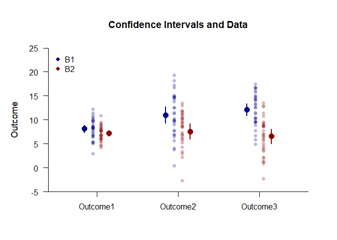

## Exposition Mixed Data Applications

### Data Management

Enter the data.

```r
Factor <- c(rep(1,30),rep(2,30))
Outcome1 <- c(rnorm(30,mean=8,sd=2),rnorm(30,mean=8,sd=2))
Outcome2 <- c(rnorm(30,mean=11,sd=4),rnorm(30,mean=8,sd=3))
Outcome3 <- c(rnorm(30,mean=12,sd=4),rnorm(30,mean=7,sd=4))
Factor <- factor(Factor,levels=c(1,2),labels=c("Level1","Level2"))
MixedData <- data.frame(Factor,Outcome1,Outcome2,Outcome3)
```
Subset the data for each simple effect.

```r
MixedB1 <- subset(MixedData,Factor=="Level1")
MixedB2 <- subset(MixedData,Factor=="Level2")
```

### Analyses of the Means

Use the exposition pipe (%$>%) to identify the subset of interest, select the variables to analyzed, and use the native pipe to plot the means and the data.

```r
(MixedB1) %$>% cbind(Outcome1,Outcome2,Outcome3) |> plotData(main="Confidence Intervals and Data",ylim=c(-5,25),offset=-.05,method="overplot",col="darkblue")
(MixedB2) %$>% cbind(Outcome1,Outcome2,Outcome3) |> plotData(add=TRUE,offset=.05,method="overplot",col="darkred")
(MixedB1) %$>% cbind(Outcome1,Outcome2,Outcome3) |> plotMeans(add=TRUE,offset=-.15,col="darkblue",values=FALSE)
(MixedB2) %$>% cbind(Outcome1,Outcome2,Outcome3) |> plotMeans(add=TRUE,offset=.15,col="darkred",values=FALSE)
legend("topleft",inset=.01,box.lty=0,pch=16,legend=c("B1","B2"),col=c("darkblue","darkred"))
```

<!-- -->

Use a similar process to obtain the tables of confidence interval estimates.

```r
(MixedB1) %$>% cbind(Outcome1,Outcome2,Outcome3) |> estimateMeans()
```

```
## $`Confidence Intervals for the Means`
##                M      SE      df      LL      UL
## Outcome1   8.292   0.313  29.000   7.651   8.933
## Outcome2  11.809   0.843  29.000  10.084  13.533
## Outcome3  11.626   0.643  29.000  10.312  12.940
```

```r
(MixedB2) %$>% cbind(Outcome1,Outcome2,Outcome3) |> estimateMeans()
```

```
## $`Confidence Intervals for the Means`
##                M      SE      df      LL      UL
## Outcome1   8.297   0.385  29.000   7.511   9.084
## Outcome2   7.633   0.547  29.000   6.513   8.753
## Outcome3   6.428   0.595  29.000   5.211   7.646
```

### Analyses of the Simple Effects

Using the pipe operators, get the source table for each simple effect.

```r
(MixedB1) %$>% cbind(Outcome1,Outcome2,Outcome3) |> describeMeansOmnibus()
```

```
## $`Source Table for the Model`
##               SS      df      MS
## Subjects 392.715  29.000  13.542
## Measures 235.151   2.000 117.575
## Error    670.534  58.000  11.561
```

```r
(MixedB2) %$>% cbind(Outcome1,Outcome2,Outcome3) |> describeMeansOmnibus()
```

```
## $`Source Table for the Model`
##               SS      df      MS
## Subjects 169.544  29.000   5.846
## Measures  53.859   2.000  26.929
## Error    528.227  58.000   9.107
```
Test each simple effect for statistical significance.

```r
(MixedB1) %$>% cbind(Outcome1,Outcome2,Outcome3) |> testMeansOmnibus()
```

```
## $`Hypothesis Test for the Model`
##                F     df1     df2       p
## Measures  10.170   2.000  58.000   0.000
```

```r
(MixedB2) %$>% cbind(Outcome1,Outcome2,Outcome3) |> testMeansOmnibus()
```

```
## $`Hypothesis Test for the Model`
##                F     df1     df2       p
## Measures   2.957   2.000  58.000   0.060
```
Obtain the proportion of variance accounted for by each simple effect.

```r
(MixedB1) %$>% cbind(Outcome1,Outcome2,Outcome3) |> estimateMeansOmnibus()
```

```
## $`Proportion of Variance Accounted For by the Model`
##              Est      LL      UL
## Measures   0.260   0.097   0.385
```

```r
(MixedB2) %$>% cbind(Outcome1,Outcome2,Outcome3) |> estimateMeansOmnibus()
```

```
## $`Proportion of Variance Accounted For by the Model`
##              Est      LL      UL
## Measures   0.093   0.000   0.203
```
