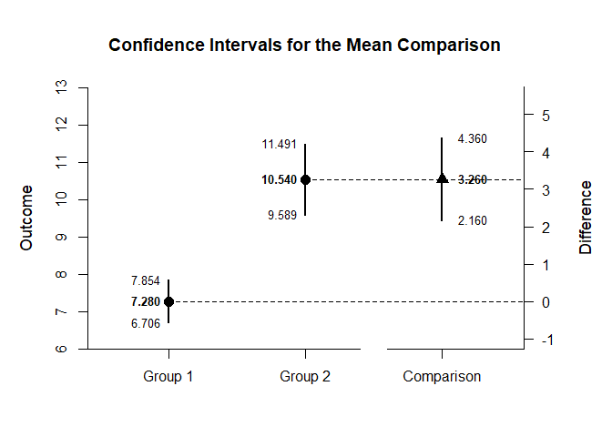

## Exposition OneWay Data Application

This page explains the use of the exposition operator in analyzing
defined data frames using one-way (between-subjects) data.

- [Data Management](#data-management)
- [Using an Exposition Operator](#using-an-exposition-operator)
- [Advanced Uses of the Operator](#advanced-uses-of-the-operator)

------------------------------------------------------------------------

### Data Management

Simulate some data, placing it directly into a data frame (as opposed to
declaring the variables separately).

``` r
OneWayData <- data.frame(Factor = rep(factor(c("Group 1","Group 2","Group 3")),each=50),
                        Outcome=c(round(rnorm(50,mean=7,sd=2),0),
                        round(rnorm(50,mean=11,sd=4),0),
                        round(rnorm(50,mean=12,sd=4),0)))
```

### Using an Exposition Operator

When larger or predefined data sets are used, it is necessary to
identify the data and the selected variables. In base R, this is
accomplished using a `with` command.

``` r
with(OneWayData,estimateMeans(Outcome~Factor))
```

    ## $`Confidence Intervals for the Means`
    ##               M      SE      df      LL      UL
    ## Group 1   7.280   0.286  49.000   6.706   7.854
    ## Group 2  10.540   0.473  49.000   9.589  11.491
    ## Group 3  11.160   0.596  49.000   9.962  12.358

In EASI, this is accomplished more efficiently and flexibly by using an
exposition operator (such as the included `%$>%`). Here, the data is
identified first, then variables are selected and all levels are piped
to the desired analyses.

``` r
OneWayData %$>% (Outcome~Factor) |> estimateMeans()
```

    ## $`Confidence Intervals for the Means`
    ##               M      SE      df      LL      UL
    ## Group 1   7.280   0.286  49.000   6.706   7.854
    ## Group 2  10.540   0.473  49.000   9.589  11.491
    ## Group 3  11.160   0.596  49.000   9.962  12.358

``` r
OneWayData %$>% (Outcome~Factor) |> plotMeans()
```

<!-- -->

### Advanced Uses of the Operator

This approach is particularly useful in cases where there is a desire to
focus on specific variables. In this case, two specific levels are
chosen for the sake of making a comparison.

``` r
OneWayData %$>% (Outcome~factor(Factor,c("Group 1","Group 2"))) |> estimateMeanComparison()
```

    ## $`Confidence Intervals for the Means`
    ##               M      SE      df      LL      UL
    ## Group 1   7.280   0.286  49.000   6.706   7.854
    ## Group 2  10.540   0.473  49.000   9.589  11.491
    ## 
    ## $`Confidence Interval for the Mean Difference`
    ##               Diff      SE      df      LL      UL
    ## Comparison   3.260   0.553  80.554   2.160   4.360

``` r
OneWayData %$>% (Outcome~factor(Factor,c("Group 1","Group 2"))) |> plotMeanComparison()
```

<!-- -->

``` r
OneWayData %$>% (Outcome~factor(Factor,c("Group 1","Group 2"))) |> estimateStandardizedMeanDifference()
```

    ## $`Confidence Interval for the Standardized Mean Difference`
    ##                  d      SE      LL      UL
    ## Comparison   1.180   0.222   0.744   1.615
