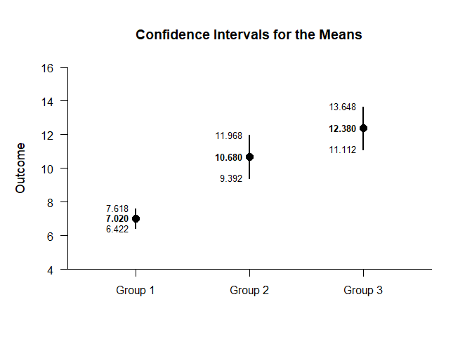

## Exposition OneWay Data Application

This page explains the use of the exposition operator in analyzing
defined data frames using one-way (between-subjects) data.

- [Data Management](#data-management)
- [Using the Exposition Operator](#using-the-exposition-operator)

------------------------------------------------------------------------

### Data Management

Simulate some data, placing it directly into a data frame (as opposed to
declaring the variables separately).

``` r
OneWayData <- data.frame(Factor = rep(factor(c("Group 1","Group 2","Group 3")),each=50),
                        Outcome=c(round(rnorm(50,mean=7,sd=2),0),
                        round(rnorm(50,mean=11,sd=4),0),
                        round(rnorm(50,mean=12,sd=4),0)))
```

### Using the Exposition Operator

When larger or predefined data sets are used, it is necessary to
identify the data first and then select the variables from within the
data set. In base R, this is accomplished using a `with` command (or
built in data identification parameters). Note that this syntax does
permit the use of pipe operators to work with individual variables (not
that the data set contains more variables in this example).

``` r
with(OneWayData,estimateMeans(Outcome~Factor))
```

    ## $`Confidence Intervals for the Means`
    ##               M      SE      df      LL      UL
    ## Group 1   7.020   0.298  49.000   6.422   7.618
    ## Group 2  10.680   0.641  49.000   9.392  11.968
    ## Group 3  12.380   0.631  49.000  11.112  13.648

In EASI, this is accomplished more efficiently and flexibly by using an
exposition operator (such as the included `%$>%`). This is particularly
useful in cases where there is a desire to on specific variables (not
that th data set contains more variables in this example).

``` r
OneWayData %$>% (Outcome~Factor) |> estimateMeans()
```

    ## $`Confidence Intervals for the Means`
    ##               M      SE      df      LL      UL
    ## Group 1   7.020   0.298  49.000   6.422   7.618
    ## Group 2  10.680   0.641  49.000   9.392  11.968
    ## Group 3  12.380   0.631  49.000  11.112  13.648

``` r
OneWayData %$>% (Outcome~Factor) |> plotMeans()
```

<!-- -->
