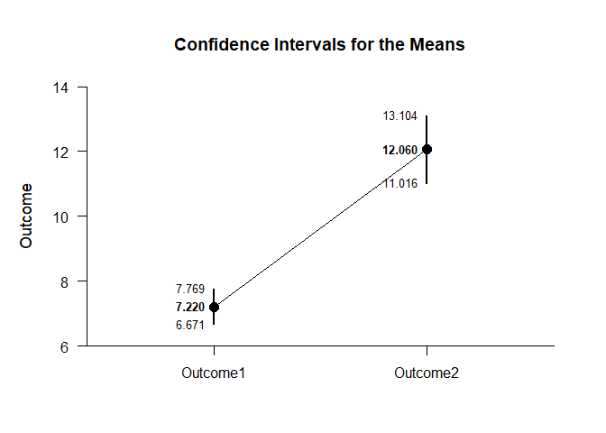
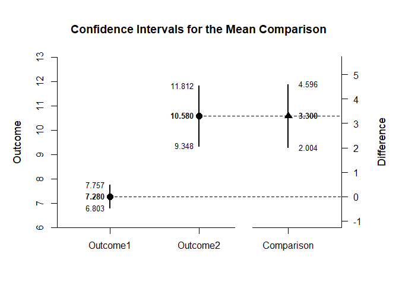

## Exposition Repeated Measures Data Application

This page explains the use of the exposition operator in analyzing
defined data frames using repeated-measures (within-subjects) data.

- [Data Management](#data-management)
- [Using an Exposition Operator](#using-an-exposition-operator)
- [Advanced Uses of the Operator](#advanced-uses-of-the-operator)

------------------------------------------------------------------------

### Data Management

Simulate some data, placing it directly into a data frame (as opposed to
declaring the variables separately).

``` r
RepeatedData <- data.frame(Outcome1=round(rnorm(50,mean=7,sd=2),0),
                          Outcome2=round(rnorm(50,mean=11,sd=4),0),
                          Outcome3=round(rnorm(50,mean=12,sd=4),0))
```

### Using an Exposition Operator

When larger or predefined data sets are used, it is necessary to
identify the data and the selected variables. In base R, this is
accomplished using a `with` command.

``` r
with(RepeatedData,estimateMeans(RepeatedData))
```

    ## $`Confidence Intervals for the Means`
    ##                M      SE      df      LL      UL
    ## Outcome1   7.280   0.237  49.000   6.803   7.757
    ## Outcome2  10.580   0.613  49.000   9.348  11.812
    ## Outcome3  12.440   0.577  49.000  11.280  13.600

In EASI, this is accomplished more efficiently and flexibly by using an
exposition operator (such as the included `%$>%`). Here, the data is
identified first, then all of the variables are piped to the desired
analyses.

``` r
RepeatedData %$>% (RepeatedData) |> estimateMeans()
```

    ## $`Confidence Intervals for the Means`
    ##                M      SE      df      LL      UL
    ## Outcome1   7.280   0.237  49.000   6.803   7.757
    ## Outcome2  10.580   0.613  49.000   9.348  11.812
    ## Outcome3  12.440   0.577  49.000  11.280  13.600

``` r
RepeatedData %$>% (RepeatedData) |> plotMeans()
```

<!-- -->

### Advanced Uses of the Operator

This approach is particularly useful in cases where there is a desire to
focus on specific variables. In this case, two specific variables are
chosen for the sake of making a comparison.

``` r
RepeatedData %$>% cbind(Outcome1,Outcome2) |> estimateMeanComparison()
```

    ## $`Confidence Intervals for the Means`
    ##                M      SE      df      LL      UL
    ## Outcome1   7.280   0.237  49.000   6.803   7.757
    ## Outcome2  10.580   0.613  49.000   9.348  11.812
    ## 
    ## $`Confidence Interval for the Mean Difference`
    ##               Diff      SE      df      LL      UL
    ## Comparison   3.300   0.645  49.000   2.004   4.596

``` r
RepeatedData %$>% cbind(Outcome1,Outcome2) |> plotMeanComparison()
```

<!-- -->

``` r
RepeatedData %$>% cbind(Outcome1,Outcome2) |> estimateStandardizedMeanDifference()
```

    ## $`Confidence Interval for the Standardized Mean Difference`
    ##                  d      SE      LL      UL
    ## Comparison   1.004   0.217   0.578   1.430
