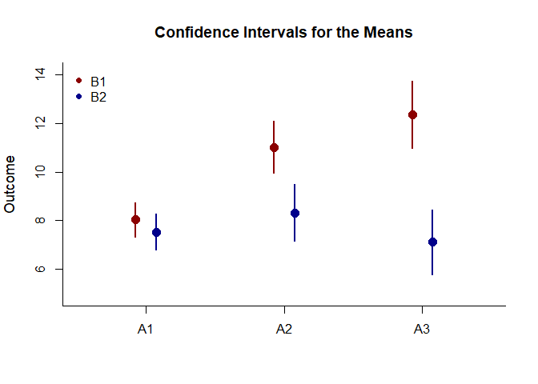
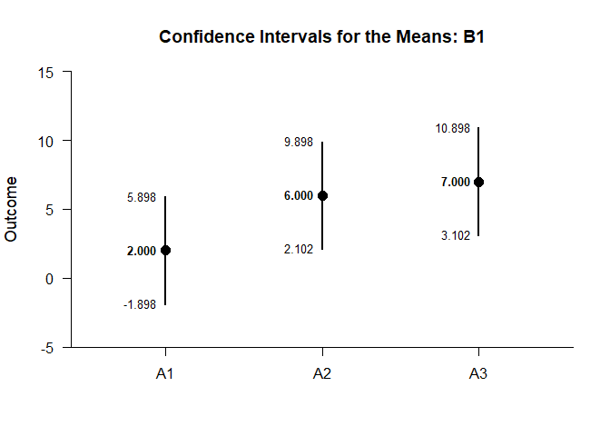
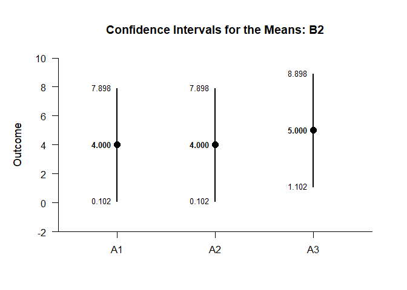
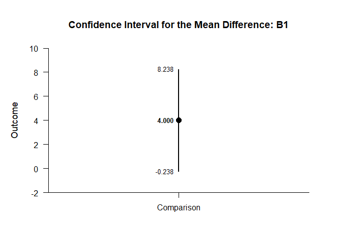
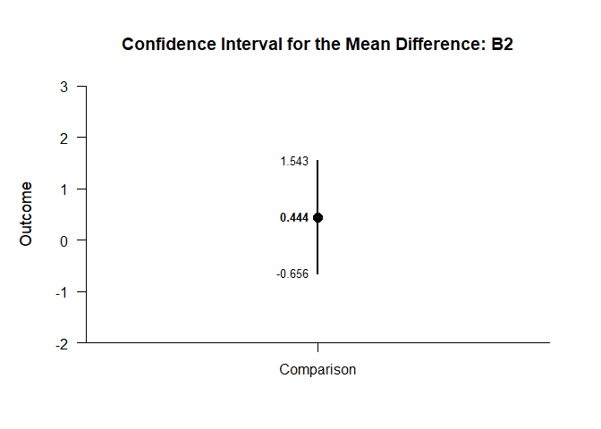
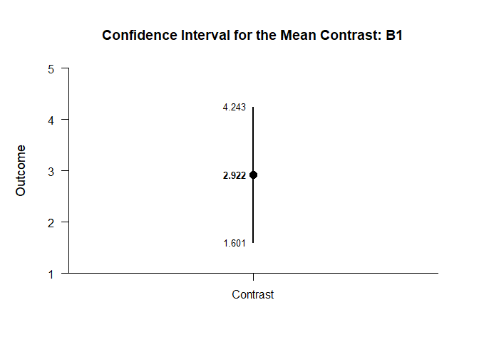
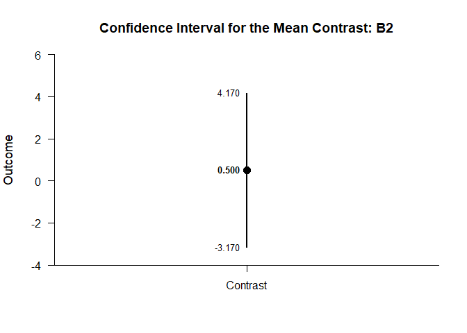

## FactorialBy Data Application

### Data Management

#### Data Entry

Enter the data.

```r
FactorA <- c(1,1,1,1,2,2,2,2,3,3,3,3,1,1,1,1,2,2,2,2,3,3,3,3)
FactorB <- c(1,1,1,1,1,1,1,1,1,1,1,1,2,2,2,2,2,2,2,2,2,2,2,2)
Outcome <- c(0,0,3,5,4,7,4,9,4,9,6,9,3,1,6,6,2,2,5,7,2,4,7,7)
FactorA <- factor(FactorA,levels=c(1,2,3),labels=c("A1","A2","A3"))
FactorB <- factor(FactorB,levels=c(1,2),labels=c("B1","B2"))
FactorialData <- data.frame(FactorA,FactorB,Outcome)
```

#### Descriptive Statistics

Get descriptive statistics separately for each simple effect.

```r
(Outcome~FactorA) |> describeMeansBy(by=FactorB)
```

```
## $`Descriptive Statistics for the Data: B1`
##          N       M      SD    Skew    Kurt
## A1   4.000   2.000   2.449   0.544  -2.944
## A2   4.000   6.000   2.449   0.544  -2.944
## A3   4.000   7.000   2.449  -0.544  -2.944
## 
## $`Descriptive Statistics for the Data: B2`
##          N       M      SD    Skew    Kurt
## A1   4.000   4.000   2.449  -0.544  -2.944
## A2   4.000   4.000   2.449   0.544  -2.944
## A3   4.000   5.000   2.449  -0.544  -2.944
```

### Analyses of the Omnibus and Simple Effects

Get an ANOVA for the design as a whole.

```r
(Outcome~FactorA) |> describeMeansOmnibusMultifactor(by=FactorB)
```

```
## $`Source Table for the Model: Between Subjects`
##                    SS      df      MS
## Factor          2.667   1.000   2.667
## Blocks         37.333   2.000  18.667
## Factor:Blocks  21.333   2.000  10.667
## Residual      108.000  18.000   6.000
```

```r
(Outcome~FactorA) |> testMeansOmnibusMultifactor(by=FactorB)
```

```
## $`Hypothesis Tests for the Model: Between Subjects`
##                     F     df1     df2       p
## Factor          0.444   1.000  18.000   0.513
## Blocks          3.111   2.000  18.000   0.069
## Factor:Blocks   1.778   2.000  18.000   0.197
```

```r
(Outcome~FactorA) |> estimateMeansOmnibusMultifactor(by=FactorB)
```

```
## $`Proportion of Variance Accounted For by the Model: Between Subjects`
##                   Est      LL      UL
## Factor          0.024   0.000   0.209
## Blocks          0.257   0.000   0.374
## Factor:Blocks   0.165   0.000   0.310
```

Get an ANOVA separately for each simple effect.

```r
(Outcome~FactorA) |> describeMeansOmnibusBy(by=FactorB)
```

```
## $`Source Table for the Model: B1`
##              SS      df      MS
## Between  56.000   2.000  28.000
## Within   54.000   9.000   6.000
## 
## $`Source Table for the Model: B2`
##              SS      df      MS
## Between   2.667   2.000   1.333
## Within   54.000   9.000   6.000
```

```r
(Outcome~FactorA) |> testMeansOmnibusBy(by=FactorB)
```

```
## $`Hypothesis Test for the Model: B1`
##              F     df1     df2       p
## Factor   4.667   2.000   9.000   0.041
## 
## $`Hypothesis Test for the Model: B2`
##              F     df1     df2       p
## Factor   0.222   2.000   9.000   0.805
```

```r
(Outcome~FactorA) |> estimateMeansOmnibusBy(by=FactorB)
```

```
## $`Proportion of Variance Accounted For by the Model: B1`
##            Est      LL      UL
## Factor   0.509   0.016   0.665
## 
## $`Proportion of Variance Accounted For by the Model: B2`
##            Est      LL      UL
## Factor   0.047   0.000   0.206
```

### Analyses of the Means

Plot the means and confidence intervals for the design as a whole.

```r
(Outcome~FactorA) |> plotMeansMultifactor(by=FactorB,col=c("black","gray60"))
legend("topleft",inset=.01,box.lty=0,pch=16,legend=c("B1","B2"),col=c("black","gray60"))
```

<!-- -->

Estimate, plot, test, and standardize the means separately for each simple effect.

```r
(Outcome~FactorA) |> estimateMeansBy(by=FactorB)
```

```
## $`Confidence Intervals for the Means: B1`
##          M      SE      df      LL      UL
## A1   2.000   1.225   3.000  -1.898   5.898
## A2   6.000   1.225   3.000   2.102   9.898
## A3   7.000   1.225   3.000   3.102  10.898
## 
## $`Confidence Intervals for the Means: B2`
##          M      SE      df      LL      UL
## A1   4.000   1.225   3.000   0.102   7.898
## A2   4.000   1.225   3.000   0.102   7.898
## A3   5.000   1.225   3.000   1.102   8.898
```

```r
(Outcome~FactorA) |> plotMeansBy(by=FactorB)
```

<!-- --><!-- -->

```r
(Outcome~FactorA) |> testMeansBy(by=FactorB)
```

```
## $`Hypothesis Tests for the Means: B1`
##       Diff      SE      df       t       p
## A1   2.000   1.225   3.000   1.633   0.201
## A2   6.000   1.225   3.000   4.899   0.016
## A3   7.000   1.225   3.000   5.715   0.011
## 
## $`Hypothesis Tests for the Means: B2`
##       Diff      SE      df       t       p
## A1   4.000   1.225   3.000   3.266   0.047
## A2   4.000   1.225   3.000   3.266   0.047
## A3   5.000   1.225   3.000   4.082   0.027
```

```r
(Outcome~FactorA) |> estimateStandardizedMeansBy(by=FactorB)
```

```
## $`Confidence Intervals for the Standardized Means: B1`
##          d      SE      LL      UL
## A1   0.816   0.616  -0.387   1.934
## A2   2.449   0.955   0.325   4.531
## A3   2.858   1.063   0.464   5.226
## 
## $`Confidence Intervals for the Standardized Means: B2`
##          d      SE      LL      UL
## A1   1.633   0.761   0.013   3.177
## A2   1.633   0.761   0.013   3.177
## A3   2.041   0.854   0.176   3.846
```

### Analyses of a Comparison

Analyze the specified comparison separately for each simple effect.

```r
Comparison=factor(FactorB,c("Level1","Level2"))
(Outcome~FactorA) |> estimateMeanDifferenceBy(by=FactorB)
```

```
## $`Confidence Interval for the Mean Difference: B1`
##               Diff      SE      df      LL      UL
## Comparison   4.000   1.732   6.000  -0.238   8.238
## 
## $`Confidence Interval for the Mean Difference: B2`
##               Diff      SE      df      LL      UL
## Comparison   0.000   1.732   6.000  -4.238   4.238
```

```r
(Outcome~FactorA) |> plotMeanDifferenceBy(by=FactorB)
```

<!-- --><!-- -->

```r
(Outcome~FactorA) |> testMeanDifferenceBy(by=FactorB)
```

```
## $`Hypothesis Test for the Mean Difference: B1`
##               Diff      SE      df       t       p
## Comparison   4.000   1.732   6.000   2.309   0.060
## 
## $`Hypothesis Test for the Mean Difference: B2`
##               Diff      SE      df       t       p
## Comparison   0.000   1.732   6.000   0.000   1.000
```

```r
(Outcome~FactorA) |> estimateStandardizedMeanDifferenceBy(by=FactorB)
```

```
## $`Confidence Interval for the Standardized Mean Difference: B1`
##                  d      SE      LL      UL
## Comparison   1.633   0.943  -0.215   3.481
## 
## $`Confidence Interval for the Standardized Mean Difference: B2`
##                  d      SE      LL      UL
## Comparison   0.000   0.816  -1.600   1.600
```

### Analyses of a Contrast

Analyze the specified contrast separately for each simple effect.

```r
L1vsOthers <- c(-1,.5,.5)
(Outcome~FactorA) |> estimateMeanContrastBy(by=FactorB,contrast=L1vsOthers)
```

```
## $`Confidence Interval for the Mean Contrast: B1`
##              Est      SE      df      LL      UL
## Contrast   4.500   1.500   6.000   0.830   8.170
## 
## $`Confidence Interval for the Mean Contrast: B2`
##              Est      SE      df      LL      UL
## Contrast   0.500   1.500   6.000  -3.170   4.170
```

```r
(Outcome~FactorA) |> plotMeanContrastBy(by=FactorB,contrast=L1vsOthers)
```

<!-- --><!-- -->

```r
(Outcome~FactorA) |> testMeanContrastBy(by=FactorB,contrast=L1vsOthers)
```

```
## $`Hypothesis Test for the Mean Contrast: B1`
##              Est      SE      df       t       p
## Contrast   4.500   1.500   6.000   3.000   0.024
## 
## $`Hypothesis Test for the Mean Contrast: B2`
##              Est      SE      df       t       p
## Contrast   0.500   1.500   6.000   0.333   0.750
```

```r
(Outcome~FactorA) |> estimateStandardizedMeanContrastBy(by=FactorB,contrast=L1vsOthers)
```

```
## $`Confidence Interval for the Standardized Mean Contrast: B1`
##              Est      SE      LL      UL
## Contrast   1.837   0.829   0.212   3.462
## 
## $`Confidence Interval for the Standardized Mean Contrast: B2`
##              Est      SE      LL      UL
## Contrast   0.204   0.709  -1.185   1.593
```
