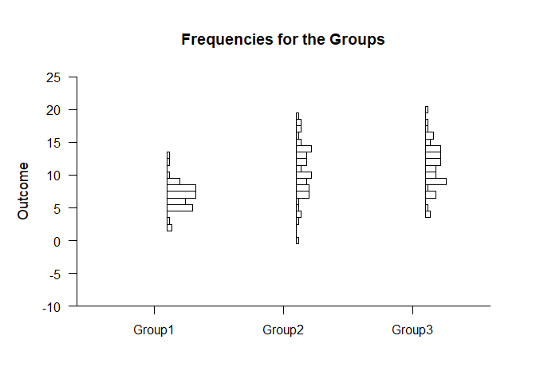
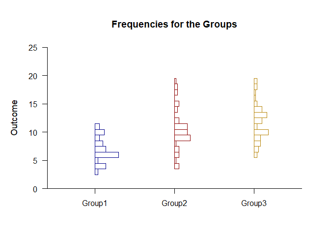
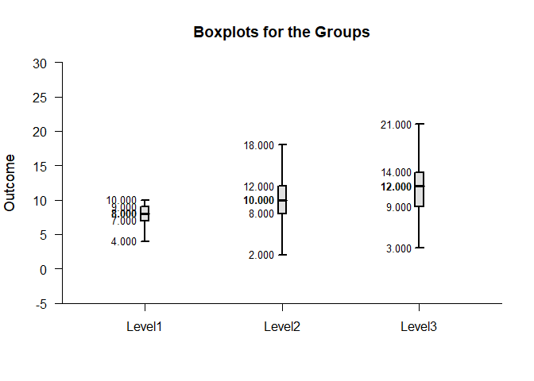
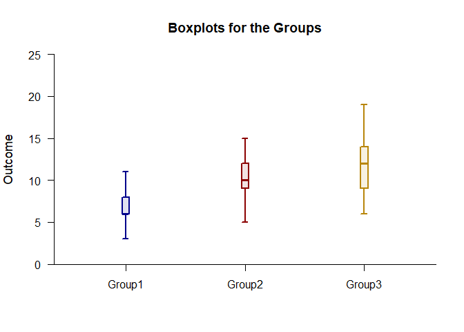

## Frequencies OneWay Data Application

### Data Management

Simulate some data.

```r
Factor <- c(rep(1,50),rep(2,50),rep(3,50))
Factor <- factor(Factor,levels=c(1,2,3),labels=c("Group1","Group2","Group3"))
Group1 <- round(rnorm(50,mean=7,sd=2),0)
Group2 <- round(rnorm(50,mean=11,sd=4),0)
Group3 <- round(rnorm(50,mean=12,sd=4),0)
Outcome <- c(Group1,Group2,Group3)
```

### Frequency Distributions

Describe and plot the frequency distributions.

```r
(Outcome~Factor) |> describeFrequencies()
```

```
## $`Frequency Distribution for the Data: Group1`
##       Freq    Perc CumFreq CumPerc
## 2    2.000   4.000   2.000   4.000
## 3    1.000   2.000   3.000   6.000
## 5   10.000  20.000  13.000  26.000
## 6    7.000  14.000  20.000  40.000
## 7   11.000  22.000  31.000  62.000
## 8   11.000  22.000  42.000  84.000
## 9    5.000  10.000  47.000  94.000
## 10   1.000   2.000  48.000  96.000
## 12   1.000   2.000  49.000  98.000
## 13   1.000   2.000  50.000 100.000
## 
## $`Frequency Distribution for the Data: Group2`
##       Freq    Perc CumFreq CumPerc
## 0    1.000   2.000   1.000   2.000
## 3    1.000   2.000   2.000   4.000
## 4    2.000   4.000   4.000   8.000
## 5    1.000   2.000   5.000  10.000
## 6    1.000   2.000   6.000  12.000
## 7    5.000  10.000  11.000  22.000
## 8    5.000  10.000  16.000  32.000
## 9    4.000   8.000  20.000  40.000
## 10   6.000  12.000  26.000  52.000
## 11   2.000   4.000  28.000  56.000
## 12   4.000   8.000  32.000  64.000
## 13   4.000   8.000  36.000  72.000
## 14   6.000  12.000  42.000  84.000
## 15   2.000   4.000  44.000  88.000
## 16   1.000   2.000  45.000  90.000
## 17   2.000   4.000  47.000  94.000
## 18   2.000   4.000  49.000  98.000
## 19   1.000   2.000  50.000 100.000
## 
## $`Frequency Distribution for the Data: Group3`
##       Freq    Perc CumFreq CumPerc
## 4    2.000   4.000   2.000   4.000
## 5    1.000   2.000   3.000   6.000
## 7    4.000   8.000   7.000  14.000
## 8    1.000   2.000   8.000  16.000
## 9    8.000  16.000  16.000  32.000
## 10   4.000   8.000  20.000  40.000
## 11   4.000   8.000  24.000  48.000
## 12   6.000  12.000  30.000  60.000
## 13   6.000  12.000  36.000  72.000
## 14   6.000  12.000  42.000  84.000
## 15   2.000   4.000  44.000  88.000
## 16   3.000   6.000  47.000  94.000
## 17   1.000   2.000  48.000  96.000
## 18   1.000   2.000  49.000  98.000
## 20   1.000   2.000  50.000 100.000
```

```r
(Outcome~Factor) |> plotFrequencies()
```

<!-- -->

Enhance the frequency distribution plot by adding color.

```r
(Outcome~Factor) |> plotFrequencies(offset=0,col=c("darkblue","darkred","darkgoldenrod"))
```

<!-- -->

### Percentiles and Boxes

Describe the percretiles and plot the boxes.

```r
(Outcome~Factor) |> describePercentiles()
```

```
## $`Percentiles for the Data`
##            Min     25%     50%     75%     Max
## Group1   2.000   5.250   7.000   8.000  13.000
## Group2   0.000   8.000  10.000  14.000  19.000
## Group3   4.000   9.000  12.000  14.000  20.000
```

```r
(Outcome~Factor) |> describeBoxes()
```

```
## $`Boxplot Statistics for the Data`
##             LW      LH     Mdn      UH      UW
## Group1   2.000   5.000   7.000   8.000  12.000
## Group2   0.000   8.000  10.000  14.000  19.000
## Group3   4.000   9.000  12.000  14.000  20.000
```

```r
(Outcome~Factor) |> plotBoxes()
```

<!-- -->

Enhance the frequency distribution plot by adding color.

```r
(Outcome~Factor) |> plotBoxes(values=FALSE,offset=0,scale=3,col=c("darkblue","darkred","darkgoldenrod"))
```

<!-- -->
