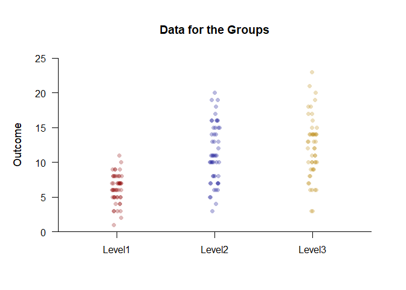
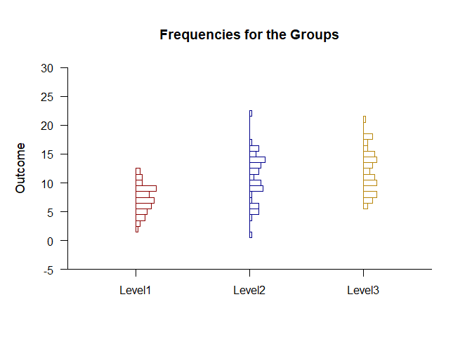

## Frequencies OneWay Data Application

### Data Management

Simulate some data.

```r
Factor <- c(rep(1,50),rep(2,50),rep(3,50))
Factor <- factor(Factor,levels=c(1,2,3),labels=c("Level1","Level2","Level3"))
Level1 <- round(rnorm(50,mean=7,sd=2),0)
Level2 <- round(rnorm(50,mean=11,sd=4),0)
Level3 <- round(rnorm(50,mean=12,sd=4),0)
Outcome <- c(Level1,Level2,Level3)
```

### Data Plots

Plot the data and enhance with color.

```r
(Outcome~Factor) |> plotData(offset=0,method="jitter",col=c("darkred","darkblue","darkgoldenrod"))
```

<!-- -->

### Frequency Distributions

Describe the frequency distributions.

```r
(Outcome~Factor) |> describeFrequencies()
```

```
## $`Frequency Distribution for the Data: Level1`
##       Freq    Perc CumFreq CumPerc
## 1    1.000   2.000   1.000   2.000
## 2    1.000   2.000   2.000   4.000
## 3    4.000   8.000   6.000  12.000
## 4    3.000   6.000   9.000  18.000
## 5    8.000  16.000  17.000  34.000
## 6    9.000  18.000  26.000  52.000
## 7   10.000  20.000  36.000  72.000
## 8    8.000  16.000  44.000  88.000
## 9    4.000   8.000  48.000  96.000
## 10   1.000   2.000  49.000  98.000
## 11   1.000   2.000  50.000 100.000
## 
## $`Frequency Distribution for the Data: Level2`
##       Freq    Perc CumFreq CumPerc
## 3    1.000   2.000   1.000   2.000
## 4    1.000   2.000   2.000   4.000
## 5    2.000   4.000   4.000   8.000
## 6    3.000   6.000   7.000  14.000
## 7    5.000  10.000  12.000  24.000
## 8    4.000   8.000  16.000  32.000
## 10   7.000  14.000  23.000  46.000
## 11   6.000  12.000  29.000  58.000
## 12   1.000   2.000  30.000  60.000
## 13   3.000   6.000  33.000  66.000
## 14   3.000   6.000  36.000  72.000
## 15   4.000   8.000  40.000  80.000
## 16   5.000  10.000  45.000  90.000
## 17   1.000   2.000  46.000  92.000
## 18   1.000   2.000  47.000  94.000
## 19   2.000   4.000  49.000  98.000
## 20   1.000   2.000  50.000 100.000
## 
## $`Frequency Distribution for the Data: Level3`
##       Freq    Perc CumFreq CumPerc
## 3    2.000   4.000   2.000   4.000
## 6    4.000   8.000   6.000  12.000
## 7    2.000   4.000   8.000  16.000
## 8    2.000   4.000  10.000  20.000
## 9    4.000   8.000  14.000  28.000
## 10   6.000  12.000  20.000  40.000
## 11   3.000   6.000  23.000  46.000
## 12   3.000   6.000  26.000  52.000
## 13   4.000   8.000  30.000  60.000
## 14   9.000  18.000  39.000  78.000
## 15   2.000   4.000  41.000  82.000
## 16   1.000   2.000  42.000  84.000
## 17   2.000   4.000  44.000  88.000
## 18   2.000   4.000  46.000  92.000
## 19   1.000   2.000  47.000  94.000
## 20   1.000   2.000  48.000  96.000
## 21   1.000   2.000  49.000  98.000
## 23   1.000   2.000  50.000 100.000
```

Plot the frequency distributions and enhance with color.

```r
(Outcome~Factor) |> plotFrequencies(offset=0,col=c("darkred","darkblue","darkgoldenrod"))
```

<!-- -->
