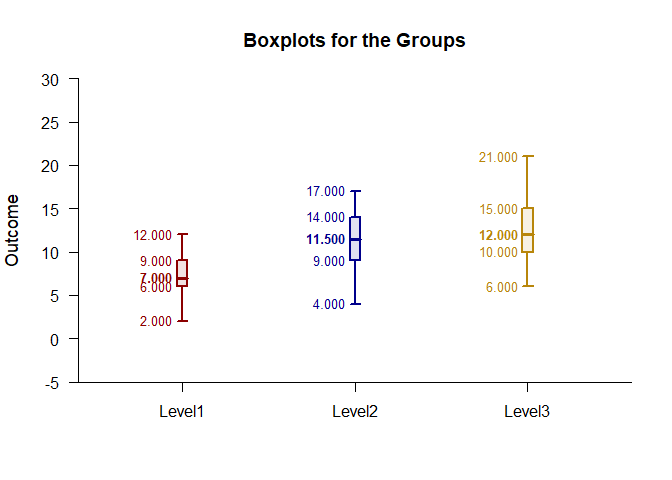

## Frequencies OneWay Data Application

### Data Management

Simulate some data.

```r
Factor <- c(rep(1,50),rep(2,50),rep(3,50))
Factor <- factor(Factor,levels=c(1,2,3),labels=c("Level1","Level2","Level3"))
Level1 <- round(rnorm(50,mean=7,sd=2),0)
Level2 <- round(rnorm(50,mean=11,sd=4),0)
Level3 <- round(rnorm(50,mean=12,sd=4),0)
Outcome <- c(Level1,Level2,Level3)
```

### Frequency Distributions

Describe the frequency distributions.

```r
(Outcome~Factor) |> describeFrequencies()
```

```
## $`Frequency Distribution for the Data: Level1`
##       Freq    Perc CumFreq CumPerc
## 2    1.000   2.000   1.000   2.000
## 3    2.000   4.000   3.000   6.000
## 4    4.000   8.000   7.000  14.000
## 5    5.000  10.000  12.000  24.000
## 6    7.000  14.000  19.000  38.000
## 7    8.000  16.000  27.000  54.000
## 8    6.000  12.000  33.000  66.000
## 9    9.000  18.000  42.000  84.000
## 10   3.000   6.000  45.000  90.000
## 11   3.000   6.000  48.000  96.000
## 12   2.000   4.000  50.000 100.000
## 
## $`Frequency Distribution for the Data: Level2`
##       Freq    Perc CumFreq CumPerc
## 1    1.000   2.000   1.000   2.000
## 4    1.000   2.000   2.000   4.000
## 5    4.000   8.000   6.000  12.000
## 6    4.000   8.000  10.000  20.000
## 7    1.000   2.000  11.000  22.000
## 8    1.000   2.000  12.000  24.000
## 9    6.000  12.000  18.000  36.000
## 10   5.000  10.000  23.000  46.000
## 11   2.000   4.000  25.000  50.000
## 12   4.000   8.000  29.000  58.000
## 13   5.000  10.000  34.000  68.000
## 14   7.000  14.000  41.000  82.000
## 15   3.000   6.000  44.000  88.000
## 16   4.000   8.000  48.000  96.000
## 17   1.000   2.000  49.000  98.000
## 22   1.000   2.000  50.000 100.000
## 
## $`Frequency Distribution for the Data: Level3`
##       Freq    Perc CumFreq CumPerc
## 6    2.000   4.000   2.000   4.000
## 7    4.000   8.000   6.000  12.000
## 8    6.000  12.000  12.000  24.000
## 10   6.000  12.000  18.000  36.000
## 11   5.000  10.000  23.000  46.000
## 12   3.000   6.000  26.000  52.000
## 13   4.000   8.000  30.000  60.000
## 14   6.000  12.000  36.000  72.000
## 15   5.000  10.000  41.000  82.000
## 16   2.000   4.000  43.000  86.000
## 17   2.000   4.000  45.000  90.000
## 18   4.000   8.000  49.000  98.000
## 21   1.000   2.000  50.000 100.000
```

Plot the frequency distributions and enhance with color.

```r
(Outcome~Factor) |> plotFrequencies(offset=0,col=c("darkred","darkblue","darkgoldenrod"))
```

<!-- -->

### Boxplots

Describe the boxes.

```r
(Outcome~Factor) |> describeBoxes()
```

```
## $`Boxplot Statistics for the Data`
##             LW      LH     Mdn      UH      UW
## Level1   2.000   6.000   7.000   9.000  12.000
## Level2   4.000   9.000  11.500  14.000  17.000
## Level3   6.000  10.000  12.000  15.000  21.000
```

Plot the boxes and enhance with color.

```r
(Outcome~Factor) |> plotBoxes(col=c("darkred","darkblue","darkgoldenrod"))
```

<!-- -->
