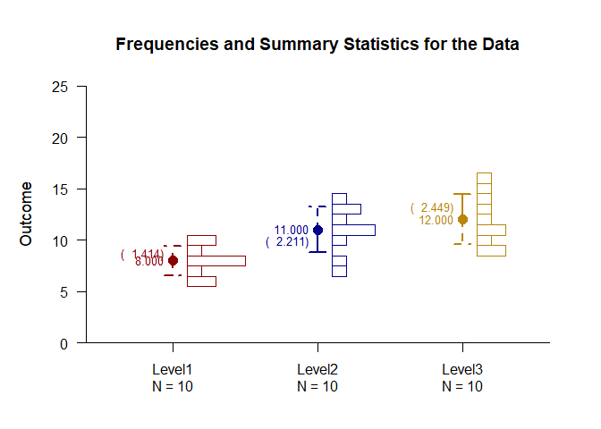

## Frequencies OneWay Data Application

This page provides basic data plots and frequency distributions using
one-way (between-subjects) data.

- [Data Management](#data-management)
- [Frequency Distributions](#frequency-distributions)
- [Summary Statistics](#summary-statistics)

------------------------------------------------------------------------

### Data Management

This code inputs the variable names and creates a viewable data frame.

``` r
Factor <- c(rep(1, 10), rep(2, 10), rep(3, 10))
Factor <- factor(Factor, levels = c(1, 2, 3), labels = c("Level1", "Level2", "Level3"))
Outcome <- c(6, 8, 6, 8, 10, 8, 10, 9, 8, 7, 7, 13, 11, 10, 13, 8, 11, 14, 12, 11, 9, 16, 11, 12, 15, 13, 9, 14, 11, 10)
OneWayData <- construct(Factor, Outcome)
```

### Frequency Distributions

Frequency distributions and data plots are often a first step in
analyzing data.

Describe the frequency distributions.

``` r
(Outcome ~ Factor) |> describeFrequencies()
```

    ## $`Frequency Distribution for the Data: Level1`
    ##       Freq    Perc CumFreq CumPerc
    ## 6    2.000  20.000   2.000  20.000
    ## 7    1.000  10.000   3.000  30.000
    ## 8    4.000  40.000   7.000  70.000
    ## 9    1.000  10.000   8.000  80.000
    ## 10   2.000  20.000  10.000 100.000
    ## 
    ## $`Frequency Distribution for the Data: Level2`
    ##       Freq    Perc CumFreq CumPerc
    ## 7    1.000  10.000   1.000  10.000
    ## 8    1.000  10.000   2.000  20.000
    ## 10   1.000  10.000   3.000  30.000
    ## 11   3.000  30.000   6.000  60.000
    ## 12   1.000  10.000   7.000  70.000
    ## 13   2.000  20.000   9.000  90.000
    ## 14   1.000  10.000  10.000 100.000
    ## 
    ## $`Frequency Distribution for the Data: Level3`
    ##       Freq    Perc CumFreq CumPerc
    ## 9    2.000  20.000   2.000  20.000
    ## 10   1.000  10.000   3.000  30.000
    ## 11   2.000  20.000   5.000  50.000
    ## 12   1.000  10.000   6.000  60.000
    ## 13   1.000  10.000   7.000  70.000
    ## 14   1.000  10.000   8.000  80.000
    ## 15   1.000  10.000   9.000  90.000
    ## 16   1.000  10.000  10.000 100.000

Plot the frequencies as data points and enhance with color.

``` r
(Outcome ~ Factor) |> plotData(offset = 0, method = "swarm", col = c("darkred", "darkblue", "darkgoldenrod"))
```

<!-- -->

### Summary Statistics

It is often helpful to view the summary statistics in conjunction with
the frequency distributions.

Describe the frequency distributions.

``` r
(Outcome ~ Factor) |> describeSummary()
```

    ## $`Summary Statistics for the Data`
    ##              N       M      SD    Skew    Kurt
    ## Level1  10.000   8.000   1.414   0.000  -0.738
    ## Level2  10.000  11.000   2.211  -0.617  -0.212
    ## Level3  10.000  12.000   2.449   0.340  -1.102

Plot the frequency distributions as histograms and add the summary
statistics. The bars represent standard deviations, with dotted lines as
the default but solid lines representing the sides with more skew.

``` r
(Outcome ~ Factor) |> plotFrequencies(main = "Frequencies and Summary Statistics for the Data", col = c("darkred", "darkblue", "darkgoldenrod"))
(Outcome ~ Factor) |> plotSummary(add = TRUE, col = c("darkred", "darkblue", "darkgoldenrod"))
```

<!-- -->
