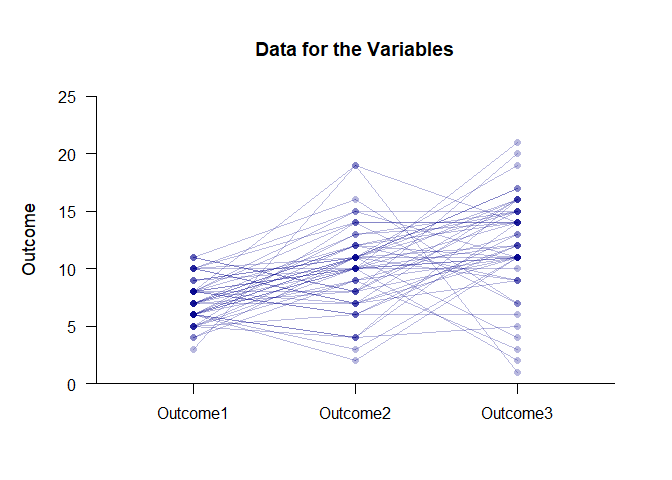
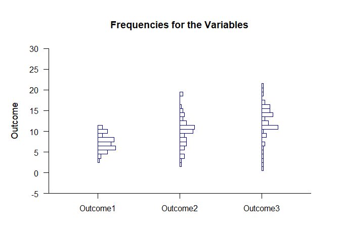

## Frequencies Repeated Measures Data Application

### Data Management

Simulate some data.

```r
Outcome1 <- round(rnorm(50,mean=7,sd=2),0)
Outcome2 <- round(rnorm(50,mean=11,sd=4),0)
Outcome3 <- round(rnorm(50,mean=12,sd=4),0)
RepeatedData <- data.frame(Outcome1,Outcome2,Outcome3)
```

### Data Plots

Plot the data and enhance with color.

```r
(RepeatedData) |> plotData(offset=0,method="overplot",connect=TRUE,col="darkblue")
```

<!-- -->

### Frequency Distributions

Describe the frequency distributions.

```r
(RepeatedData) |> describeFrequencies()
```

```
## $`Frequency Distribution for the Data: Outcome1`
##       Freq    Perc CumFreq CumPerc
## 3    1.000   2.000   1.000   2.000
## 4    2.000   4.000   3.000   6.000
## 5    6.000  12.000   9.000  18.000
## 6   11.000  22.000  20.000  40.000
## 7    8.000  16.000  28.000  56.000
## 8   10.000  20.000  38.000  76.000
## 9    3.000   6.000  41.000  82.000
## 10   6.000  12.000  47.000  94.000
## 11   3.000   6.000  50.000 100.000
## 
## $`Frequency Distribution for the Data: Outcome2`
##       Freq    Perc CumFreq CumPerc
## 2    1.000   2.000   1.000   2.000
## 3    1.000   2.000   2.000   4.000
## 4    3.000   6.000   5.000  10.000
## 6    3.000   6.000   8.000  16.000
## 7    4.000   8.000  12.000  24.000
## 8    4.000   8.000  16.000  32.000
## 9    3.000   6.000  19.000  38.000
## 10   8.000  16.000  27.000  54.000
## 11   9.000  18.000  36.000  72.000
## 12   4.000   8.000  40.000  80.000
## 13   2.000   4.000  42.000  84.000
## 14   3.000   6.000  45.000  90.000
## 15   2.000   4.000  47.000  94.000
## 16   1.000   2.000  48.000  96.000
## 19   2.000   4.000  50.000 100.000
## 
## $`Frequency Distribution for the Data: Outcome3`
##       Freq    Perc CumFreq CumPerc
## 1    1.000   2.000   1.000   2.000
## 2    1.000   2.000   2.000   4.000
## 3    1.000   2.000   3.000   6.000
## 4    1.000   2.000   4.000   8.000
## 5    1.000   2.000   5.000  10.000
## 6    1.000   2.000   6.000  12.000
## 7    2.000   4.000   8.000  16.000
## 9    3.000   6.000  11.000  22.000
## 10   1.000   2.000  12.000  24.000
## 11  10.000  20.000  22.000  44.000
## 12   4.000   8.000  26.000  52.000
## 13   2.000   4.000  28.000  56.000
## 14   7.000  14.000  35.000  70.000
## 15   5.000  10.000  40.000  80.000
## 16   5.000  10.000  45.000  90.000
## 17   2.000   4.000  47.000  94.000
## 19   1.000   2.000  48.000  96.000
## 20   1.000   2.000  49.000  98.000
## 21   1.000   2.000  50.000 100.000
```

Plot the frequency distributions and enhance with color.

```r
(RepeatedData) |> plotFrequencies(offset=0,col="darkblue")
```

<!-- -->
