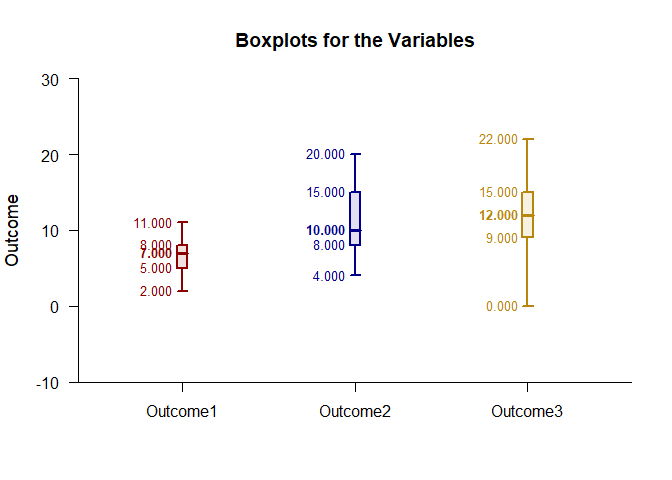

## Frequencies Repeated Measures Data Application

### Data Management

Simulate some data.

```r
Outcome1 <- round(rnorm(50,mean=7,sd=2),0)
Outcome2 <- round(rnorm(50,mean=11,sd=4),0)
Outcome3 <- round(rnorm(50,mean=12,sd=4),0)
RepeatedData <- data.frame(Outcome1,Outcome2,Outcome3)
```

### Frequency Distributions

Describe the frequency distributions.

```r
(RepeatedData) |> describeFrequencies()
```

```
## $`Frequency Distribution for the Data: Outcome1`
##       Freq    Perc CumFreq CumPerc
## 2    1.000   2.000   1.000   2.000
## 3    1.000   2.000   2.000   4.000
## 4    5.000  10.000   7.000  14.000
## 5    8.000  16.000  15.000  30.000
## 6    8.000  16.000  23.000  46.000
## 7    8.000  16.000  31.000  62.000
## 8   16.000  32.000  47.000  94.000
## 10   2.000   4.000  49.000  98.000
## 11   1.000   2.000  50.000 100.000
## 
## $`Frequency Distribution for the Data: Outcome2`
##       Freq    Perc CumFreq CumPerc
## 4    1.000   2.000   1.000   2.000
## 5    1.000   2.000   2.000   4.000
## 6    4.000   8.000   6.000  12.000
## 7    5.000  10.000  11.000  22.000
## 8    7.000  14.000  18.000  36.000
## 9    5.000  10.000  23.000  46.000
## 10   3.000   6.000  26.000  52.000
## 11   4.000   8.000  30.000  60.000
## 12   2.000   4.000  32.000  64.000
## 13   3.000   6.000  35.000  70.000
## 14   2.000   4.000  37.000  74.000
## 15   4.000   8.000  41.000  82.000
## 16   4.000   8.000  45.000  90.000
## 17   1.000   2.000  46.000  92.000
## 18   1.000   2.000  47.000  94.000
## 19   2.000   4.000  49.000  98.000
## 20   1.000   2.000  50.000 100.000
## 
## $`Frequency Distribution for the Data: Outcome3`
##       Freq    Perc CumFreq CumPerc
## 0    1.000   2.000   1.000   2.000
## 4    1.000   2.000   2.000   4.000
## 5    1.000   2.000   3.000   6.000
## 6    2.000   4.000   5.000  10.000
## 7    2.000   4.000   7.000  14.000
## 8    5.000  10.000  12.000  24.000
## 9    4.000   8.000  16.000  32.000
## 10   6.000  12.000  22.000  44.000
## 11   2.000   4.000  24.000  48.000
## 12   3.000   6.000  27.000  54.000
## 13   5.000  10.000  32.000  64.000
## 14   4.000   8.000  36.000  72.000
## 15   4.000   8.000  40.000  80.000
## 16   4.000   8.000  44.000  88.000
## 17   4.000   8.000  48.000  96.000
## 19   1.000   2.000  49.000  98.000
## 22   1.000   2.000  50.000 100.000
```

Plot the frequency distributions and enhance with color.

```r
(RepeatedData) |> plotFrequencies(offset=0,col=c("darkred","darkblue","darkgoldenrod"))
```

<!-- -->

### Boxplots

Describe the boxes.

```r
(RepeatedData) |> describeBoxes()
```

```
## $`Boxplot Statistics for the Data`
##               LW      LH     Mdn      UH      UW
## Outcome1   2.000   5.000   7.000   8.000  11.000
## Outcome2   4.000   8.000  10.000  15.000  20.000
## Outcome3   0.000   9.000  12.000  15.000  22.000
```

Plot the boxes and enhance with color.

```r
(RepeatedData) |> plotBoxes(col=c("darkred","darkblue","darkgoldenrod"))
```

<!-- -->
