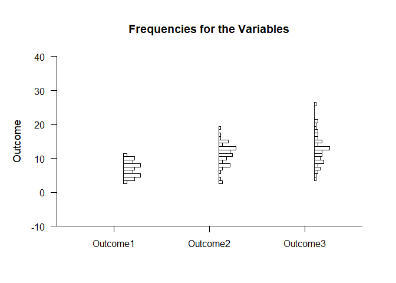
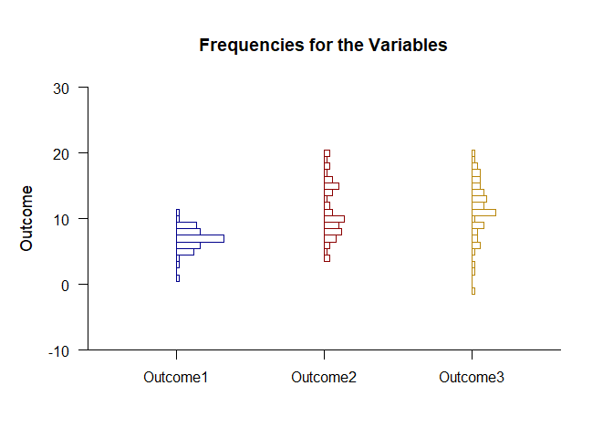
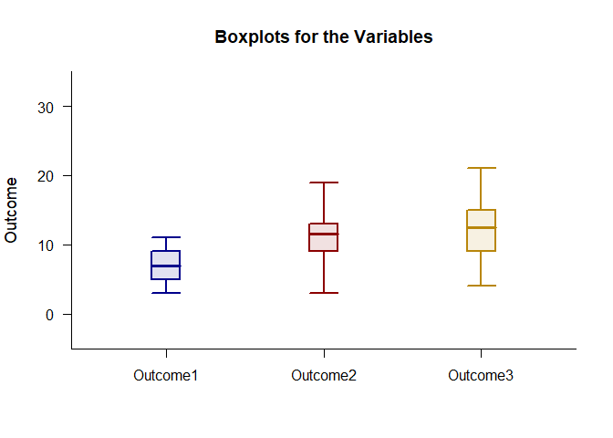

## Frequencies Repeated Measures Data Application

### Data Management

Simulate some data.

```r
Outcome1 <- round(rnorm(50,mean=7,sd=2),0)
Outcome2 <- round(rnorm(50,mean=11,sd=4),0)
Outcome3 <- round(rnorm(50,mean=12,sd=4),0)
RepeatedData <- data.frame(Outcome1,Outcome2,Outcome3)
```

### Frequency Distributions

Describe and plot the frequency distributions.

```r
(RepeatedData) |> describeFrequencies()
```

```
## $`Frequency Distribution for the Data: Outcome1`
##       Freq    Perc CumFreq CumPerc
## 1    1.000   2.000   1.000   2.000
## 3    1.000   2.000   2.000   4.000
## 4    1.000   2.000   3.000   6.000
## 5    6.000  12.000   9.000  18.000
## 6    8.000  16.000  17.000  34.000
## 7   16.000  32.000  33.000  66.000
## 8    8.000  16.000  41.000  82.000
## 9    7.000  14.000  48.000  96.000
## 10   1.000   2.000  49.000  98.000
## 11   1.000   2.000  50.000 100.000
## 
## $`Frequency Distribution for the Data: Outcome2`
##       Freq    Perc CumFreq CumPerc
## 4    2.000   4.000   2.000   4.000
## 5    1.000   2.000   3.000   6.000
## 6    2.000   4.000   5.000  10.000
## 7    4.000   8.000   9.000  18.000
## 8    6.000  12.000  15.000  30.000
## 9    5.000  10.000  20.000  40.000
## 10   7.000  14.000  27.000  54.000
## 11   3.000   6.000  30.000  60.000
## 12   2.000   4.000  32.000  64.000
## 13   1.000   2.000  33.000  66.000
## 14   3.000   6.000  36.000  72.000
## 15   5.000  10.000  41.000  82.000
## 16   3.000   6.000  44.000  88.000
## 17   1.000   2.000  45.000  90.000
## 18   2.000   4.000  47.000  94.000
## 19   1.000   2.000  48.000  96.000
## 20   2.000   4.000  50.000 100.000
## 
## $`Frequency Distribution for the Data: Outcome3`
##       Freq    Perc CumFreq CumPerc
## -1   1.000   2.000   1.000   2.000
## 2    1.000   2.000   2.000   4.000
## 3    1.000   2.000   3.000   6.000
## 5    1.000   2.000   4.000   8.000
## 6    3.000   6.000   7.000  14.000
## 7    2.000   4.000   9.000  18.000
## 8    2.000   4.000  11.000  22.000
## 9    4.000   8.000  15.000  30.000
## 10   1.000   2.000  16.000  32.000
## 11   8.000  16.000  24.000  48.000
## 12   4.000   8.000  28.000  56.000
## 13   5.000  10.000  33.000  66.000
## 14   4.000   8.000  37.000  74.000
## 15   3.000   6.000  40.000  80.000
## 16   3.000   6.000  43.000  86.000
## 17   3.000   6.000  46.000  92.000
## 18   2.000   4.000  48.000  96.000
## 19   1.000   2.000  49.000  98.000
## 20   1.000   2.000  50.000 100.000
```

```r
(RepeatedData) |> plotFrequencies()
```

<!-- -->

Enhance the frequency distribution plot by adding color.

```r
(RepeatedData) |> plotFrequencies(offset=0,col=c("darkblue","darkred","darkgoldenrod"))
```

<!-- -->

### Percentiles and Boxes

Describe the percretiles and plot the boxes.

```r
(RepeatedData) |> describePercentiles()
```

```
## $`Percentiles for the Data`
##              Min     25%     50%     75%     Max
## Outcome1   1.000   6.000   7.000   8.000  11.000
## Outcome2   4.000   8.000  10.000  15.000  20.000
## Outcome3  -1.000   9.000  12.000  14.750  20.000
```

```r
(RepeatedData) |> describeBoxes()
```

```
## $`Boxplot Statistics for the Data`
##               LW      LH     Mdn      UH      UW
## Outcome1   3.000   6.000   7.000   8.000  11.000
## Outcome2   4.000   8.000  10.000  15.000  20.000
## Outcome3   2.000   9.000  12.000  15.000  20.000
```

```r
(RepeatedData) |> plotBoxes()
```

<!-- -->

Enhance the frequency distribution plot by adding color.

```r
(RepeatedData) |> plotBoxes(values=FALSE,offset=0,scale=3,col=c("darkblue","darkred","darkgoldenrod"))
```

<!-- -->
