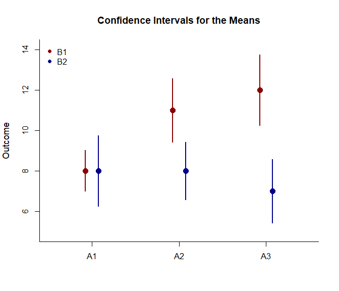
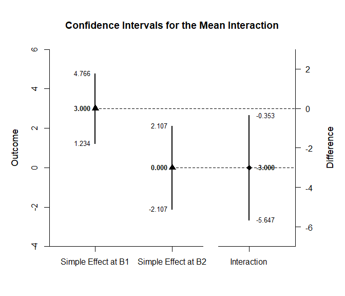

## Interaction Factorial Data Application

This page provides analyses of interactions using factorial
(between-subjects) data.

- [Data Management](#data-management)
- [Analyses of the Omnibus Design](#analyses-of-the-omnibus-design)
- [Analyses of Interaction
  Contrasts](#analyses-of-interaction-contrasts)

------------------------------------------------------------------------

### Data Management

This code inputs the variable names and creates a viewable data frame.

``` r
FactorA <- c(rep(1, 20), rep(2, 20), rep(3, 20))
FactorA <- factor(FactorA, levels = c(1, 2, 3), labels = c("A1", "A2", "A3"))
FactorB <- c(rep(1, 10), rep(2, 10), rep(1, 10), rep(2, 10), rep(1, 10), rep(2, 10))
FactorB <- factor(FactorB, levels = c(1, 2), labels = c("B1", "B2"))
Outcome <- c(6, 8, 6, 8, 10, 8, 10, 9, 8, 7, 5, 9, 10, 9, 11, 4, 11, 7, 6, 8, 7, 13, 11, 10, 13, 8, 11, 14, 12, 11, 7, 8, 7, 11, 10, 7, 8, 4, 8, 10, 9, 16, 11, 12, 15, 13, 9, 14, 11, 10, 8, 6, 8, 11, 5, 7, 9, 3, 6, 7)
FactorialData <- construct(FactorA, FactorB, Outcome)
```

### Analyses of the Omnibus Design

Get an ANOVA for the design as a whole, including a source table, an
estimate of the proportion of variance accounted for, and an ANOVA test
of the main effects and interaction.

``` r
(Outcome ~ FactorA) |> describeFactorial(by = FactorB)
```

    ## $`Source Table for the Model: Between Subjects`
    ##                    SS      df      MS
    ## Factor        106.667   1.000 106.667
    ## Blocks         30.000   2.000  15.000
    ## Factor:Blocks  63.333   2.000  31.667
    ## Residual      250.000  54.000   4.630

``` r
(Outcome ~ FactorA) |> estimateFactorial(by = FactorB)
```

    ## $`Proportion of Variance Accounted For by the Model: Between Subjects`
    ##                   Est      LL      UL
    ## Factor          0.299   0.136   0.437
    ## Blocks          0.107   0.000   0.176
    ## Factor:Blocks   0.202   0.014   0.248

``` r
(Outcome ~ FactorA) |> testFactorial(by = FactorB)
```

    ## $`Hypothesis Tests for the Model: Between Subjects`
    ##                     F     df1     df2       p
    ## Factor         23.040   1.000  54.000   0.000
    ## Blocks          3.240   2.000  54.000   0.047
    ## Factor:Blocks   6.840   2.000  54.000   0.002

Plot the means and confidence intervals for the design as a whole.

``` r
(Outcome ~ FactorA) |> plotFactorial(by = FactorB, col = c("darkred", "darkblue"))
legend("topleft", inset = .01, box.lty = 0, pch = 16, legend = c("B1", "B2"), col = c("darkred", "darkblue"))
```

<!-- -->

### Analyses of Interaction Contrasts

Identify a 2 x 2 interaction of interest (in this case, two levels of
FactorA and the existing two levels of FactorB). Estimate, plot, and
test the interaction contrast (which includes the comparisons within
each simple effect).

``` r
(Outcome ~ FactorA) |> focus(A1, A2) |> estimateInteraction(by = FactorB)
```

    ## $`Confidence Intervals for the Simple Effect Constrasts`
    ##                         Est      SE      df      LL      UL
    ## Simple Effect at B1   3.000   0.830  15.308   1.234   4.766
    ## Simple Effect at B2   0.000   1.000  17.308  -2.107   2.107
    ## 
    ## $`Confidence Interval for the Interaction Contrast`
    ##                 Est      SE      df      LL      UL
    ## Interaction  -3.000   1.300  32.129  -5.647  -0.353

``` r
(Outcome ~ FactorA) |> focus(A1, A2) |> plotInteraction(by = FactorB)
```

<!-- -->

``` r
(Outcome ~ FactorA) |> focus(A1, A2) |> testInteraction(by = FactorB)
```

    ## $`Hypothesis Tests for the Main Effect Constrasts`
    ##                         Est      SE       t      df       p
    ## Simple Effect at B1   3.000   0.830   3.614  15.308   0.002
    ## Simple Effect at B2   0.000   1.000   0.000  17.308   1.000
    ## 
    ## $`Hypothesis Test for the Interaction Contrast`
    ##                 Est      SE       t      df       p
    ## Interaction   3.000   1.300   2.308  32.129   0.028
