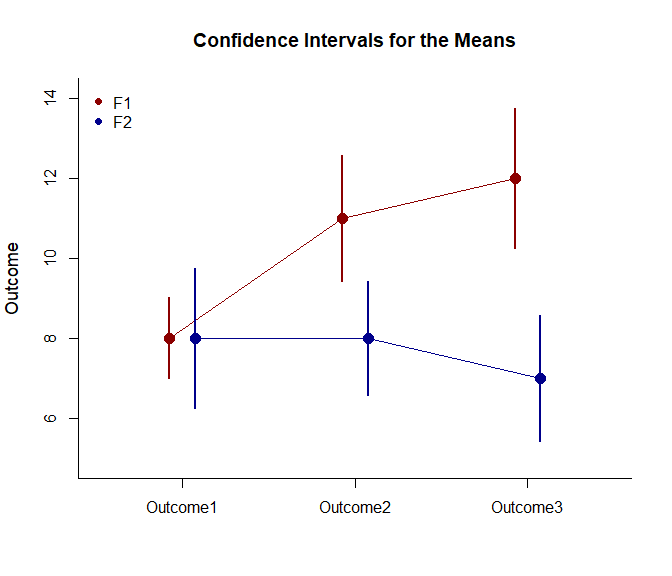
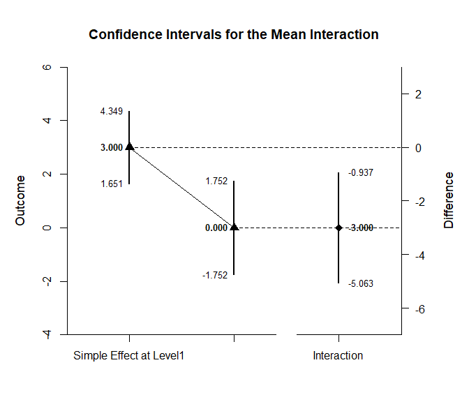

## Interaction Mixed Data Application

This page provides analyses of interactions using mixed design
(between-subjects and within-subjects) data.

- [Data Management](#data-management)
- [Analyses of the Omnibus Design](#analyses-of-the-omnibus-design)
- [Analyses of Interaction
  Contrasts](#analyses-of-interaction-contrasts)

------------------------------------------------------------------------

### Data Management

This code inputs the variable names and creates a viewable data frame.

``` r
Factor <- c(rep(1, 10), rep(2, 10))
Factor <- factor(Factor, levels = c(1, 2), labels = c("F1", "F2"))
Outcome1 <- c(6, 8, 6, 8, 10, 8, 10, 9, 8, 7, 5, 9, 10, 9, 11, 4, 11, 7, 6, 8)
Outcome2 <- c(7, 13, 11, 10, 13, 8, 11, 14, 12, 11, 7, 8, 7, 11, 10, 7, 8, 4, 8, 10)
Outcome3 <- c(9, 16, 11, 12, 15, 13, 9, 14, 11, 10, 8, 6, 8, 11, 5, 7, 9, 3, 6, 7)
MixedData <- construct(Factor, Outcome1, Outcome2, Outcome3)
```

### Analyses of the Omnibus Design

Get an ANOVA for the design as a whole, including a source table, an
estimate of the proportion of variance accounted for, and an ANOVA test
of the main effects and interaction.

``` r
construct(Outcome1, Outcome2, Outcome3) |> describeMeansFactorial(by = Factor)
```

    ## $`Source Table for the Model: Between Subjects`
    ##               SS      df      MS
    ## Blocks   106.667   1.000 106.667
    ## Subjects 152.000  18.000   8.444
    ## 
    ## $`Source Table for the Model: Within Subjects`
    ##                      SS      df      MS
    ## Measures         30.000   2.000  15.000
    ## Measures:Blocks  63.333   2.000  31.667
    ## Residual         98.000  36.000   2.722

``` r
construct(Outcome1, Outcome2, Outcome3) |> estimateMeansFactorial(by = Factor)
```

    ## $`Proportion of Variance Accounted For by the Model: Between Subjects`
    ##            Est      LL      UL
    ## Blocks   0.412   0.114   0.595
    ## 
    ## $`Proportion of Variance Accounted For by the Model: Within Subjects`
    ##                     Est      LL      UL
    ## Measures          0.234   0.040   0.385
    ## Measures:Blocks   0.393   0.163   0.528

``` r
construct(Outcome1, Outcome2, Outcome3) |> testMeansFactorial(by = Factor)
```

    ## $`Hypothesis Tests for the Model: Between Subjects`
    ##              F     df1     df2       p
    ## Blocks  12.632   1.000  18.000   0.002
    ## 
    ## $`Hypothesis Tests for the Model: Within Subjects`
    ##                       F     df1     df2       p
    ## Measures          5.510   2.000  36.000   0.008
    ## Measures:Blocks  11.633   2.000  36.000   0.000

Plot the means and confidence intervals for the design as a whole.

``` r
construct(Outcome1, Outcome2, Outcome3) |> plotMeansFactorial(by = Factor, col = c("darkred", "darkblue"))
legend("topleft", inset = .01, box.lty = 0, pch = 16, legend = c("F1", "F2"), col = c("darkred", "darkblue"))
```

<!-- -->

### Analyses of Interaction Contrasts

Identify a 2 x 2 interaction of interest (in this case, two levels of
Outcome and the existing two levels of the Factor). Estimate, plot, and
test the interaction contrast (which includes the comparisons within
each simple effect).

``` r
construct(Outcome1, Outcome2) |> estimateMeanInteraction(by = Factor)
```

    ## $`Confidence Intervals for the Simple Effect Constrasts`
    ##                         Est      SE      df      LL      UL
    ## Simple Effect at F1   3.000   0.596   9.000   1.651   4.349
    ## Simple Effect at F2   0.000   0.775   9.000  -1.752   1.752
    ## 
    ## $`Confidence Interval for the Interaction Contrast`
    ##                 Est      SE      df      LL      UL
    ## Interaction  -3.000   0.978  16.894  -5.063  -0.937

``` r
construct(Outcome1, Outcome2) |> testMeanInteraction(by = Factor)
```

    ## $`Hypothesis Tests for the Main Effect Constrasts`
    ##                         Est      SE       t      df       p
    ## Simple Effect at F1   3.000   0.596   5.031   9.000   0.001
    ## Simple Effect at F2   0.000   0.775   0.000   9.000   1.000
    ## 
    ## $`Hypothesis Test for the Interaction Contrast`
    ##                 Est      SE       t      df       p
    ## Interaction  -3.000   0.978  -3.069  16.894   0.007

``` r
construct(Outcome1, Outcome2) |> plotMeanInteraction(by = Factor)
```

<!-- -->
