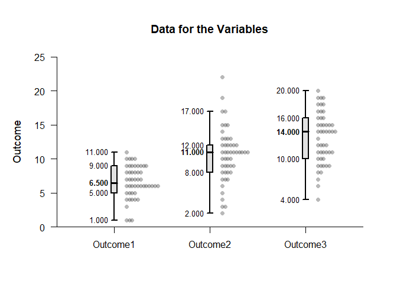
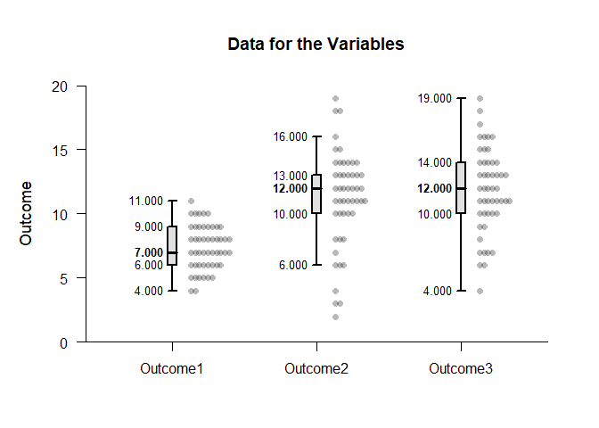
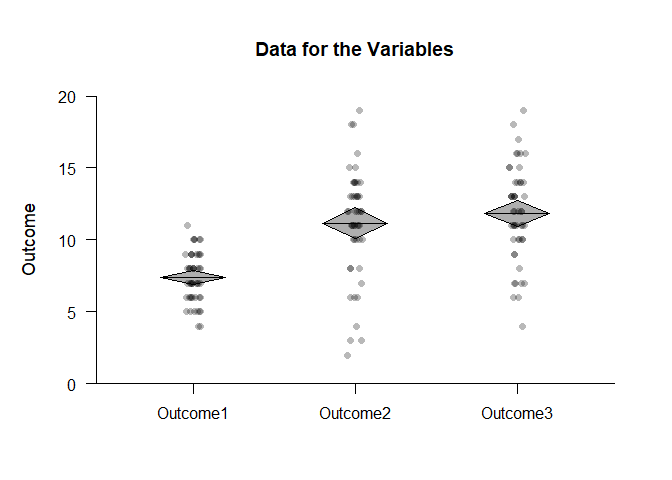
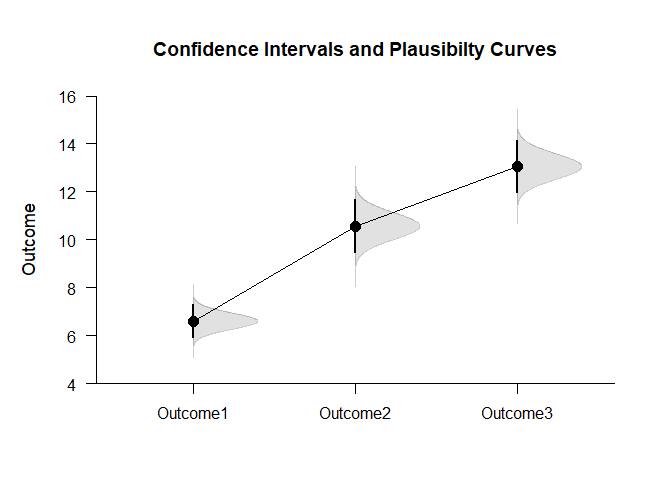

## Layers Repeated Measures Data Application

This page utilize advnaced methods to build plots that combine various
elements using repeated measures (within-subjects) data.

- [Data Management](#data-management)
- [Using the “add” Functions](#using-the-%22add%22-functions)
- [Using Passthrough Abilities](#using-passthrough-abilities)

------------------------------------------------------------------------

### Data Management

Simulate some data.

``` r
Outcome1 <- round(rnorm(50,mean=7,sd=2),0)
Outcome2 <- round(rnorm(50,mean=11,sd=4),0)
Outcome3 <- round(rnorm(50,mean=12,sd=4),0)
RepeatedData <- data.frame(Outcome1,Outcome2,Outcome3)
```

### Using the “add” Functions

The typical way to build a plot is to use sepearate calls for each
plotting elements (e.g., data, boxplots) and using the “add” parameter
to put them on the same plot.

``` r
(RepeatedData) |> plotData() 
(RepeatedData) |> plotBoxes(add=TRUE)
```

<!-- -->

This can be simplified by using an “add” version of the function call
instead of using the longer “add” parameter for the function call.

``` r
(RepeatedData) |> plotData() 
(RepeatedData) |> addBoxes()
```

<!-- -->

### Using Passthrough Abilities

Rather than separate lines for function calls, all plotting elements
have passthrough capabilites that allow the them to be placed on the
same line.

``` r
(RepeatedData) |> plotData() |> addBoxes()
```

<!-- -->

As another example, diamond plots (which represent confidence intervals)
can be combined with a jittered plot of data.

``` r
(RepeatedData) |> plotData(offset=0,method="jitter") |> addDiamonds()
```

<!-- -->

As a third example, plausibility curves can be used in conjunction with
confidence intervals for the means.

``` r
(RepeatedData) |> plotPlausible(main="Confidence Intervals and Plausibilty Curves",offset=0) |> addIntervals(values=FALSE)
```

<!-- -->
