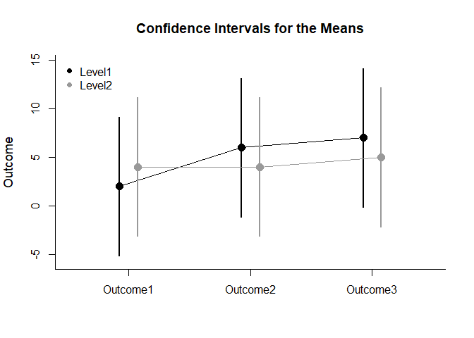
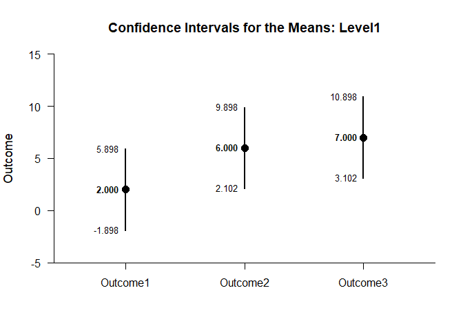
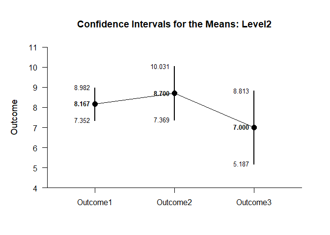
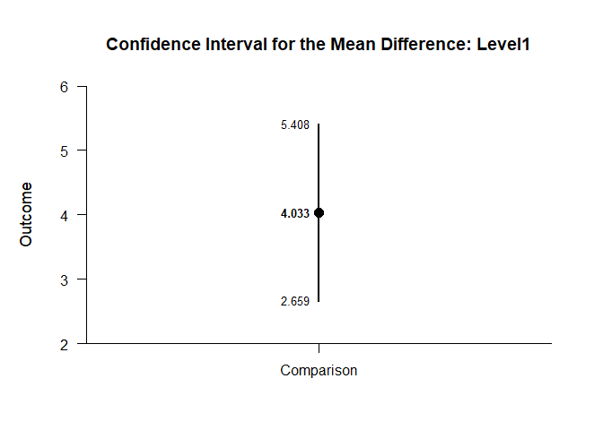

## Mixed Design (Between-Subjects and Within-Subjects) Data Applications

### Data Management

Enter the data.

```r
Factor <- c(1,1,1,1,2,2,2,2)
Outcome1 <- c(0,0,3,5,1,3,6,6)
Outcome2 <- c(4,7,4,9,3,1,6,6)
Outcome3 <- c(4,9,6,9,3,3,6,8)
Factor <- factor(Factor,levels=c(1,2),labels=c("Level1","Level2"))
MixedData <- data.frame(Factor,Outcome1,Outcome2,Outcome3)
MixedData
```

```
##   Factor Outcome1 Outcome2 Outcome3
## 1 Level1        0        4        4
## 2 Level1        0        7        9
## 3 Level1        3        4        6
## 4 Level1        5        9        9
## 5 Level2        1        3        3
## 6 Level2        3        1        3
## 7 Level2        6        6        6
## 8 Level2        6        6        8
```

#### Descriptive Statistics

Get the descriptive statistics separately for each simple effect.

```r
describeMeansBy(cbind(Outcome1,Outcome2,Outcome3),by=Factor)
```

```
## $`Descriptive Statistics for the Data: Level1`
##                N       M      SD    Skew    Kurt
## Outcome1   4.000   2.000   2.449   0.544  -2.944
## Outcome2   4.000   6.000   2.449   0.544  -2.944
## Outcome3   4.000   7.000   2.449  -0.544  -2.944
## 
## $`Descriptive Statistics for the Data: Level2`
##                N       M      SD    Skew    Kurt
## Outcome1   4.000   4.000   2.449  -0.544  -2.944
## Outcome2   4.000   4.000   2.449  -0.544  -2.944
## Outcome3   4.000   5.000   2.449   0.544  -2.944
```

### Analyses of the Omnibus and Simple Effects

Get an ANOVA for the design as a whole.

```r
describeMeansOmnibusMultifactor(cbind(Outcome1,Outcome2,Outcome3),by=Factor)
```

```
## $`Source Table for the Model: Between Subjects`
##               SS      df      MS
## Blocks     2.667   1.000   2.667
## Subjects  88.000   6.000  14.667
## 
## $`Source Table for the Model: Within Subjects`
##                      SS      df      MS
## Measures         37.333   2.000  18.667
## Measures:Blocks  21.333   2.000  10.667
## Residual         20.000  12.000   1.667
```

```r
testMeansOmnibusMultifactor(cbind(Outcome1,Outcome2,Outcome3),by=Factor)
```

```
## $`Hypothesis Tests for the Model: Between Subjects`
##              F     df1     df2       p
## Blocks   0.182   1.000   6.000   0.685
## 
## $`Hypothesis Tests for the Model: Within Subjects`
##                       F     df1     df2       p
## Measures         11.200   2.000  12.000   0.002
## Measures:Blocks   6.400   2.000  12.000   0.013
```

```r
estimateMeansOmnibusMultifactor(cbind(Outcome1,Outcome2,Outcome3),by=Factor)
```

```
## $`Proportion of Variance Accounted For by the Model: Between Subjects`
##            Est      LL      UL
## Blocks   0.029   0.000   0.330
## 
## $`Proportion of Variance Accounted For by the Model: Within Subjects`
##                     Est      LL      UL
## Measures          0.651   0.245   0.758
## Measures:Blocks   0.516   0.089   0.664
```

Get an ANOVA separately for each simple effect.

```r
describeMeansOmnibusBy(cbind(Outcome1,Outcome2,Outcome3),by=Factor)
```

```
## $`Source Table for the Model: Level1`
##               SS      df      MS
## Subjects  39.333   3.000  13.111
## Measures  56.000   2.000  28.000
## Error     14.667   6.000   2.444
## 
## $`Source Table for the Model: Level2`
##               SS      df      MS
## Subjects  48.667   3.000  16.222
## Measures   2.667   2.000   1.333
## Error      5.333   6.000   0.889
```

```r
testMeansOmnibusBy(cbind(Outcome1,Outcome2,Outcome3),by=Factor)
```

```
## $`Hypothesis Test for the Model: Level1`
##                F     df1     df2       p
## Measures  11.455   2.000   6.000   0.009
## 
## $`Hypothesis Test for the Model: Level2`
##                F     df1     df2       p
## Measures   1.500   2.000   6.000   0.296
```

```r
estimateMeansOmnibusBy(cbind(Outcome1,Outcome2,Outcome3),by=Factor)
```

```
## $`Proportion of Variance Accounted For by the Model: Level1`
##              Est      LL      UL
## Measures   0.792   0.237   0.858
## 
## $`Proportion of Variance Accounted For by the Model: Level2`
##              Est      LL      UL
## Measures   0.333   0.000   0.548
```

### Analyses of the Means

Plot the means and confidence intervals for the design as a whole.

```r
plotMeansMultifactor(cbind(Outcome1,Outcome2,Outcome3),by=Factor)
```

<!-- -->

```r
plotMeansMultifactor(cbind(Outcome1,Outcome2,Outcome3),by=Factor,conf.level=.99,col=c("black","gray60"))
legend("topleft",inset=.01,box.lty=0,pch=16,legend=c("Level1","Level2"),col=c("black","gray60"))
```

<!-- -->

Estimate, plot, test, and standardize the means separately for each simple effect.

```r
estimateMeansBy(cbind(Outcome1,Outcome2,Outcome3),by=Factor)
```

```
## $`Confidence Intervals for the Means: Level1`
##                M      SE      df      LL      UL
## Outcome1   2.000   1.225   3.000  -1.898   5.898
## Outcome2   6.000   1.225   3.000   2.102   9.898
## Outcome3   7.000   1.225   3.000   3.102  10.898
## 
## $`Confidence Intervals for the Means: Level2`
##                M      SE      df      LL      UL
## Outcome1   4.000   1.225   3.000   0.102   7.898
## Outcome2   4.000   1.225   3.000   0.102   7.898
## Outcome3   5.000   1.225   3.000   1.102   8.898
```

```r
plotMeansBy(cbind(Outcome1,Outcome2,Outcome3),by=Factor)
```

<!-- --><!-- -->

```r
testMeansBy(cbind(Outcome1,Outcome2,Outcome3),by=Factor)
```

```
## $`Hypothesis Tests for the Means: Level1`
##             Diff      SE      df       t       p
## Outcome1   2.000   1.225   3.000   1.633   0.201
## Outcome2   6.000   1.225   3.000   4.899   0.016
## Outcome3   7.000   1.225   3.000   5.715   0.011
## 
## $`Hypothesis Tests for the Means: Level2`
##             Diff      SE      df       t       p
## Outcome1   4.000   1.225   3.000   3.266   0.047
## Outcome2   4.000   1.225   3.000   3.266   0.047
## Outcome3   5.000   1.225   3.000   4.082   0.027
```

```r
estimateStandardizedMeansBy(cbind(Outcome1,Outcome2,Outcome3),by=Factor)
```

```
## $`Confidence Intervals for the Standardized Means: Level1`
##                d      SE      LL      UL
## Outcome1   0.816   0.616  -0.387   1.934
## Outcome2   2.449   0.955   0.325   4.531
## Outcome3   2.858   1.063   0.464   5.226
## 
## $`Confidence Intervals for the Standardized Means: Level2`
##                d      SE      LL      UL
## Outcome1   1.633   0.761   0.013   3.177
## Outcome2   1.633   0.761   0.013   3.177
## Outcome3   2.041   0.854   0.176   3.846
```

### Analyses of a Comparison

Analyze the specified comparison separately for each simple effect.

```r
estimateMeanDifferenceBy(cbind(Outcome1,Outcome2),by=Factor)
```

```
## $`Confidence Interval for the Mean Difference: Level1`
##               Diff      SE      df      LL      UL
## Comparison   4.000   1.225   3.000   0.102   7.898
## 
## $`Confidence Interval for the Mean Difference: Level2`
##               Diff      SE      df      LL      UL
## Comparison   0.000   0.816   3.000  -2.598   2.598
```

```r
testMeanDifferenceBy(cbind(Outcome1,Outcome2),by=Factor)
```

```
## $`Hypothesis Test for the Mean Difference: Level1`
##               Diff      SE      df       t       p
## Comparison   4.000   1.225   3.000   3.266   0.047
## 
## $`Hypothesis Test for the Mean Difference: Level2`
##               Diff      SE      df       t       p
## Comparison   0.000   0.816   3.000   0.000   1.000
```

```r
plotMeanDifferenceBy(cbind(Outcome1,Outcome2),by=Factor)
```

<!-- --><!-- -->

```r
estimateStandardizedMeanDifferenceBy(cbind(Outcome1,Outcome2),by=Factor)
```

```
## $`Confidence Interval for the Standardized Mean Difference: Level1`
##                  d      SE      LL      UL
## Comparison   1.633   0.782   0.101   3.165
## 
## $`Confidence Interval for the Standardized Mean Difference: Level2`
##                  d      SE      LL      UL
## Comparison   0.000   0.385  -0.754   0.754
```

### Analyses of a Contrast

Analyze the specified contrast separately for each simple effect.

```r
O1vsOthers <- c(-1,.5,.5)
estimateMeanContrastBy(cbind(Outcome1,Outcome2,Outcome3),by=Factor,contrast=O1vsOthers)
```

```
## $`Confidence Interval for the Mean Contrast: Level1`
##              Est      SE      df      LL      UL
## Contrast   4.500   1.258   3.000   0.496   8.504
## 
## $`Confidence Interval for the Mean Contrast: Level2`
##              Est      SE      df      LL      UL
## Contrast   0.500   0.645   3.000  -1.554   2.554
```

```r
testMeanContrastBy(cbind(Outcome1,Outcome2,Outcome3),by=Factor,contrast=O1vsOthers)
```

```
## $`Hypothesis Test for the Mean Contrast: Level1`
##              Est      SE      df       t       p
## Contrast   4.500   1.258   3.000   3.576   0.037
## 
## $`Hypothesis Test for the Mean Contrast: Level2`
##              Est      SE      df       t       p
## Contrast   0.500   0.645   3.000   0.775   0.495
```

```r
plotMeanContrastBy(cbind(Outcome1,Outcome2,Outcome3),by=Factor,contrast=O1vsOthers)
```

<!-- --><!-- -->

```r
estimateStandardizedMeanContrastBy(cbind(Outcome1,Outcome2,Outcome3),by=Factor,contrast=O1vsOthers)
```

```
## $`Confidence Interval for the Standardized Mean Contrast: Level1`
##              Est      SE      LL      UL
## Contrast   1.837   0.676   0.512   3.162
## 
## $`Confidence Interval for the Standardized Mean Contrast: Level2`
##              Est      SE      LL      UL
## Contrast   0.204   0.279  -0.344   0.752
```
