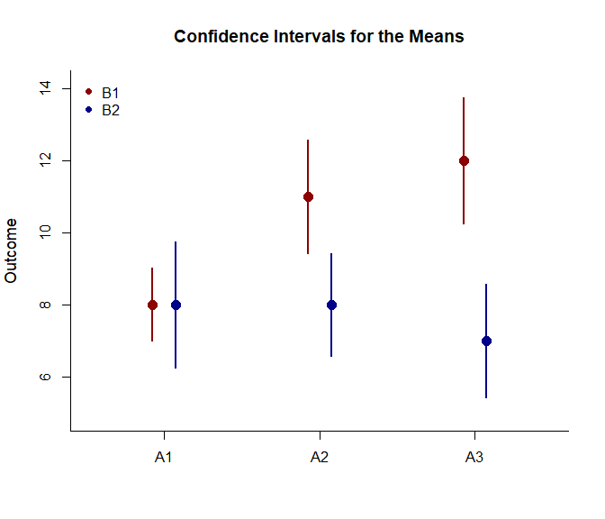

## Omnibus Factorial Data Application

This page provides an omnibus analysis using factorial
(between-subjects) data.

- [Data Management](#data-management)
- [Analyses of the Means](#analyses-of-the-means)
- [Analyses of the Omnibus and Simple
  Effects](#analyses-of-the-omnibus-and-simple-effects)

------------------------------------------------------------------------

### Data Management

This code inputs the variable names and creates a viewable data frame.

``` r
FactorA <- c(rep(1, 20), rep(2, 20), rep(3, 20))
FactorA <- factor(FactorA, levels = c(1, 2, 3), labels = c("A1", "A2", "A3"))
FactorB <- c(rep(1, 10), rep(2, 10), rep(1, 10), rep(2, 10), rep(1, 10), rep(2, 10))
FactorB <- factor(FactorB, levels = c(1, 2), labels = c("B1", "B2"))
Outcome <- c(6, 8, 6, 8, 10, 8, 10, 9, 8, 7, 5, 9, 10, 9, 11, 4, 11, 7, 6, 8, 7, 13, 11, 10, 13, 8, 11, 14, 12, 11, 7, 8, 7, 11, 10, 7, 8, 4, 8, 10, 9, 16, 11, 12, 15, 13, 9, 14, 11, 10, 8, 6, 8, 11, 5, 7, 9, 3, 6, 7)
FactorialData <- construct(FactorA, FactorB, Outcome)
```

### Analyses of the Means

Plot the means and confidence intervals for the design as a whole.

``` r
(Outcome ~ FactorA) |> plotMeansFactorial(by = FactorB, col = c("darkred", "darkblue"))
legend("topleft", inset = .01, box.lty = 0, pch = 16, legend = c("B1", "B2"), col = c("darkred", "darkblue"))
```

<!-- -->

### Analyses of the Omnibus and Simple Effects

Get an ANOVA for the design as a whole.

``` r
(Outcome ~ FactorA) |> describeMeansFactorial(by = FactorB)
```

    ## $`Source Table for the Model: Between Subjects`
    ##                    SS      df      MS
    ## Factor        106.667   1.000 106.667
    ## Blocks         30.000   2.000  15.000
    ## Factor:Blocks  63.333   2.000  31.667
    ## Residual      250.000  54.000   4.630

``` r
(Outcome ~ FactorA) |> estimateMeansFactorial(by = FactorB)
```

    ## $`Proportion of Variance Accounted For by the Model: Between Subjects`
    ##                   Est      LL      UL
    ## Factor          0.299   0.136   0.437
    ## Blocks          0.107   0.000   0.176
    ## Factor:Blocks   0.202   0.014   0.248

``` r
(Outcome ~ FactorA) |> testMeansFactorial(by = FactorB)
```

    ## $`Hypothesis Tests for the Model: Between Subjects`
    ##                     F     df1     df2       p
    ## Factor         23.040   1.000  54.000   0.000
    ## Blocks          3.240   2.000  54.000   0.047
    ## Factor:Blocks   6.840   2.000  54.000   0.002

Get an ANOVA separately for each simple effect.

``` r
(Outcome ~ FactorA) |> describeMeansEffectBy(by = FactorB)
```

    ## $`Source Table for the Model: B1`
    ##              SS      df      MS
    ## Between  86.667   2.000  43.333
    ## Within  116.000  27.000   4.296
    ## 
    ## $`Source Table for the Model: B2`
    ##              SS      df      MS
    ## Between   6.667   2.000   3.333
    ## Within  134.000  27.000   4.963

``` r
(Outcome ~ FactorA) |> estimateMeansEffectBy(by = FactorB)
```

    ## $`Proportion of Variance Accounted For by the Model: B1`
    ##            Est      LL      UL
    ## Factor   0.428   0.157   0.569
    ## 
    ## $`Proportion of Variance Accounted For by the Model: B2`
    ##            Est      LL      UL
    ## Factor   0.047   0.000   0.173

``` r
(Outcome ~ FactorA) |> testMeansEffectBy(by = FactorB)
```

    ## $`Hypothesis Test for the Model: B1`
    ##              F     df1     df2       p
    ## Factor  10.086   2.000  27.000   0.001
    ## 
    ## $`Hypothesis Test for the Model: B2`
    ##              F     df1     df2       p
    ## Factor   0.672   2.000  27.000   0.519
