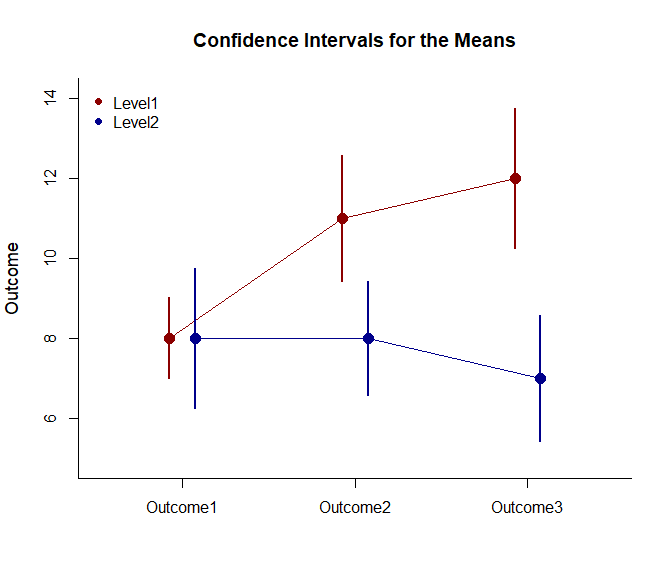

## Omnibus Mixed Data Application

This page provides an omnibus analysis using mixed design
(between-subjects and within-subjects) data.

- [Data Management](#data-management)
- [Analyses of the Means](#analyses-of-the-means)
- [Analyses of the Omnibus and Simple
  Effects](#analyses-of-the-omnibus-and-simple-effects)

------------------------------------------------------------------------

### Data Management

This code inputs the variable names and creates a viewable data frame.

``` r
Factor <- c(rep(1, 10), rep(2, 10))
Factor <- factor(Factor, levels = c(1, 2), labels = c("Level1", "Level2"))
Outcome1 <- c(6, 8, 6, 8, 10, 8, 10, 9, 8, 7, 5, 9, 10, 9, 11, 4, 11, 7, 6, 8)
Outcome2 <- c(7, 13, 11, 10, 13, 8, 11, 14, 12, 11, 7, 8, 7, 11, 10, 7, 8, 4, 8, 10)
Outcome3 <- c(9, 16, 11, 12, 15, 13, 9, 14, 11, 10, 8, 6, 8, 11, 5, 7, 9, 3, 6, 7)
MixedData <- construct(Factor, Outcome1, Outcome2, Outcome3)
```

### Analyses of the Means

Plot the means and confidence intervals for the design as a whole.

``` r
construct(Outcome1, Outcome2, Outcome3) |> plotMeansFactorial(by = Factor, col = c("darkred", "darkblue"))
legend("topleft", inset = .01, box.lty = 0, pch = 16, legend = c("Level1", "Level2"), col = c("darkred", "darkblue"))
```

<!-- -->

### Analyses of the Omnibus and Simple Effects

Get an ANOVA for the design as a whole.

``` r
construct(Outcome1, Outcome2, Outcome3) |> describeMeansFactorial(by = Factor)
```

    ## $`Source Table for the Model: Between Subjects`
    ##               SS      df      MS
    ## Blocks   106.667   1.000 106.667
    ## Subjects 152.000  18.000   8.444
    ## 
    ## $`Source Table for the Model: Within Subjects`
    ##                      SS      df      MS
    ## Measures         30.000   2.000  15.000
    ## Measures:Blocks  63.333   2.000  31.667
    ## Residual         98.000  36.000   2.722

``` r
construct(Outcome1, Outcome2, Outcome3) |> estimateMeansFactorial(by = Factor)
```

    ## $`Proportion of Variance Accounted For by the Model: Between Subjects`
    ##            Est      LL      UL
    ## Blocks   0.412   0.114   0.595
    ## 
    ## $`Proportion of Variance Accounted For by the Model: Within Subjects`
    ##                     Est      LL      UL
    ## Measures          0.234   0.040   0.385
    ## Measures:Blocks   0.393   0.163   0.528

``` r
construct(Outcome1, Outcome2, Outcome3) |> testMeansFactorial(by = Factor)
```

    ## $`Hypothesis Tests for the Model: Between Subjects`
    ##              F     df1     df2       p
    ## Blocks  12.632   1.000  18.000   0.002
    ## 
    ## $`Hypothesis Tests for the Model: Within Subjects`
    ##                       F     df1     df2       p
    ## Measures          5.510   2.000  36.000   0.008
    ## Measures:Blocks  11.633   2.000  36.000   0.000

Get an ANOVA separately for each simple effect.

``` r
construct(Outcome1, Outcome2, Outcome3) |> describeMeansEffectBy(by = Factor)
```

    ## $`Source Table for the Model: Level1`
    ##               SS      df      MS
    ## Subjects  75.333   9.000   8.370
    ## Measures  86.667   2.000  43.333
    ## Error     40.667  18.000   2.259
    ## 
    ## $`Source Table for the Model: Level2`
    ##               SS      df      MS
    ## Subjects  76.667   9.000   8.519
    ## Measures   6.667   2.000   3.333
    ## Error     57.333  18.000   3.185

``` r
construct(Outcome1, Outcome2, Outcome3) |> estimateMeansEffectBy(by = Factor)
```

    ## $`Proportion of Variance Accounted For by the Model: Level1`
    ##              Est      LL      UL
    ## Measures   0.681   0.389   0.772
    ## 
    ## $`Proportion of Variance Accounted For by the Model: Level2`
    ##              Est      LL      UL
    ## Measures   0.104   0.000   0.282

``` r
construct(Outcome1, Outcome2, Outcome3) |> testMeansEffectBy(by = Factor)
```

    ## $`Hypothesis Test for the Model: Level1`
    ##                F     df1     df2       p
    ## Measures  19.180   2.000  18.000   0.000
    ## 
    ## $`Hypothesis Test for the Model: Level2`
    ##                F     df1     df2       p
    ## Measures   1.047   2.000  18.000   0.372
