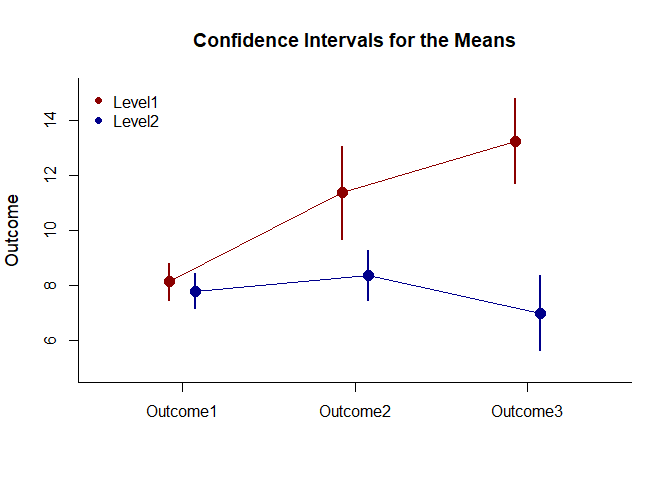

## Omnibus Mixed Data Application

This page provides an omnibus analysis using mixed design (between-subjects and within-subjects) data.

### Data Management

Simulate some data.

```r
Factor <- c(rep(1,30),rep(2,30))
Outcome1 <- c(round(rnorm(30,mean=8,sd=2),0),round(rnorm(30,mean=8,sd=2),0))
Outcome2 <- c(round(rnorm(30,mean=11,sd=4),0),round(rnorm(30,mean=8,sd=3),0))
Outcome3 <- c(round(rnorm(30,mean=12,sd=4),0),round(rnorm(30,mean=7,sd=4),0))
Factor <- factor(Factor,levels=c(1,2),labels=c("Level1","Level2"))
MixedData <- data.frame(Factor,Outcome1,Outcome2,Outcome3)
```

### Analyses of the Means

Plot the means and confidence intervals for the design as a whole.

```r
cbind(Outcome1,Outcome2,Outcome3) |> plotMeansMultifactor(by=Factor,col=c("darkred","darkblue"))
legend("topleft",inset=.01,box.lty=0,pch=16,legend=c("Level1","Level2"),col=c("darkred","darkblue"))
```

<!-- -->

### Analyses of the Omnibus and Simple Effects

Get an ANOVA for the design as a whole.

```r
cbind(Outcome1,Outcome2,Outcome3) |> describeMeansOmnibusMultifactor(by=Factor)
```

```
## $`Source Table for the Model: Between Subjects`
##               SS      df      MS
## Blocks   281.250   1.000 281.250
## Subjects 618.811  58.000  10.669
## 
## $`Source Table for the Model: Within Subjects`
##                       SS      df      MS
## Measures         123.744   2.000  61.872
## Measures:Blocks  190.633   2.000  95.317
## Residual        1020.956 116.000   8.801
```

```r
cbind(Outcome1,Outcome2,Outcome3) |> estimateMeansOmnibusMultifactor(by=Factor)
```

```
## $`Proportion of Variance Accounted For by the Model: Between Subjects`
##            Est      LL      UL
## Blocks   0.312   0.153   0.445
## 
## $`Proportion of Variance Accounted For by the Model: Within Subjects`
##                     Est      LL      UL
## Measures          0.108   0.028   0.192
## Measures:Blocks   0.157   0.061   0.248
```

```r
cbind(Outcome1,Outcome2,Outcome3) |> testMeansOmnibusMultifactor(by=Factor)
```

```
## $`Hypothesis Tests for the Model: Between Subjects`
##              F     df1     df2       p
## Blocks  26.361   1.000  58.000   0.000
## 
## $`Hypothesis Tests for the Model: Within Subjects`
##                       F     df1     df2       p
## Measures          7.030   2.000 116.000   0.001
## Measures:Blocks  10.830   2.000 116.000   0.000
```

Get an ANOVA separately for each simple effect.

```r
cbind(Outcome1,Outcome2,Outcome3) |> describeMeansOmnibusBy(by=Factor)
```

```
## $`Source Table for the Model: Level1`
##               SS      df      MS
## Subjects 365.156  29.000  12.592
## Measures 301.956   2.000 150.978
## Error    592.711  58.000  10.219
## 
## $`Source Table for the Model: Level2`
##               SS      df      MS
## Subjects 253.656  29.000   8.747
## Measures  12.422   2.000   6.211
## Error    428.244  58.000   7.384
```

```r
cbind(Outcome1,Outcome2,Outcome3) |> estimateMeansOmnibusBy(by=Factor)
```

```
## $`Proportion of Variance Accounted For by the Model: Level1`
##              Est      LL      UL
## Measures   0.338   0.163   0.458
## 
## $`Proportion of Variance Accounted For by the Model: Level2`
##              Est      LL      UL
## Measures   0.028   0.000   0.105
```

```r
cbind(Outcome1,Outcome2,Outcome3) |> testMeansOmnibusBy(by=Factor)
```

```
## $`Hypothesis Test for the Model: Level1`
##                F     df1     df2       p
## Measures  14.774   2.000  58.000   0.000
## 
## $`Hypothesis Test for the Model: Level2`
##                F     df1     df2       p
## Measures   0.841   2.000  58.000   0.436
```
