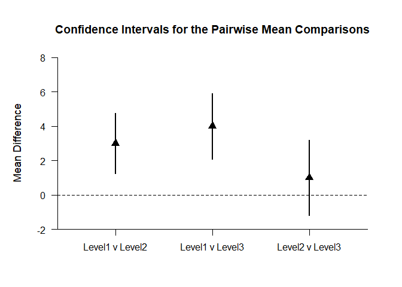
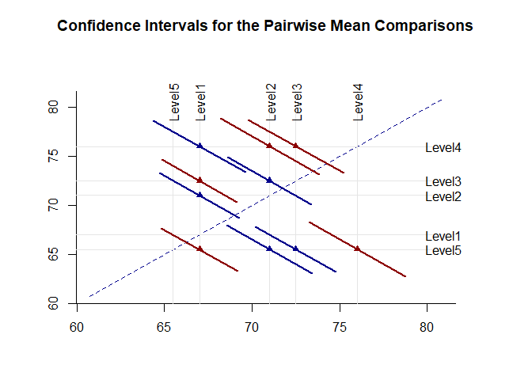
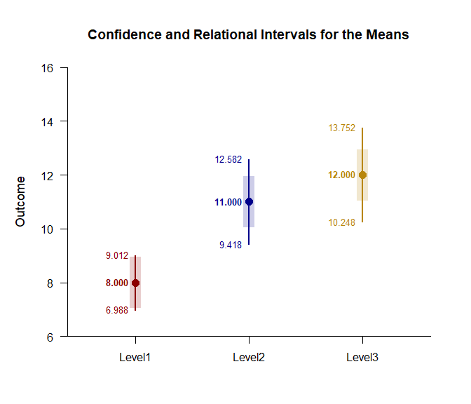
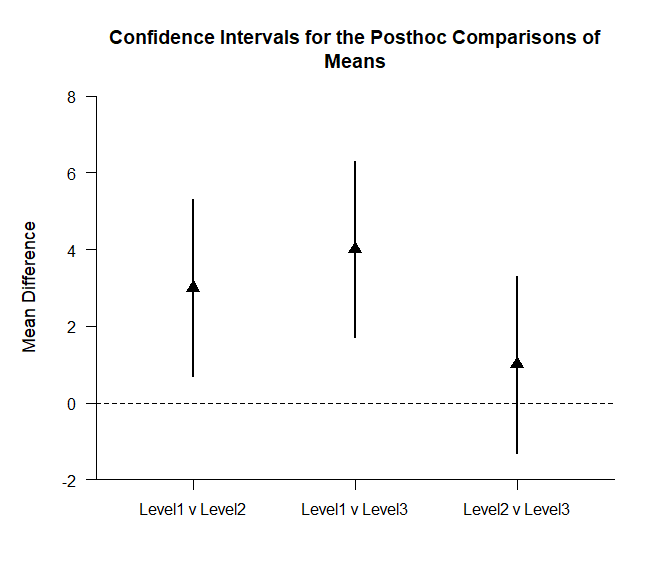
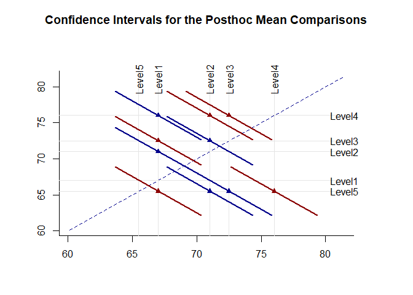

## Pairwise OneWay Data Application

This page examines unadjusted pairwise comparisons and Tukey post hoc
comparisons with traditional confidence interval plots, relational
interval plots, and diffograms using one-way (between-subjects) data.

- [Data Management](#data-management)
- [Omnibus Analyses](#omnibus-analyses)
- [Analyses of Pairwise Comparisons](#analyses-of-pairwise-comparisons)
- [Analyses of Relational Intervals](#analyses-of-relational-intervals)
- [Analyses of Post Hoc Comparisons](#analyses-of-post-hoc-comparisons)

------------------------------------------------------------------------

### Data Management

This code inputs the variable names and creates a viewable data frame.

``` r
Factor <- c(rep(1, 10), rep(2, 10), rep(3, 10))
Factor <- factor(Factor, levels = c(1, 2, 3), labels = c("Level1", "Level2", "Level3"))
Outcome <- c(6, 8, 6, 8, 10, 8, 10, 9, 8, 7, 7, 13, 11, 10, 13, 8, 11, 14, 12, 11, 9, 16, 11, 12, 15, 13, 9, 14, 11, 10)
OneWayData <- construct(Factor, Outcome)
```

### Omnibus Analyses

Provide an ANOVA source table.

``` r
(Outcome ~ Factor) |> describeEffect()
```

    ## $`Source Table for the Model`
    ##              SS      df      MS
    ## Between  86.667   2.000  43.333
    ## Within  116.000  27.000   4.296

``` r
(Outcome ~ Factor) |> testEffect()
```

    ## $`Hypothesis Test for the Model`
    ##              F     df1     df2       p
    ## Factor  10.086   2.000  27.000   0.001

### Analyses of Pairwise Comparisons

The analyses for the pairwise comparisons do not assume homogeneity of
variance and do not make adjustments for multiple comparisons (and are
therefore effectively equivalent to a series of independent samples t
tests).

Obtain tables of the interval estimates for the pairwise comparisons,
tests of their statistical significance, and their standardized effect
sizes.

``` r
(Outcome ~ Factor) |> estimatePairwise()
```

    ## $`Confidence Intervals for the Pairwise Comparisons of Means`
    ##                      MD      SE      df      LL      UL
    ## Level1 v Level2   3.000   0.830  15.308   1.234   4.766
    ## Level1 v Level3   4.000   0.894  14.400   2.087   5.913
    ## Level2 v Level3   1.000   1.043  17.815  -1.194   3.194

``` r
(Outcome ~ Factor) |> testPairwise()
```

    ## $`Hypothesis Tests for the Pairwise Comparisons of Means`
    ##                      MD      SE      df       t       p
    ## Level1 v Level2   3.000   0.830  15.308   3.614   0.002
    ## Level1 v Level3   4.000   0.894  14.400   4.472   0.000
    ## Level2 v Level3   1.000   1.043  17.815   0.958   0.351

``` r
(Outcome ~ Factor) |> standardizePairwise()
```

    ## $`Confidence Intervals for the Pairwise Standardized Comparisons of Means`
    ##                       d      SE      LL      UL
    ## Level1 v Level2   1.616   0.555   0.529   2.703
    ## Level1 v Level3   2.000   0.601   0.822   3.178
    ## Level2 v Level3   0.429   0.477  -0.506   1.363

Provide a traditional plot of the confidence intervals for the pairwise
comparisons (including a line that represents no difference for the
comparisons).

``` r
(Outcome ~ Factor) |> plotPairwise(line = 0, values = FALSE)
```

<!-- -->

Provide a diffogram (plot of means and the confidence intervals for the
pairwise comparisons) and specify colors for intervals that do not
include zero (darkblue) and those that do include zero (darkred).

``` r
(Outcome ~ Factor) |> plotPairwiseDiffogram(col = c("darkblue", "darkred"))
```

<!-- -->

### Analyses of Relational Intervals

The analyses for the relational confidence intervals do assume
homogeneity of variance but do not make adjustments for multiple
comparisons.

Provide estimates of the arelational and relational intervals.

``` r
(Outcome ~ Factor) |> estimateRelational()
```

    ## $`Confidence and Relational Intervals for the Means`
    ##              M   RI.LL   RI.UL   CI.LL   CI.UL
    ## Level1   8.000   7.049   8.951   6.988   9.012
    ## Level2  11.000  10.049  11.951   9.418  12.582
    ## Level3  12.000  11.049  12.951  10.248  13.752

Plot the intervals and enhance with color.

``` r
(Outcome ~ Factor) |> plotRelational(col = c("darkred", "darkblue", "darkgoldenrod"))
```

<!-- -->

### Analyses of Post Hoc Comparisons

The analyses for the post hoc comparisons do assume homogeneity of
variance and do make adjustments for multiple comparisons (based on
Tukey HSD procedures).

Obtain tables of the interval estimates for the posthoc comparisons,
tests of their statistical significance, and their standardized effect
sizes.

``` r
(Outcome ~ Factor) |> estimatePosthoc()
```

    ## $`Confidence Intervals for the Posthoc Comparisons of Means`
    ##                    Diff      SE      df      LL      UL
    ## Level1 v Level2   3.000   0.927  27.000   0.702   5.298
    ## Level1 v Level3   4.000   0.927  27.000   1.702   6.298
    ## Level2 v Level3   1.000   0.927  27.000  -1.298   3.298

``` r
(Outcome ~ Factor) |> testPairwise()
```

    ## $`Hypothesis Tests for the Pairwise Comparisons of Means`
    ##                      MD      SE      df       t       p
    ## Level1 v Level2   3.000   0.830  15.308   3.614   0.002
    ## Level1 v Level3   4.000   0.894  14.400   4.472   0.000
    ## Level2 v Level3   1.000   1.043  17.815   0.958   0.351

``` r
(Outcome ~ Factor) |> standardizePosthoc()
```

    ## $`Confidence Intervals for the Posthoc Standardized Comparisons of Means`
    ##                       d      SE      LL      UL
    ## Level1 v Level2   1.616   0.555   0.529   2.703
    ## Level1 v Level3   2.000   0.601   0.822   3.178
    ## Level2 v Level3   0.429   0.477  -0.506   1.363

Provide a traditional plot of the confidence intervals for the post hoc
comparisons (including a line that represents no difference for the
comparisons).

``` r
(Outcome ~ Factor) |> plotPosthoc(line = 0, values = FALSE)
```

<!-- -->

Provide a diffogram (plot of means and the confidence intervals for the
post hoc comparisons) and specify colors for intervals that do not
include zero (darkblue) and those that do include zero (darkred).

``` r
(Outcome ~ Factor) |> plotPosthocDiffogram(col = c("darkblue", "darkred"))
```

<!-- -->
