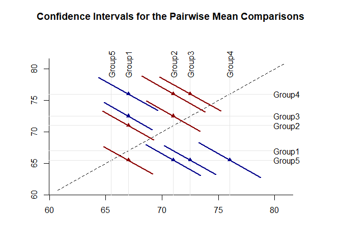
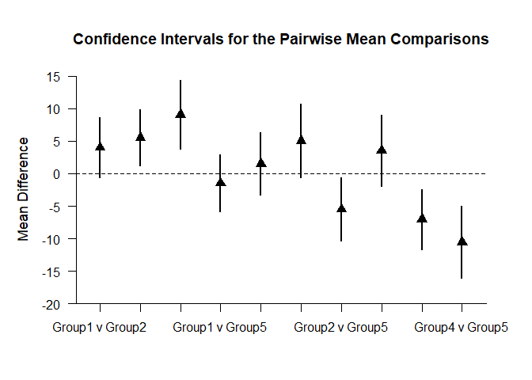
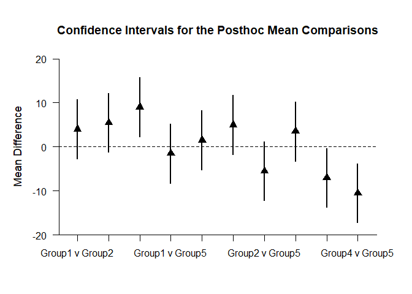

## Pairwise OneWay Data Applications

### Data Management


```r
Factor <- c(rep(1,4),rep(2,4),rep(3,4))
Outcome <- c(0,0,3,5,4,7,4,9,9,6,4,9)
Factor <- factor(Factor,levels=c(1,2,3),labels=c("Level1","Level2","Level3"))
OneWayData <- data.frame(Factor,Outcome)
```

### Descriptive Statistics

Provide descriptive statistics for the groups.

```r
describeMeans(Outcome~Factor)
```

```
## $`Descriptive Statistics for the Data`
##              N       M      SD    Skew    Kurt
## Level1   4.000   2.000   2.449   0.544  -2.944
## Level2   4.000   6.000   2.449   0.544  -2.944
## Level3   4.000   7.000   2.449  -0.544  -2.944
```

### Analyses of Pairwise Comparisons

The analyses for the pairwise comparisons do not assume homogeneity of variance and do not make adjustments for multiple comparisons (and are therefore effectively equivalent to a series of independent samples t tests).

Provide a diffogram (plot of means and the confidence intervals for the pairwise comparisons) and specify colors for intervals that do not include zero (darkblue) and those that do include zero (darkred).

```r
plotMeansPairwiseDiffogram(Outcome~Factor,col=c("darkblue","darkred"))
```

<!-- -->

Provide a traditional plot of the confidence intervals for the pairwise comparisons (including a line that represents no difference for the comparisons).

```r
plotMeansPairwise(Outcome~Factor,line=0)
```

<!-- -->

Obtain a table of the point and interval estimates for the pairwise comparisons.

```r
estimateMeansPairwise(Outcome~Factor)
```

```
## $`Confidence Intervals for the Pairwise Mean Comparisons`
##                      MD      SE      df      LL      UL
## Level1 v Level2   4.000   1.732   6.000  -0.238   8.238
## Level1 v Level3   5.000   1.732   6.000   0.762   9.238
## Level2 v Level3   1.000   1.732   6.000  -3.238   5.238
```
Test the pairwise comparisons for statistical significance.

```r
testMeansPairwise(Outcome~Factor)
```

```
## $`Hypothesis Tests for the Pairwise Mean Comparisons`
##                      MD      SE      df       t       p
## Level1 v Level2   4.000   1.732   6.000   2.309   0.060
## Level1 v Level3   5.000   1.732   6.000   2.887   0.028
## Level2 v Level3   1.000   1.732   6.000   0.577   0.585
```
Obtain standardized mean difference and their confidence intervals for the pairwise comparisons.

```r
estimateStandardizedMeansPairwise(Outcome~Factor)
```

```
## $`Confidence Intervals for the Pairwise Standardized Mean Comparisons`
##                       d      SE      LL      UL
## Level1 v Level2   1.633   0.943  -0.215   3.481
## Level1 v Level3   2.041   1.007   0.068   4.015
## Level2 v Level3   0.408   0.825  -1.209   2.025
```

### Analyses of Post Hoc Comparisons

The analyses for the post hoc comparisons do assume homogeneity of variance and do make adjustments for multiple comparisons (based on Tukey HSD procedures).

Provide a diffogram (plot of means and the confidence intervals for the post hoc comparisons)and specify colors for intervals that do not include zero (darkblue) and those that do include zero (darkred).

```r
plotMeansPosthocDiffogram(Outcome~Factor,col=c("darkblue","darkred"))
```

<!-- -->

Provide a traditional plot of the confidence intervals for the post hoc comparisons (including a line that represents no difference for the comparisons).

```r
plotMeansPosthoc(Outcome~Factor,line=0)
```

<!-- -->

Obtain a table of the point and interval estimates for the post hoc comparisons.

```r
estimateMeansPosthoc(Outcome~Factor)
```

```
## $`Confidence Intervals for the Posthoc Mean Comparisons`
##                    Diff      SE      df      LL      UL
## Level1 v Level2   4.000   1.732   9.000  -0.836   8.836
## Level1 v Level3   5.000   1.732   9.000   0.164   9.836
## Level2 v Level3   1.000   1.732   9.000  -3.836   5.836
```
Test the post hoc comparisons for statistical significance.

```r
testMeansPairwise(Outcome~Factor)
```

```
## $`Hypothesis Tests for the Pairwise Mean Comparisons`
##                      MD      SE      df       t       p
## Level1 v Level2   4.000   1.732   6.000   2.309   0.060
## Level1 v Level3   5.000   1.732   6.000   2.887   0.028
## Level2 v Level3   1.000   1.732   6.000   0.577   0.585
```
Obtain standardized mean difference and their confidence intervals for the post hoc comparisons.

```r
estimateStandardizedMeansPosthoc(Outcome~Factor)
```

```
## $`Confidence Intervals for the Posthoc Standardized Mean Comparisons`
##                       d      SE      LL      UL
## Level1 v Level2   1.633   0.943  -0.215   3.481
## Level1 v Level3   2.041   1.007   0.068   4.015
## Level2 v Level3   0.408   0.825  -1.209   2.025
```
