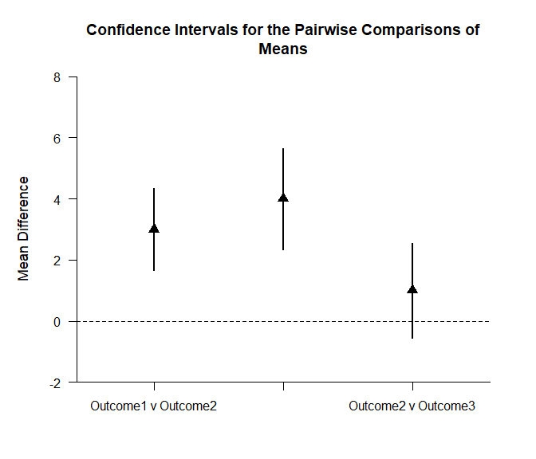
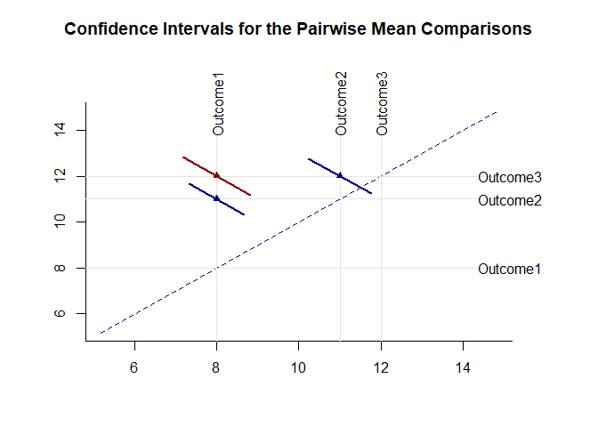
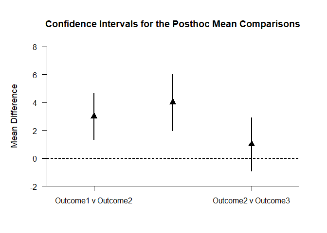
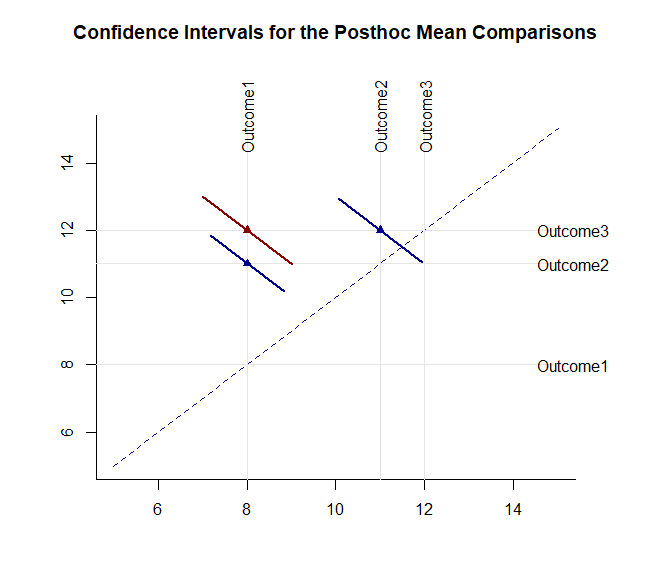

## Pairwise Repeated Data Application

### Data Management

Enter the data.

```r
Outcome1 <-c(61,64,72,64,64,70,73,65,65,72)
Outcome2 <- c(69,74,79,69,64,64,69,69,74,79)
Outcome3 <- c(70,75,80,80,70,65,70,75,70,70) 
Outcome4 <- c(70,80,85,75,70,65,75,75,85,80)
Outcome5 <- c(65,55,70,65,65,70,70,60,65,70)
RepeatedData <- data.frame(Outcome1,Outcome2,Outcome3,Outcome4,Outcome5)
```

### Omnibus Analyses

Provide descriptive statistics and an ANOVA source table.

```r
(RepeatedData) |> describeMeans()
```

```
## $`Descriptive Statistics for the Data`
##                N       M      SD    Skew    Kurt
## Outcome1  10.000  67.000   4.295   0.316  -1.646
## Outcome2  10.000  71.000   5.375   0.322  -0.882
## Outcome3  10.000  72.500   4.859   0.454  -0.516
## Outcome4  10.000  76.000   6.583  -0.088  -0.751
## Outcome5  10.000  65.500   4.972  -1.085   0.914
```

```r
(RepeatedData) |> describeMeansOmnibus()
```

```
## $`Source Table for the Model`
##               SS      df      MS
## Subjects 529.200   9.000  58.800
## Measures 717.000   4.000 179.250
## Error    721.800  36.000  20.050
```

```r
(RepeatedData) |> testMeansOmnibus()
```

```
## $`Hypothesis Test for the Model`
##                F     df1     df2       p
## Measures   8.940   4.000  36.000   0.000
```

### Analyses of Pairwise Comparisons

The analyses for the pairwise comparisons do not assume homogeneity of variance and do not make adjustments for multiple comparisons (and are therefore effectively equivalent to a series of paired samples t tests).

Obtain tables of the interval estimates for the pairwise comparisons, tests of their statistical significance, and their standardized effect sizes.

```r
(RepeatedData) |> estimateMeansPairwise()
```

```
## $`Confidence Intervals for the Pairwise Mean Comparisons`
##                        Diff      SE      df      LL      UL
## Outcome1 v Outcome2   4.000   1.751   9.000   0.039   7.961
## Outcome1 v Outcome3   5.500   2.156   9.000   0.622  10.378
## Outcome1 v Outcome4   9.000   2.226   9.000   3.964  14.036
## Outcome1 v Outcome5  -1.500   1.147   9.000  -4.096   1.096
## Outcome2 v Outcome3   1.500   1.740   9.000  -2.436   5.436
## Outcome2 v Outcome4   5.000   1.000   9.000   2.738   7.262
## Outcome2 v Outcome5  -5.500   2.242   9.000 -10.572  -0.428
## Outcome3 v Outcome4   3.500   1.833   9.000  -0.647   7.647
## Outcome3 v Outcome5  -7.000   2.494   9.000 -12.643  -1.357
## Outcome4 v Outcome5 -10.500   2.734   9.000 -16.684  -4.316
```

```r
(RepeatedData) |> testMeansPairwise()
```

```
## $`Hypothesis Tests for the Pairwise Mean Comparisons`
##                        Diff      SE      df       t       p
## Outcome1 v Outcome2   4.000   1.751   9.000   2.284   0.048
## Outcome1 v Outcome3   5.500   2.156   9.000   2.551   0.031
## Outcome1 v Outcome4   9.000   2.226   9.000   4.043   0.003
## Outcome1 v Outcome5  -1.500   1.147   9.000  -1.307   0.224
## Outcome2 v Outcome3   1.500   1.740   9.000   0.862   0.411
## Outcome2 v Outcome4   5.000   1.000   9.000   5.000   0.001
## Outcome2 v Outcome5  -5.500   2.242   9.000  -2.453   0.037
## Outcome3 v Outcome4   3.500   1.833   9.000   1.909   0.089
## Outcome3 v Outcome5  -7.000   2.494   9.000  -2.806   0.021
## Outcome4 v Outcome5 -10.500   2.734   9.000  -3.841   0.004
```

```r
(RepeatedData) |> estimateStandardizedMeansPairwise()
```

```
## $`Confidence Intervals for the Pairwise Standardized Mean Comparisons`
##                           d      SE      LL      UL
## Outcome1 v Outcome2   0.822   0.407   0.024   1.621
## Outcome1 v Outcome3   1.199   0.434   0.349   2.050
## Outcome1 v Outcome4   1.619   0.491   0.656   2.582
## Outcome1 v Outcome5  -0.323   0.382  -1.072   0.426
## Outcome2 v Outcome3   0.293   0.381  -0.454   1.039
## Outcome2 v Outcome4   0.832   0.407   0.033   1.631
## Outcome2 v Outcome5  -1.062   0.422  -1.889  -0.236
## Outcome3 v Outcome4   0.605   0.397  -0.174   1.384
## Outcome3 v Outcome5  -1.424   0.454  -2.313  -0.535
## Outcome4 v Outcome5  -1.800   0.503  -2.785  -0.815
```

Provide a traditional plot of the confidence intervals for the pairwise comparisons (including a line that represents no difference for the comparisons).

```r
(RepeatedData) |> plotMeansPairwise(line=0,values=FALSE)
```

<!-- -->

Provide a diffogram (plot of means and the confidence intervals for the pairwise comparisons)and specify colors for intervals that do not include zero (darkblue) and those that do include zero (darkred).

```r
(RepeatedData) |> plotMeansPairwiseDiffogram(col=c("darkblue","darkred"))
```

<!-- -->

### Analyses of Post Hoc Comparisons

The analyses for the post hoc comparisons do assume homogeneity of variance and do make adjustments for multiple comparisons (based on Tukey HSD procedures).

Obtain tables of the interval estimates for the posthoc comparisons, tests of their statistical significance, and their standardized effect sizes.

```r
(RepeatedData) |> estimateMeansPosthoc()
```

```
## $`Confidence Intervals for the Posthoc Mean Comparisons`
##                        Diff      SE      df      LL      UL
## Outcome1 v Outcome2   4.000   1.751   9.000  -1.889   9.889
## Outcome1 v Outcome3   5.500   2.156   9.000  -1.751  12.751
## Outcome1 v Outcome4   9.000   2.226   9.000   1.515  16.485
## Outcome1 v Outcome5  -1.500   1.147   9.000  -5.358   2.358
## Outcome2 v Outcome3   1.500   1.740   9.000  -4.351   7.351
## Outcome2 v Outcome4   5.000   1.000   9.000   1.637   8.363
## Outcome2 v Outcome5  -5.500   2.242   9.000 -13.040   2.040
## Outcome3 v Outcome4   3.500   1.833   9.000  -2.665   9.665
## Outcome3 v Outcome5  -7.000   2.494   9.000 -15.388   1.388
## Outcome4 v Outcome5 -10.500   2.734   9.000 -19.692  -1.308
```

```r
(RepeatedData) |> testMeansPairwise()
```

```
## $`Hypothesis Tests for the Pairwise Mean Comparisons`
##                        Diff      SE      df       t       p
## Outcome1 v Outcome2   4.000   1.751   9.000   2.284   0.048
## Outcome1 v Outcome3   5.500   2.156   9.000   2.551   0.031
## Outcome1 v Outcome4   9.000   2.226   9.000   4.043   0.003
## Outcome1 v Outcome5  -1.500   1.147   9.000  -1.307   0.224
## Outcome2 v Outcome3   1.500   1.740   9.000   0.862   0.411
## Outcome2 v Outcome4   5.000   1.000   9.000   5.000   0.001
## Outcome2 v Outcome5  -5.500   2.242   9.000  -2.453   0.037
## Outcome3 v Outcome4   3.500   1.833   9.000   1.909   0.089
## Outcome3 v Outcome5  -7.000   2.494   9.000  -2.806   0.021
## Outcome4 v Outcome5 -10.500   2.734   9.000  -3.841   0.004
```

```r
(RepeatedData) |> estimateStandardizedMeansPosthoc()
```

```
## $`Confidence Intervals for the Posthoc Standardized Mean Comparisons`
##                           d      SE      LL      UL
## Outcome1 v Outcome2   0.822   0.407   0.024   1.621
## Outcome1 v Outcome3   1.199   0.434   0.349   2.050
## Outcome1 v Outcome4   1.619   0.491   0.656   2.582
## Outcome1 v Outcome5  -0.323   0.382  -1.072   0.426
## Outcome2 v Outcome3   0.293   0.381  -0.454   1.039
## Outcome2 v Outcome4   0.832   0.407   0.033   1.631
## Outcome2 v Outcome5  -1.062   0.422  -1.889  -0.236
## Outcome3 v Outcome4   0.605   0.397  -0.174   1.384
## Outcome3 v Outcome5  -1.424   0.454  -2.313  -0.535
## Outcome4 v Outcome5  -1.800   0.503  -2.785  -0.815
```

Provide a traditional plot of the confidence intervals for the post hoc comparisons (including a line that represents no difference for the comparisons).

```r
(RepeatedData) |> plotMeansPosthoc(line=0,values=FALSE)
```

<!-- -->

Provide a diffogram (plot of means and the confidence intervals for the post hoc comparisons) and specify colors for intervals that do not include zero (darkblue) and those that do include zero (darkred).

```r
(RepeatedData) |> plotMeansPosthocDiffogram(col=c("darkblue","darkred"))
```

<!-- -->
