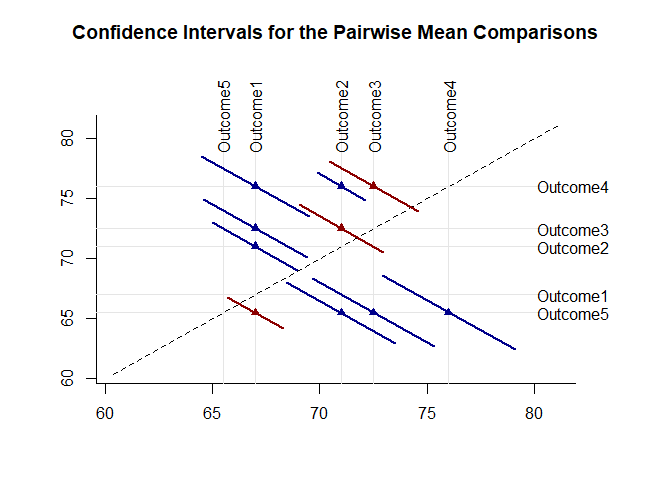

## Pairwise Repeated Data Applications

### Data Management


```r
Outcome1 <- c(0,0,3,5)
Outcome2 <- c(4,7,4,9)
Outcome3 <- c(9,6,4,9)
RepeatedData <- data.frame(Outcome1,Outcome2,Outcome3)
```

### Descriptive Statistics

Provide descriptive statistics for the variables.

```r
describeMeans(RepeatedData)
```

```
## $`Descriptive Statistics for the Data`
##                N       M      SD    Skew    Kurt
## Outcome1   4.000   2.000   2.449   0.544  -2.944
## Outcome2   4.000   6.000   2.449   0.544  -2.944
## Outcome3   4.000   7.000   2.449  -0.544  -2.944
```

### Analyses of Pairwise Comparisons

The analyses for the pairwise comparisons do not assume homogeneity of variance and do not make adjustments for multiple comparisons (and are therefore effectively equivalent to a series of paired samples t tests).

Provide a diffogram (plot of means and the confidence intervals for the pairwise comparisons)and specify colors for intervals that do not include zero (darkblue) and those that do include zero (darkred).

```r
plotMeansPairwiseDiffogram(RepeatedData,col=c("darkblue","darkred"))
```

<!-- -->

Provide a traditional plot of the confidence intervals for the pairwise comparisons (including a line that represents no difference for the comparisons).

```r
plotMeansPairwise(RepeatedData,line=0)
```

<!-- -->

Obtain a table of the point and interval estimates for the pairwise comparisons.

```r
estimateMeansPairwise(RepeatedData)
```

```
## $`Confidence Intervals for the Pairwise Mean Comparisons`
##                        Diff      SE      df      LL      UL
## Outcome1 v Outcome2   4.000   1.225   3.000   0.102   7.898
## Outcome1 v Outcome3   5.000   1.683   3.000  -0.357  10.357
## Outcome2 v Outcome3   1.000   1.354   3.000  -3.309   5.309
```
Test the pairwise comparisons for statistical significance.

```r
testMeansPairwise(RepeatedData)
```

```
## $`Hypothesis Tests for the Pairwise Mean Comparisons`
##                        Diff      SE      df       t       p
## Outcome1 v Outcome2   4.000   1.225   3.000   3.266   0.047
## Outcome1 v Outcome3   5.000   1.683   3.000   2.970   0.059
## Outcome2 v Outcome3   1.000   1.354   3.000   0.739   0.514
```
Obtain standardized mean difference and their confidence intervals for the pairwise comparisons.

```r
estimateStandardizedMeansPairwise(RepeatedData)
```

```
## $`Confidence Intervals for the Pairwise Standardized Mean Comparisons`
##                           d      SE      LL      UL
## Outcome1 v Outcome2   1.633   0.782   0.101   3.165
## Outcome1 v Outcome3   2.041   0.876   0.324   3.758
## Outcome2 v Outcome3   0.408   0.592  -0.752   1.569
```

### Analyses of Post Hoc Comparisons

The analyses for the post hoc comparisons do assume homogeneity of variance and do make adjustments for multiple comparisons (based on Tukey HSD procedures).

Provide a diffogram (plot of means and the confidence intervals for the post hoc comparisons) and specify colors for intervals that do not include zero (darkblue) and those that do include zero (darkred).

```r
plotMeansPosthocDiffogram(RepeatedData,col=c("darkblue","darkred"))
```

<!-- -->

Provide a traditional plot of the confidence intervals for the post hoc comparisons (including a line that represents no difference for the comparisons).

```r
plotMeansPosthoc(RepeatedData,line=0)
```

<!-- -->

Obtain a table of the point and interval estimates for the post hoc comparisons.

```r
estimateMeansPosthoc(RepeatedData)
```

```
## $`Confidence Intervals for the Posthoc Mean Comparisons`
##                        Diff      SE      df      LL      UL
## Outcome1 v Outcome2   4.000   1.225   3.000  -1.118   9.118
## Outcome1 v Outcome3   5.000   1.683   3.000  -2.034  12.034
## Outcome2 v Outcome3   1.000   1.354   3.000  -4.658   6.658
```
Test the post hoc comparisons for statistical significance.

```r
testMeansPairwise(RepeatedData)
```

```
## $`Hypothesis Tests for the Pairwise Mean Comparisons`
##                        Diff      SE      df       t       p
## Outcome1 v Outcome2   4.000   1.225   3.000   3.266   0.047
## Outcome1 v Outcome3   5.000   1.683   3.000   2.970   0.059
## Outcome2 v Outcome3   1.000   1.354   3.000   0.739   0.514
```
Obtain standardized mean difference and their confidence intervals for the post hoc comparisons.

```r
estimateStandardizedMeansPosthoc(RepeatedData)
```

```
## $`Confidence Intervals for the Posthoc Standardized Mean Comparisons`
##                           d      SE      LL      UL
## Outcome1 v Outcome2   1.633   0.782   0.101   3.165
## Outcome1 v Outcome3   2.041   0.876   0.324   3.758
## Outcome2 v Outcome3   0.408   0.592  -0.752   1.569
```
