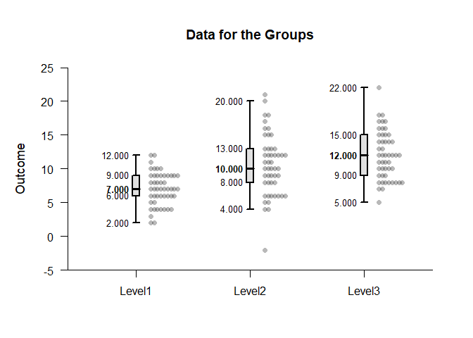
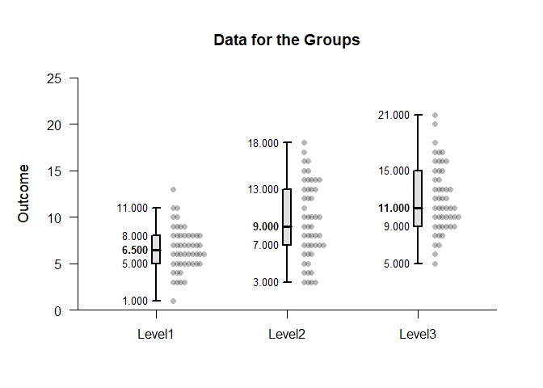
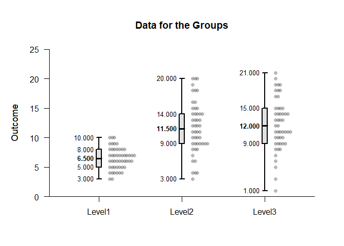
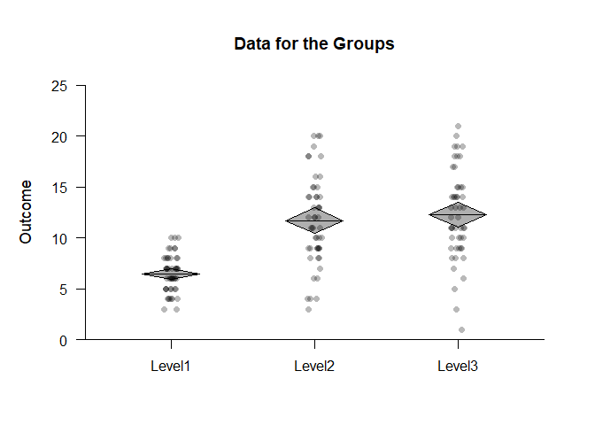
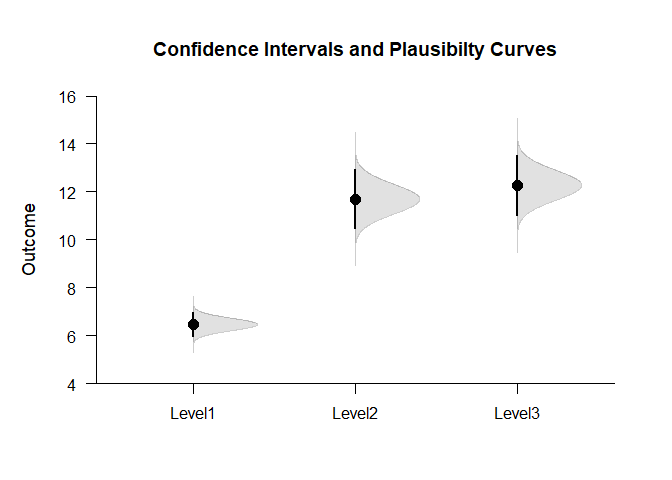

## Passthrough One Way Data Application

This page utilizes passthrough capabilities and pipe operators to build plots that combine various elements using one-way (between-subjects) data.

### Data Management

Enter the data.

```r
Factor <- c(rep(1,50),rep(2,50),rep(3,50))
Factor <- factor(Factor,levels=c(1,2,3),labels=c("Level1","Level2","Level3"))
Level1 <- round(rnorm(50,mean=7,sd=2),0)
Level2 <- round(rnorm(50,mean=11,sd=4),0)
Level3 <- round(rnorm(50,mean=12,sd=4),0)
Outcome <- c(Level1,Level2,Level3)
```

### Using the "add" Functions

The typical way to build a plot is to use sepearate calls for each plotting elements (e.g., data, boxplots) and using the "add" parameter to put them on the same plot.

```r
(Outcome~Factor) |> plotData() 
(Outcome~Factor) |> plotBoxes(add=TRUE)
```

<!-- -->

This can be simplified by using an "add" version of the function call instead of using the longer "add" parameter for the function call.

```r
(Outcome~Factor) |> plotData() 
(Outcome~Factor) |> addBoxes()
```

<!-- -->

### Using Passthrough Abilities

Rather than separate lines for function calls, all plotting elements have passthrough capabilites that allow the them to be placed on the same line.

```r
(Outcome~Factor) |> plotData() |> addBoxes()
```

<!-- -->

As another example, diamond plots (which represent confidence intervals) can be combined with a jittered plot of data.

```r
(Outcome~Factor) |> plotData(offset=0,method="jitter") |> addDiamonds()
```

<!-- -->

As a third example, plausibility curves can be used in conjunction with confidence intervals for the means.

```r
(Outcome~Factor) |> plotPlausible(main="Confidence Intervals and Plausibilty Curves",offset=0) |> addIntervals(values=FALSE)
```

<!-- -->
