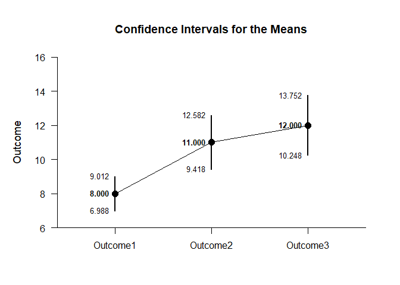
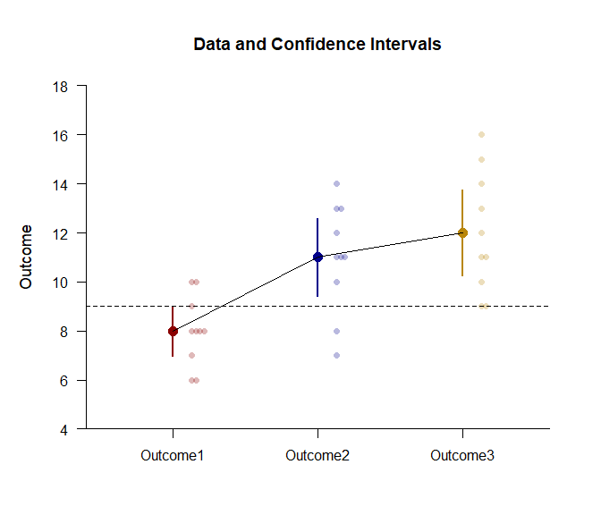
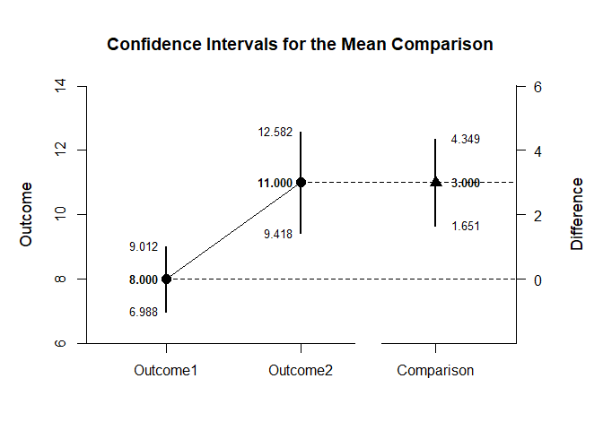
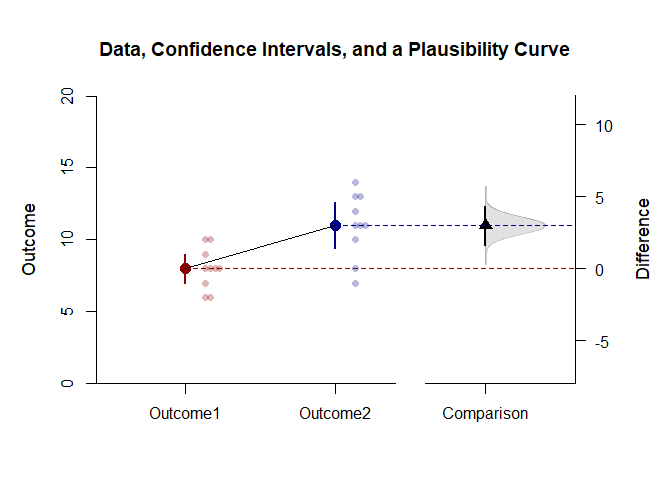
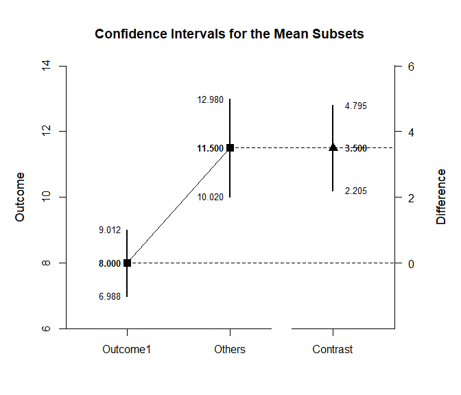
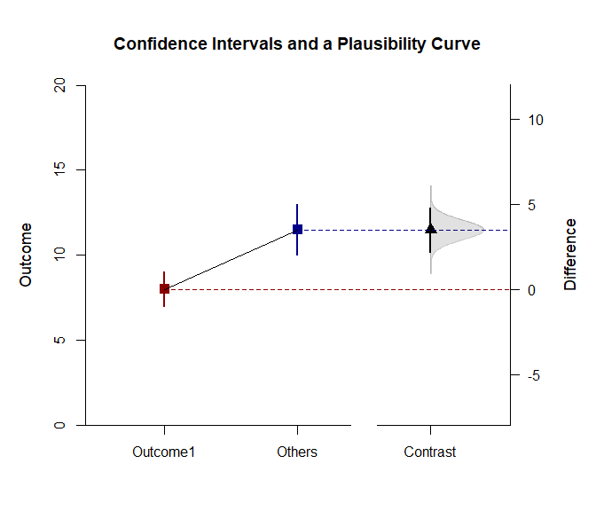

## Plausible Repeated Measures Data Application

This page adds data and plausibility curves to confidence interval plots
of comparisons and contrasts using repeated-measures (within-subjects)
data.

- [Data Management](#data-management)
- [Analyses of the Means](#analyses-of-the-means)
- [Analyses of a Comparison](#analyses-of-a-comparison)
- [Analyses of a Mean Contrast](#analyses-of-a-mean-contrast)

------------------------------------------------------------------------

### Data Management

This code inputs the variable names and creates a viewable data frame.

``` r
Outcome1 <- c(6, 8, 6, 8, 10, 8, 10, 9, 8, 7)
Outcome2 <- c(7, 13, 11, 10, 13, 8, 11, 14, 12, 11)
Outcome3 <- c(9, 16, 11, 12, 15, 13, 9, 14, 11, 10)
RepeatedData <- construct(Outcome1, Outcome2, Outcome3)
```

### Analyses of the Means

Get a simple plot of the confidence intervals.

``` r
(RepeatedData) |> estimateMeans()
```

    ## $`Confidence Intervals for the Means`
    ##                M      SE      df      LL      UL
    ## Outcome1   8.000   0.447   9.000   6.988   9.012
    ## Outcome2  11.000   0.699   9.000   9.418  12.582
    ## Outcome3  12.000   0.775   9.000  10.248  13.752

``` r
(RepeatedData) |> plotMeans()
```

<!-- -->

Get an enhanced plot of data and confidence intervals.

``` r
(RepeatedData) |> plotData(main = "Data and Confidence Intervals", method = "stack", col = c("darkred", "darkblue", "darkgoldenrod"))
(RepeatedData) |> addMeans(values = FALSE, line = 9, col = c("darkred", "darkblue", "darkgoldenrod"))
```

<!-- -->

### Analyses of a Comparison

Create a comparison and get a simple plot of the confidence intervals.

``` r
(RepeatedData) |> focus(Outcome1, Outcome2) |> estimateComparison()
```

    ## $`Confidence Intervals for the Means`
    ##                M      SE      df      LL      UL
    ## Outcome1   8.000   0.447   9.000   6.988   9.012
    ## Outcome2  11.000   0.699   9.000   9.418  12.582
    ## 
    ## $`Confidence Interval for the Difference of Means`
    ##               Diff      SE      df      LL      UL
    ## Comparison   3.000   0.596   9.000   1.651   4.349

``` r
(RepeatedData) |> focus(Outcome1, Outcome2) |> plotComparison()
```

<!-- -->

Get an enhanced plot of data and confidence intervals with a
plausibility curve.

``` r
(RepeatedData) |> focus(Outcome1, Outcome2) |> plotComparison(main = "Data, Confidence Intervals, and a Plausibility Curve", ylim = c(0, 20), values = FALSE, col = c("darkred", "darkblue", "black"))
(RepeatedData) |> focus(Outcome1, Outcome2) |> addPlausible(type = c("none", "none", "right"), col = c("darkred", "darkblue", "black"))
(RepeatedData) |> focus(Outcome1, Outcome2) |> addData(method = "stack", col = c("darkred", "darkblue", "black"))
```

<!-- -->

### Analyses of a Mean Contrast

Create a contrast and get a plot of the mean subsets and the contrast.

``` r
(RepeatedData) |> estimateSubsets(contrast = c(-1, .5, .5), labels = c("Outcome1", "Others"))
```

    ## $`Confidence Intervals for the Subsets of Means`
    ##              Est      SE      df      LL      UL
    ## Outcome1   8.000   0.447   9.000   6.988   9.012
    ## Others    11.500   0.654   9.000  10.020  12.980
    ## 
    ## $`Confidence Interval for the Contrast of Means`
    ##              Est      SE      df      LL      UL
    ## Contrast   3.500   0.573   9.000   2.205   4.795

``` r
(RepeatedData) |> plotSubsets(contrast = c(-1, .5, .5), labels = c("Outcome1", "Others"))
```

<!-- -->

Create an enhanced plot of the means and the mean subsets with a
plausibility curve.

``` r
(RepeatedData) |> plotSubsets(contrast = c(-1, .5, .5), labels = c("Outcome1", "Others"), main = "Confidence Intervals and a Plausibility Curve", ylim = c(0, 20), values = FALSE, col = c("darkred", "darkblue", "black"))
(RepeatedData) |> addPlausible(contrast = c(-1, .5, .5), type = c("none", "none", "right"), col = c("darkred", "darkblue", "black"))
```

<!-- -->
