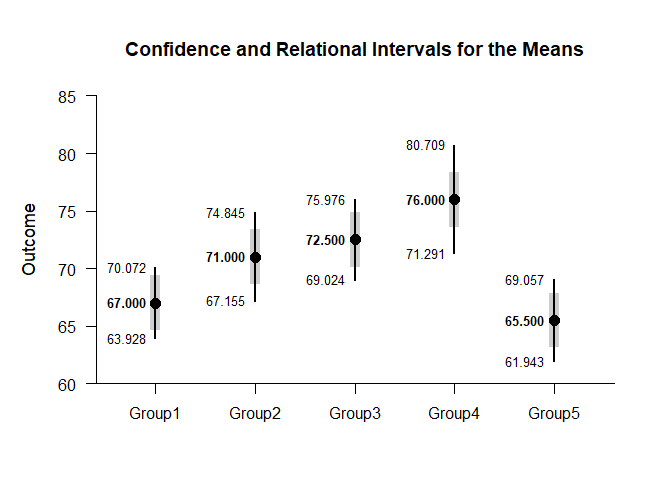

## Relational Intervals OneWay Data Applications

### Data Management


```r
Group <- c(rep(1,10),rep(2,10),rep(3,10),rep(4,10),rep(5,10))
Outcome <- c(61,64,72,64,64,70,73,65,65,72,69,74,79,69,64,64,69,69,74,79,70,75,80,80,70,65,70,75,70,70,70,80,85,75,70,65,75,75,85,80,65,55,70,65,65,70,70,60,65,70)
Group <- factor(Group,levels=c(1,2,3,4,5),labels=c("Group1","Group2","Group3","Group4","Group5"))
```

### Analyses of Relational Intervals

Provide descriptive statistics and ANOVA source table

```r
(Outcome~Group) |> describeMeans()
```

```
## $`Descriptive Statistics for the Data`
##              N       M      SD    Skew    Kurt
## Group1  10.000  67.000   4.295   0.316  -1.646
## Group2  10.000  71.000   5.375   0.322  -0.882
## Group3  10.000  72.500   4.859   0.454  -0.516
## Group4  10.000  76.000   6.583  -0.088  -0.751
## Group5  10.000  65.500   4.972  -1.085   0.914
```

```r
(Outcome~Group) |> describeMeansOmnibus()
```

```
## $`Source Table for the Model`
##               SS      df      MS
## Between  717.000   4.000 179.250
## Within  1251.000  45.000  27.800
```

```r
(Outcome~Group) |> testMeansOmnibus()
```

```
## $`Hypothesis Test for the Model`
##              F     df1     df2       p
## Factor   6.448   4.000  45.000   0.000
```

Provide and plot estimates of the arelational and relational intervals

```r
(Outcome~Group) |> estimateMeansRelational()
```

```
## $`Confidence and Relational Intervals for the Means`
##              M   RI.LL   RI.UL   CI.LL   CI.UL
## Group1  67.000  64.625  69.375  63.928  70.072
## Group2  71.000  68.625  73.375  67.155  74.845
## Group3  72.500  70.125  74.875  69.024  75.976
## Group4  76.000  73.625  78.375  71.291  80.709
## Group5  65.500  63.125  67.875  61.943  69.057
```

```r
(Outcome~Group) |> plotMeansRelational()
```

<!-- -->
