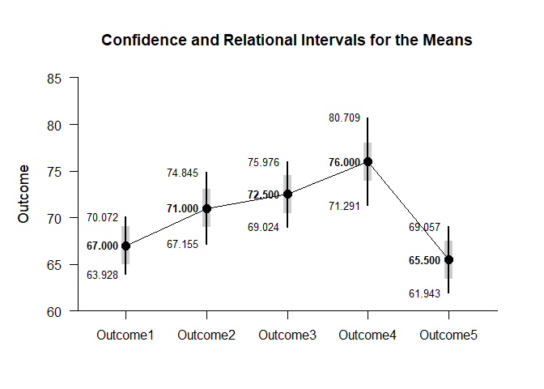
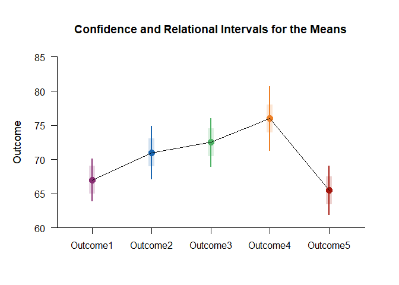

## Relational Repeated Measures Data Application

### Data Management

Enter the data.

```r
Outcome1 <-c(61,64,72,64,64,70,73,65,65,72)
Outcome2 <- c(69,74,79,69,64,64,69,69,74,79)
Outcome3 <- c(70,75,80,80,70,65,70,75,70,70) 
Outcome4 <- c(70,80,85,75,70,65,75,75,85,80)
Outcome5 <- c(65,55,70,65,65,70,70,60,65,70)
RepeatedData <- data.frame(Outcome1,Outcome2,Outcome3,Outcome4,Outcome5)
```

### Omnibus Analyses

Provide descriptive statistics and an ANOVA source table.

```r
(RepeatedData) |> describeMeans()
```

```
## $`Descriptive Statistics for the Data`
##                N       M      SD    Skew    Kurt
## Outcome1  10.000  67.000   4.295   0.316  -1.646
## Outcome2  10.000  71.000   5.375   0.322  -0.882
## Outcome3  10.000  72.500   4.859   0.454  -0.516
## Outcome4  10.000  76.000   6.583  -0.088  -0.751
## Outcome5  10.000  65.500   4.972  -1.085   0.914
```

```r
(RepeatedData) |> describeMeansOmnibus()
```

```
## $`Source Table for the Model`
##               SS      df      MS
## Subjects 529.200   9.000  58.800
## Measures 717.000   4.000 179.250
## Error    721.800  36.000  20.050
```

```r
(RepeatedData) |> testMeansOmnibus()
```

```
## $`Hypothesis Test for the Model`
##                F     df1     df2       p
## Measures   8.940   4.000  36.000   0.000
```

### Analyses of Relational Intervals

Provide and plot estimates of the arelational and relational intervals.

```r
(RepeatedData) |> estimateMeansRelational()
```

```
## $`Confidence and Relational Intervals for the Means`
##                M   RI.LL   RI.UL   CI.LL   CI.UL
## Outcome1  67.000  64.969  69.031  63.928  70.072
## Outcome2  71.000  68.969  73.031  67.155  74.845
## Outcome3  72.500  70.469  74.531  69.024  75.976
## Outcome4  76.000  73.969  78.031  71.291  80.709
## Outcome5  65.500  63.469  67.531  61.943  69.057
```

```r
(RepeatedData) |> plotMeansRelational()
```

<!-- -->

Enhance the plot by adding color.

```r
colorTheme=c('#882e72','#1965b0','#4eb265','#ee8026','#a5170e')
(RepeatedData) |> plotMeansRelational(values=FALSE,col=colorTheme)
```

<!-- -->
