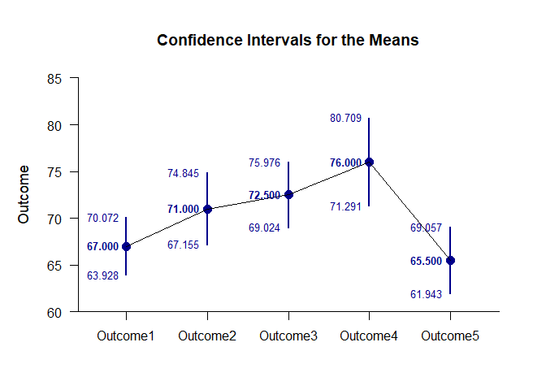
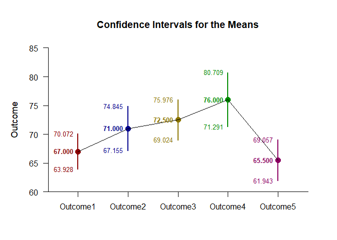

## Theme Repeated Measures Data Application

This page shows how to enhance different types of plots with EASI color themes using repeated-measures (within-subjects) data.

### Data Management

Simulate some data.

```r
Outcome1 <-c(61,64,72,64,64,70,73,65,65,72)
Outcome2 <- c(69,74,79,69,64,64,69,69,74,79)
Outcome3 <- c(70,75,80,80,70,65,70,75,70,70)
Outcome4 <- c(70,80,85,75,70,65,75,75,85,80)
Outcome5 <- c(65,55,70,65,65,70,70,60,65,70)
RepeatedData <- data.frame(Outcome1,Outcome2,Outcome3,Outcome4,Outcome5)
```

### Analyses of the Means

Rather than directly specifying colors for each level, simply specify a built-in color theme (like EASI's "muted" theme, which is the default if "theme" is used).

```r
(RepeatedData) |> plotMeans(col=theme())
(RepeatedData) |> plotData(col=theme(),add=TRUE)
```

<!-- -->

For larger number of levels, it may be preferably to use colors along a spectrum (similar to the vibrant or muted themes, though with the color orders determined mathematically) and have R determine the number of levels across the main effect.

```r
(RepeatedData) |> plotMeans(col=theme("muted","main",ncol(RepeatedData)))
(RepeatedData) |> plotData(col=theme("muted","main",ncol(RepeatedData)),add=TRUE)
```

<!-- -->

### Analyses of a Comparison

In plotting a comparison, it may be preferable to use a theme for the main elements (like the confidence intervals and plausibility curves), but use a set color for the comparison portion of the graph. To do this, use the "comp" parameter (instead of "main").

```r
ComparisonData <- cbind(Outcome1,Outcome2)
ComparisonData |> plotMeanComparison(col=theme("vibrant","comp"))
ComparisonData |> plotPlausible(col=theme("vibrant","comp"),add=TRUE)
```

<!-- -->
