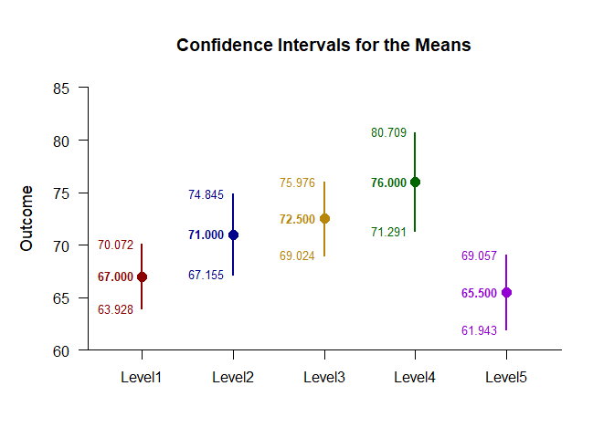
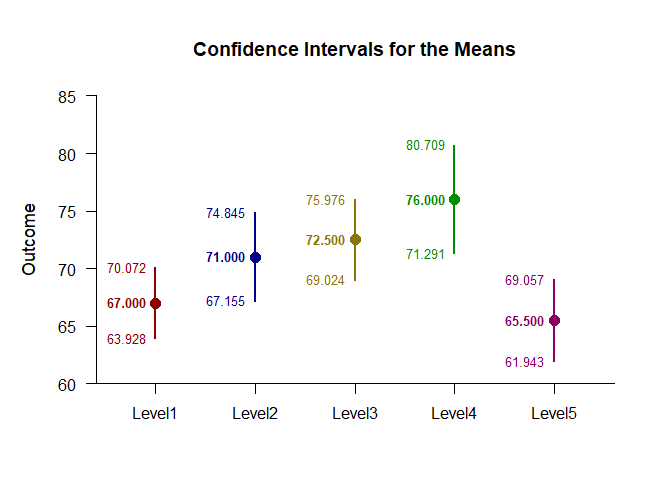
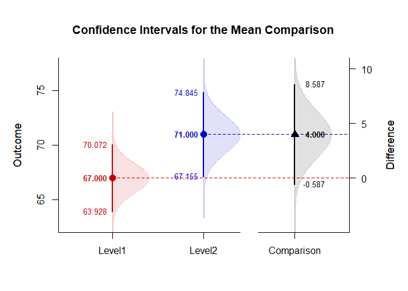

## Themes OneWay Data Application

This page shows how to enhance different types of plots with color themes using one-way (between-subjects) data.

### Data Management

Simulate some data.

```r
Factor <- c(rep(1,10),rep(2,10),rep(3,10),rep(4,10),rep(5,10))
Outcome <- c(61,64,72,64,64,70,73,65,65,72,69,74,79,69,64,64,69,69,74,79,70,75,80,80,70,65,70,75,70,70,70,80,85,75,70,65,75,75,85,80,65,55,70,65,65,70,70,60,65,70)
Factor <- factor(Factor,levels=c(1,2,3,4,5),labels=c("Level1","Level2","Level3","Level4","Level5"))
```

### Analyses of the Means

In plotting a main effect, the classic method for specifying colors is to identify either a single color for all elements of the plot or to directly specify the color for each level.

```r
(Outcome~Factor) |> plotMeans(col="darkblue")
```

<!-- -->

```r
(Outcome~Factor) |> plotMeans(col=c("darkred","darkblue","darkgoldenrod","darkgreen","darkviolet"))
```

<!-- -->

Rather than directly specifying colors for each level, simply specify a pre-determined color theme (like the "muted" theme).

```r
(Outcome~Factor) |> plotMeans(col=theme("muted"))
(Outcome~Factor) |> plotMeans(col=theme("muted","main"))
```

<!-- -->

### Analyses of a Comparison

In plotting a comparison, the classic method would again directly specify the levels for each element of the graph.

```r
Comparison <- factor(Factor,c("Level1","Level2"))
(Outcome~Comparison) |> plotMeanComparison(col=c("red3","blue3","black"))
(Outcome~Comparison) |> plotPlausible(col=c("red3","blue3","black"),add=TRUE)
```

<!-- -->

It may be preferable to use a theme for the main elements (using the "vibrant" theme), but use a set color for the comparison portion of the graph. To do this, use the "comp" parameter (instead of "main").

```r
(Outcome~Comparison) |> plotMeanComparison(col=theme("vibrant","comp"))
(Outcome~Comparison) |> plotPlausible(col=theme("vibrant","comp"),add=TRUE)
```

<!-- -->
