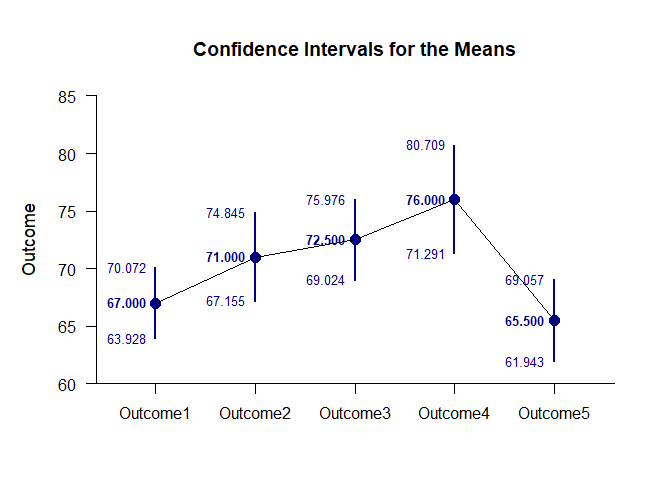
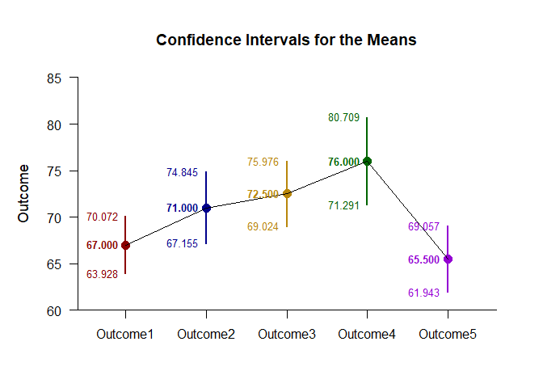
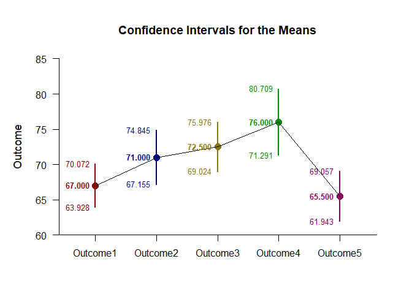
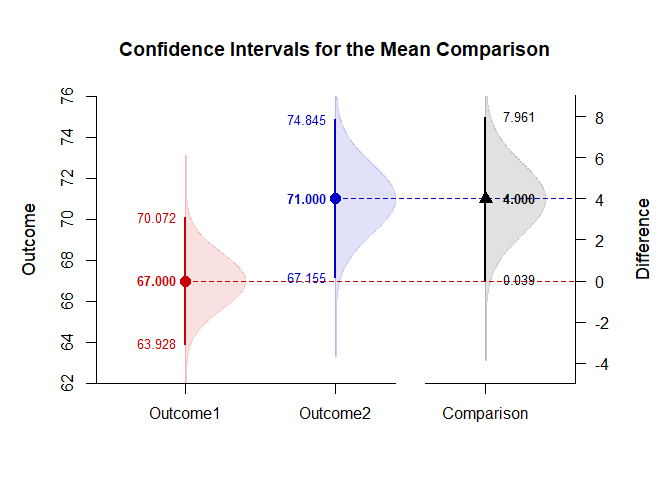

## Themes Repeated Measures Data Application

This page shows how to enhance different types of plots with color
themes using repeated-measures (within-subjects) data.

- [Data Management](#data-management)
- [Analyses of the Means](#analyses-of-the-means)
- [Analyses of a Comparison](#analyses-of-a-comparison)

------------------------------------------------------------------------

### Data Management

Simulate some data.

``` r
Outcome1 <-c(61,64,72,64,64,70,73,65,65,72)
Outcome2 <- c(69,74,79,69,64,64,69,69,74,79)
Outcome3 <- c(70,75,80,80,70,65,70,75,70,70)
Outcome4 <- c(70,80,85,75,70,65,75,75,85,80)
Outcome5 <- c(65,55,70,65,65,70,70,60,65,70)
RepeatedData <- data.frame(Outcome1,Outcome2,Outcome3,Outcome4,Outcome5)
```

### Analyses of the Means

In plotting a main effect, the classic method for specifying colors is
to identify either a single color for all elements of the plot or to
directly specify the color for each level.

``` r
(RepeatedData) |> plotMeans(col="darkblue")
```

<!-- -->

``` r
(RepeatedData) |> plotMeans(col=c("darkred","darkblue","darkgoldenrod","darkgreen","darkviolet"))
```

<!-- -->

Rather than directly specifying colors for each level, simply specify a
pre-determined color theme (like the “muted” theme).

``` r
(RepeatedData) |> plotMeans(col=theme("muted"))
(RepeatedData) |> plotMeans(col=theme("muted","main"))
```

<!-- -->

### Analyses of a Comparison

In plotting a comparison, the classic method would again directly
specify the levels for each element of the graph.

``` r
ComparisonData <- cbind(Outcome1,Outcome2)
(ComparisonData) |> plotMeanComparison(col=c("red3","blue3","black"))
(ComparisonData) |> plotPlausible(col=c("red3","blue3","black"),add=TRUE)
```

<!-- -->

It may be preferable to use a theme for the main elements (using the
“vibrant” theme), but use a set color for the comparison portion of the
graph. To do this, use the “comp” parameter (instead of “main”).

``` r
(ComparisonData) |> plotMeanComparison(col=theme("vibrant","comp"))
(ComparisonData) |> plotPlausible(col=theme("vibrant","comp"),add=TRUE)
```

<!-- -->
