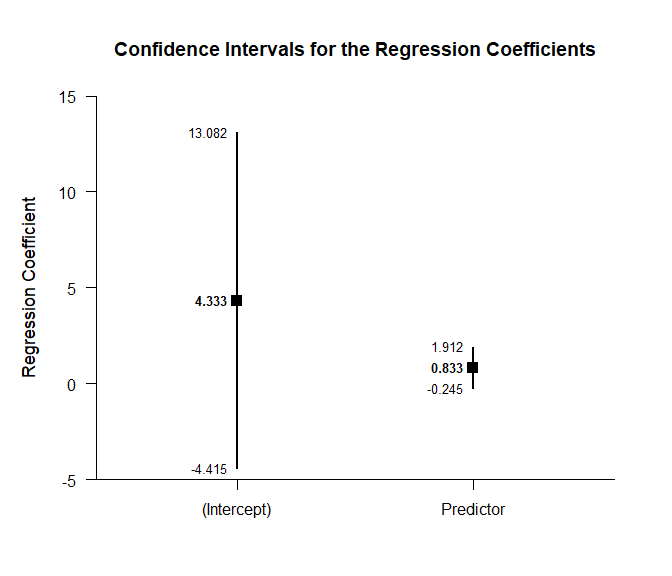
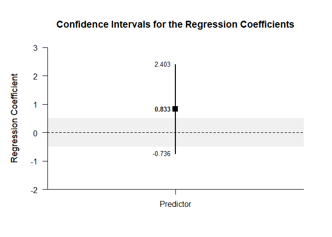
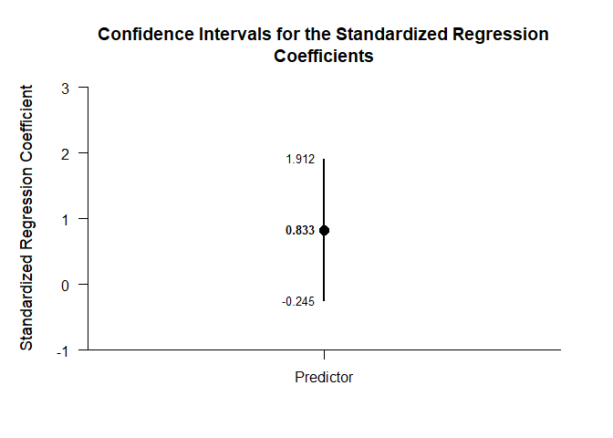
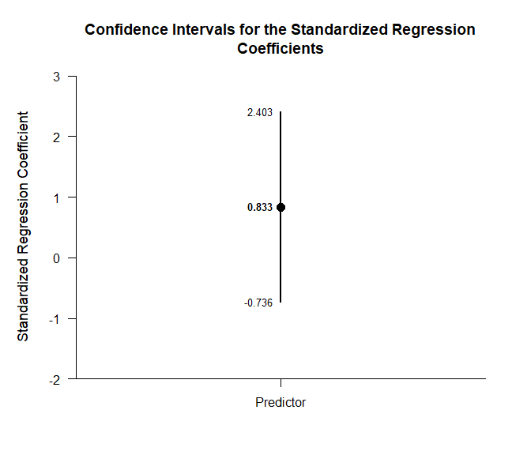
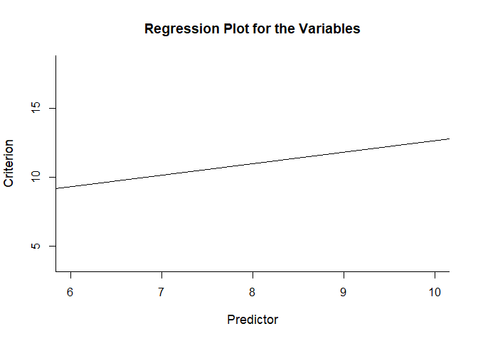
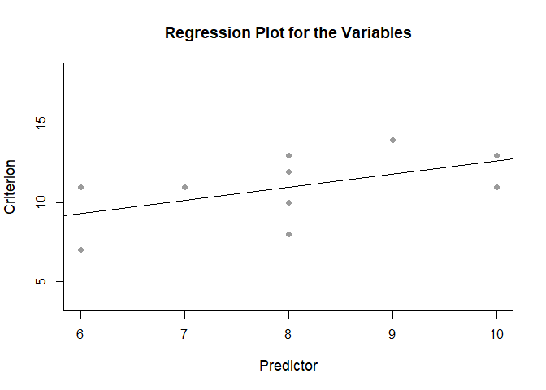
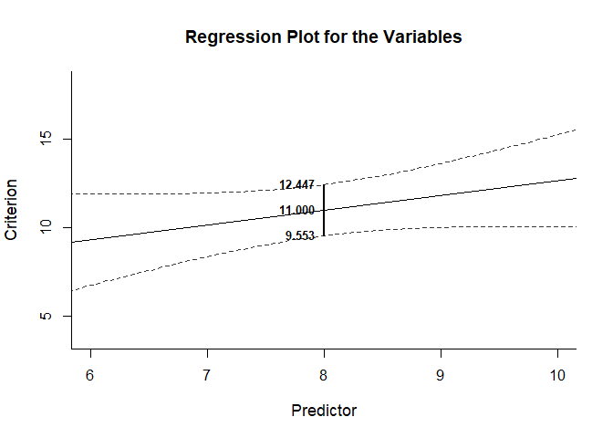
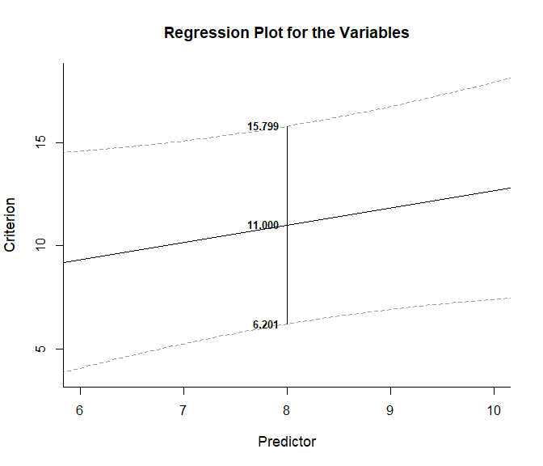

## Bivariate Regression Data Example

This page analyzes bivariate regression models using raw data input.

- [Data Management](#data-management)
  - [Data Entry](#data-entry)
  - [Summary Statistics](#summary-statistics)
- [Analyses of the Overall Model](#analyses-of-the-overall-model)
  - [Confidence Interval](#confidence-interval)
  - [Significance Test](#significance-test)
- [Analyses of the Regression
  Coefficients](#analyses-of-the-regression-coefficients)
  - [Confidence Intervals](#confidence-intervals)
  - [Significance Tests](#significance-tests)
  - [Standardized Coefficient](#standardized-coefficient)
- [Analyses of Regression Values](#analyses-of-regression-values)
  - [Regression Line](#regression-line)
  - [Confidence and Prediction
    Intervals](#confidence-and-prediction-intervals)

------------------------------------------------------------------------

### Data Management

#### Data Entry

This code inputs the variable names and creates a viewable data frame.

``` r
Predictor <- c(6, 8, 6, 8, 10, 8, 10, 9, 8, 7)
Criterion <- c(7, 13, 11, 10, 13, 8, 11, 14, 12, 11)
BivariateData <- construct(Predictor, Criterion)
```

#### Summary Statistics

This code obtains the descriptive statistics for the data frame.

``` r
(BivariateData) |> describeSummary()
```

    ## $`Descriptive Statistics for the Data`
    ##                 N       M      SD    Skew    Kurt
    ## Predictor  10.000   8.000   1.414   0.000  -0.738
    ## Criterion  10.000  11.000   2.211  -0.617  -0.212

``` r
(BivariateData) |> describeCorrelations()
```

    ## $`Correlation Matrix for the Variables`
    ##           Predictor Criterion
    ## Predictor     1.000     0.533
    ## Criterion     0.533     1.000

### Analyses of the Overall Model

This section produces analyses of the overall regression model.

#### Confidence Interval

This code will produce the confidence interval for R Squared.

``` r
(BivariateData) |> estimateRegressionOmnibus()
```

    ## $`Proportion of Variance Accounted For by the Regression Model`
    ##           Est      LL      UL
    ## Model   0.284   0.000   0.555

The code defaults to 90% confidence intervals. This can be changed if
desired.

``` r
(BivariateData) |> estimateRegressionOmnibus(conf.level = .95)
```

    ## $`Proportion of Variance Accounted For by the Regression Model`
    ##           Est      LL      UL
    ## Model   0.284   0.000   0.600

#### Significance Test

This code will produce a source table associated with the regression
model.

``` r
(BivariateData) |> describeRegressionOmnibus()
```

    ## $`Source Table for the Regression Model`
    ##            SS      df      MS
    ## Model  12.500   1.000  12.500
    ## Error  31.500   8.000   3.938
    ## Total  44.000   9.000   4.889

This code will calculate NHST for the regression model.

``` r
(BivariateData) |> testRegressionOmnibus()
```

    ## $`Hypothesis Test for the Regression Model`
    ##             F     df1     df2       p
    ## Model   3.175   1.000   8.000   0.113

### Analyses of the Regression Coefficients

This section analyses the regression coefficients obtained from the
overall model.

#### Confidence Intervals

This code will provide a table of confidence intervals for each of the
regression coefficients.

``` r
(BivariateData) |> estimateRegressionCoefficients()
```

    ## $`Confidence Intervals for the Regression Coefficients`
    ##                 Est      SE      LL      UL
    ## (Intercept)   4.333   3.794  -4.415  13.082
    ## Predictor     0.833   0.468  -0.245   1.912

This code will produce a graph of the confidence intervals for each of
the regression coefficients.

``` r
(BivariateData) |> plotRegressionCoefficients()
```

<!-- -->

The code defaults to 95% confidence intervals. This can be changed if
desired.

``` r
(BivariateData) |> estimateRegressionCoefficients(conf.level = .99)
```

    ## $`Confidence Intervals for the Regression Coefficients`
    ##                 Est      SE      LL      UL
    ## (Intercept)   4.333   3.794  -8.397  17.063
    ## Predictor     0.833   0.468  -0.736   2.403

For the graph, it is possible to plot just coefficients for the
predictors (minus the intercept) in addition to changing the confidence
level. A comparison line and region of practical equivalence can also be
added.

``` r
(BivariateData) |> plotRegressionCoefficients(conf.level = .99, line = 0, rope = c(-.5, .5), intercept = FALSE)
```

<!-- -->

#### Significance Tests

This code will produce a table of NHST separately for each of the
regression coefficients. In this case, all the coefficients are tested
against a value of zero.

``` r
(BivariateData) |> testRegressionCoefficients()
```

    ## $`Hypothesis Tests for the Regression Coefficients`
    ##                 Est      SE       t       p
    ## (Intercept)   4.333   3.794   1.142   0.286
    ## Predictor     0.833   0.468   1.782   0.113

#### Standardized Coefficient

This code will provide a table of confidence intervals for the
standardized coefficient.

``` r
(BivariateData) |> estimateStandardizedRegressionCoefficients()
```

    ## $`Confidence Intervals for the Standardized Regression Coefficients`
    ##               Est      SE      LL      UL
    ## Predictor   0.833   0.468  -0.245   1.912

This code will produce a graph of the confidence intervals for the
standardized coefficient.

``` r
(BivariateData) |> plotStandardizedRegressionCoefficients()
```

<!-- -->

As in other places, the code defaults to a 95% confidence interval. This
can be changed if desired.

``` r
(BivariateData) |> estimateStandardizedRegressionCoefficients(conf.level = .99)
```

    ## $`Confidence Intervals for the Standardized Regression Coefficients`
    ##               Est      SE      LL      UL
    ## Predictor   0.833   0.468  -0.736   2.403

For the graph, it is possible to change the confidence level.

``` r
(BivariateData) |> plotStandardizedRegressionCoefficients(conf.level = .99)
```

<!-- -->

### Analyses of Regression Values

This section provides analyses of individual predicted values.

#### Regression Line

This code produces a plot of the regression line (with confidence and
prediction intervals suppressed).

``` r
(BivariateData) |> plotRegression(interval = "none")
```

<!-- -->

This code adds a scatter of data points to the regression plot.

``` r
(BivariateData) |> plotRegression(interval = "none", points = TRUE)
```

<!-- -->

#### Confidence and Prediction Intervals

This code provides estimates confidence and prediction limits for a
specific value of the Predictor (value=4).

``` r
(BivariateData) |> estimateRegression(value = 4)
```

    ## $`Confidence and Prediction Intervals for the Regression Value`
    ##       Est   CI.LL   CI.UL   PI.LL   PI.UL
    ## 4   7.667   3.116  12.217   1.213  14.120

This code plots the confidence interval associated with the regression
line and labels the interval for the specific value of the Predictor.

``` r
(BivariateData) |> plotRegression(value = 4, interval = "confidence")
```

<!-- -->

This code plots the prediction interval associated with the regression
line and labels the interval for the specific value of the Predictor.

``` r
(BivariateData) |> plotRegression(value = 4, interval = "prediction")
```

<!-- -->
