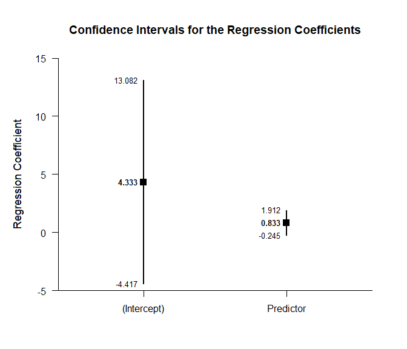
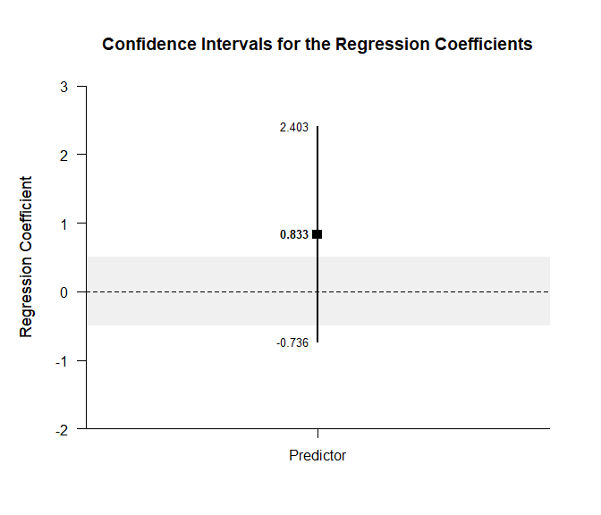
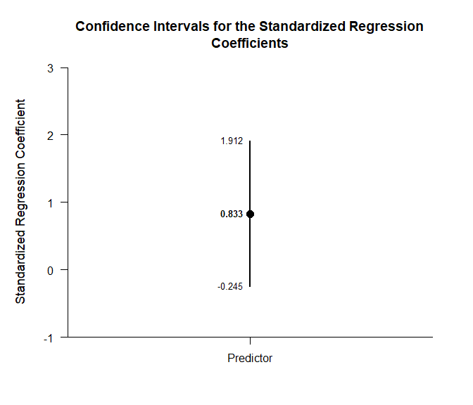
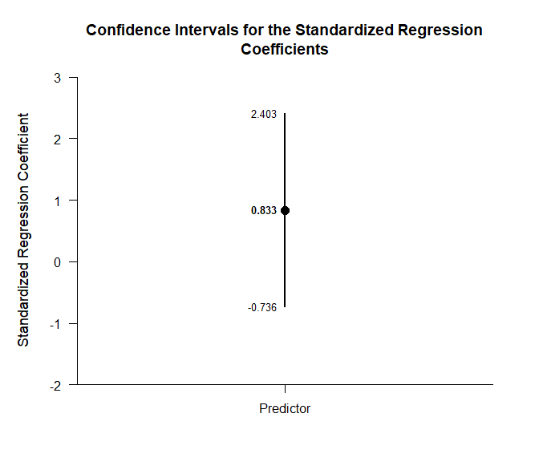
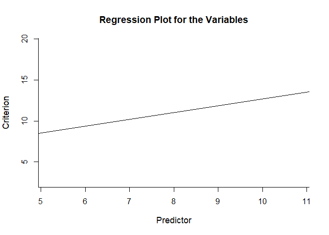
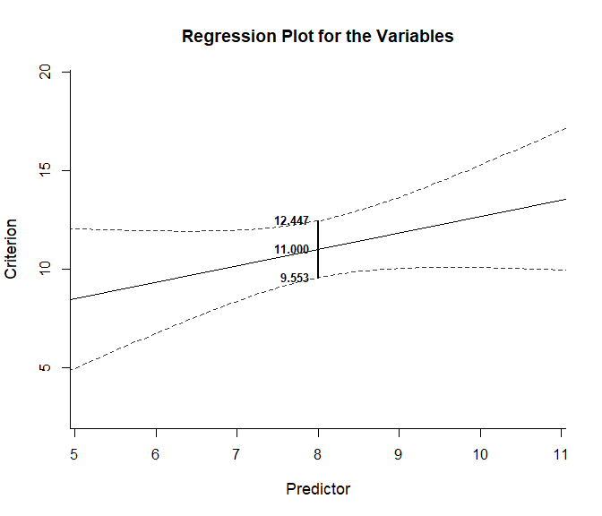
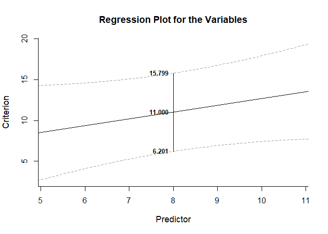

## Bivariate Regression Summary Statistics Example

This page analyzes bivariate regression models using summary statistics
input.

- [Data Management](#data-management)
  - [Data Entry](#data-entry)
  - [Summary Statistics](#summary-statistics)
- [Analyses of Overall Model](#analyses-of-overall-model)
  - [Confidence Interval](#confidence-interval)
  - [Significance Test](#significance-test)
- [Analyses of the Regression
  Coefficients](#analyses-of-the-regression-coefficients)
  - [Confidence Intervals](#confidence-intervals)
  - [Significance Tests](#significance-tests)
  - [Standardized Coefficient](#standardized-coefficient)
- [Analyses of Regression Values](#analyses-of-regression-values)
  - [Regression Line](#regression-line)
  - [Confidence and Prediction
    Intervals](#confidence-and-prediction-intervals)

------------------------------------------------------------------------

### Data Management

#### Data Entry

This code inputs the variable summaries and creates a summary table.

``` r
Predictor <- c(N = 10, M = 8.000, SD = 1.414)
Criterion <- c(N = 10, M = 11.000, SD = 2.211)
BivariateSummary <- construct(Predictor, Criterion, type = "wss")
```

This code creates a correlation matrix.

``` r
Predictor <- c(1.000, .533)
Criterion <- c(.533, 1.000)
BivariateCorr <- construct(Predictor, Criterion, type = "corr")
```

#### Summary Statistics

This code confirms the descriptive statistics from the summary tables.

``` r
(BivariateSummary) |> describeSummary()
```

    ## $`Summary Statistics for the Data`
    ##                 N       M      SD
    ## Predictor  10.000   8.000   1.414
    ## Criterion  10.000  11.000   2.211

``` r
(BivariateCorr) |> describeCorrelations()
```

    ## $`Correlation Matrix for the Variables`
    ##           Predictor Criterion
    ## Predictor     1.000     0.533
    ## Criterion     0.533     1.000

### Analyses of Overall Model

This section produces analyses of the overall regression model.

This code will produce a source table associated with the regression
model.

``` r
(BivariateSummary) |> describeRegressionEffect(BivariateCorr)
```

    ## $`Source Table for the Regression Model`
    ##            SS      df      MS
    ## Model  12.499   1.000  12.499
    ## Error  31.498   8.000   3.937
    ## Total  43.997   9.000   4.889

#### Confidence Interval

This code will produce the confidence interval for R Squared.

``` r
(BivariateSummary) |> estimateRegressionEffect(BivariateCorr)
```

    ## $`Proportion of Variance Accounted For by the Regression Model`
    ##           Est      LL      UL
    ## Model   0.284   0.000   0.555

The code defaults to 90% confidence intervals. This can be changed if
desired.

``` r
(BivariateSummary) |> estimateRegressionEffect(BivariateCorr, conf.level = .95)
```

    ## $`Proportion of Variance Accounted For by the Regression Model`
    ##           Est      LL      UL
    ## Model   0.284   0.000   0.600

#### Significance Test

This code will calculate NHST for the regression model.

``` r
(BivariateSummary) |> testRegressionEffect(BivariateCorr)
```

    ## $`Hypothesis Test for the Regression Model`
    ##             F     df1     df2       p
    ## Model   3.175   1.000   8.000   0.113

### Analyses of the Regression Coefficients

This section analyses the regression coefficients obtained from the
overall model.

#### Confidence Intervals

This code will provide a table of confidence intervals for each of the
regression coefficients.

``` r
(BivariateSummary) |> estimateRegressionCoefficients(BivariateCorr)
```

    ## $`Confidence Intervals for the Regression Coefficients`
    ##                 Est      SE      LL      UL
    ## (Intercept)   4.333   3.794  -4.417  13.082
    ## Predictor     0.833   0.468  -0.245   1.912

This code will produce a graph of the confidence intervals for each of
the regression coefficients.

``` r
(BivariateSummary) |> plotRegressionCoefficients(BivariateCorr)
```

<!-- -->

The code defaults to 95% confidence intervals. This can be changed if
desired.

``` r
(BivariateSummary) |> estimateRegressionCoefficients(BivariateCorr, conf.level = .99)
```

    ## $`Confidence Intervals for the Regression Coefficients`
    ##                 Est      SE      LL      UL
    ## (Intercept)   4.333   3.794  -8.399  17.064
    ## Predictor     0.833   0.468  -0.736   2.403

For the graph, it is possible to plot just coefficients for the
predictors (minus the intercept) in addition to changing the confidence
level. A comparison line and region of practical equivalence can also be
added.

``` r
(BivariateSummary) |> plotRegressionCoefficients(BivariateCorr, conf.level = .99, line = 0, rope = c(-.5, .5), intercept = FALSE)
```

<!-- -->

#### Significance Tests

This code will produce a table of NHST separately for each of the
regression coefficients. In this case, all the coefficients are tested
against a value of zero.

``` r
(BivariateSummary) |> testRegressionCoefficients(BivariateCorr)
```

    ## $`Hypothesis Tests for the Regression Coefficients`
    ##                 Est      SE       t       p
    ## (Intercept)   4.333   3.794   1.142   0.287
    ## Predictor     0.833   0.468   1.782   0.113

#### Standardized Coefficient

This code will provide a table of confidence intervals for the
standardized coefficient.

``` r
(BivariateSummary) |> estimateStandardizedRegressionCoefficients(BivariateCorr)
```

    ## $`Confidence Intervals for the Standardized Regression Coefficients`
    ##               Est      SE      LL      UL
    ## Predictor   0.833   0.468  -0.245   1.912

This code will produce a graph of the confidence intervals for the
standardized coefficient.

``` r
(BivariateSummary) |> plotStandardizedRegressionCoefficients(BivariateCorr)
```

<!-- -->

As in other places, the code defaults to a 95% confidence interval. This
can be changed if desired.

``` r
(BivariateSummary) |> estimateStandardizedRegressionCoefficients(BivariateCorr, conf.level = .99)
```

    ## $`Confidence Intervals for the Standardized Regression Coefficients`
    ##               Est      SE      LL      UL
    ## Predictor   0.833   0.468  -0.736   2.403

For the graph, it is possible to change the confidence level.

``` r
(BivariateSummary) |> plotStandardizedRegressionCoefficients(BivariateCorr, conf.level = .99)
```

<!-- -->

### Analyses of Regression Values

This section provides analyses of individual predicted values.

#### Regression Line

This code produces a plot of the regression line (with confidence and
prediction intervals suppressed).

``` r
(BivariateSummary) |> plotRegression(BivariateCorr, interval = "none")
```

<!-- -->

#### Confidence and Prediction Intervals

This code provides estimates confidence and prediction limits for a
specific value of the Predictor (value=4).

``` r
(BivariateSummary) |> estimateRegression(BivariateCorr, value = 8)
```

    ## $`Confidence and Prediction Intervals for the Regression Value`
    ##       Est   CI.LL   CI.UL   PI.LL   PI.UL
    ## 8  11.000   9.553  12.447   6.201  15.799

This code plots the confidence interval associated with the regression
line and labels the interval for the specific value of the Predictor.

``` r
(BivariateSummary) |> plotRegression(BivariateCorr, value = 8, interval = "confidence")
```

<!-- -->

This code plots the prediction interval associated with the regression
line and labels the interval for the specific value of the Predictor.

``` r
(BivariateSummary) |> plotRegression(BivariateCorr, value = 8, interval = "prediction")
```

<!-- -->
