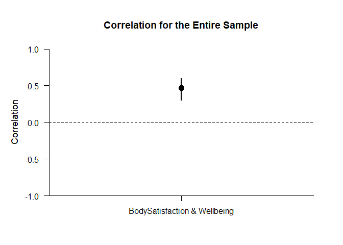

## BodyWell One Sample Summary Statistics Example

### Data Management

This code inputs the variable summaries and creates a summary table.

```r
BodySatisfaction <- c(N=106,M=3.605,SD=0.659)
Wellbeing <- c(N=106,M=5.055,SD=1.162)
BodyWellOneSummary <- rbind(BodySatisfaction,Wellbeing)
class(BodyWellOneSummary) <- "wss"
```

This code creates a correlation matrix and enters single correlation.

```r
BodyWellOneCorr <- declareCorrelations("BodySatisfaction","Wellbeing")
BodyWellOneCorr["BodySatisfaction","Wellbeing"] <- .467
```

### Analyses of the Correlation

We can get the confidence interval for the correlation.

```r
estimateCorrelations(BodyWellOneSummary,BodyWellOneCorr)
```

```
## $`Confidence Interval for the Correlation`
##                                    R      SE      LL      UL
## BodySatisfaction & Wellbeing   0.467   0.099   0.303   0.604
```

This is the plot of correlation and its confidence interval.

```r
plotCorrelations(BodyWellOneSummary,BodyWellOneCorr,main="Correlation for the Entire Sample",ylim=c(-1,1))
```

<!-- -->
