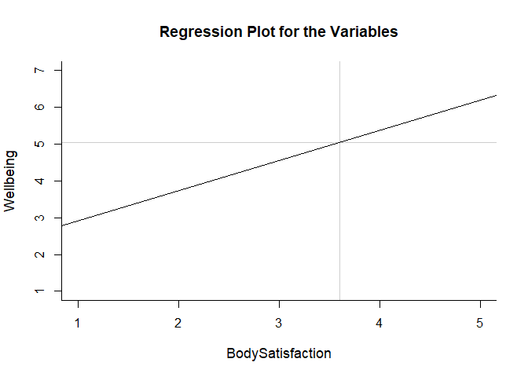
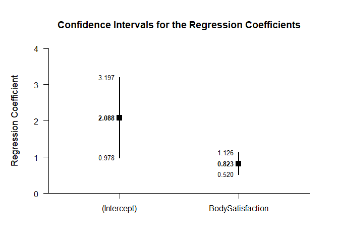
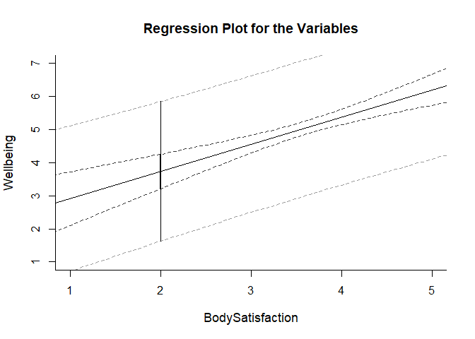

## BodyWell Regression Data Example

This page analyzes bivariate regression models using raw data input.

### Data Management

#### Data Entry

First, enter the data.

```r
BodySatisfaction <- c(4,2.4,3,3,3.1,2.4,2.9,3.1,3,3.3,2,3.1,2.4,3.1,3.3,3.4,3.3,3.6,2.7,3.3,3.6,2.3,3.7,4,2.7,3.1,3.3,3.4,4.4,3.3,3.3,4,4.1,3.3,3.6,3.9,4,5,3,3,3.3,3.9,3.9,4.7,5,2.6,2.9,3.4,3.4,3.9,4.3,2.6,3.1,3.4,3.7,4,4.1,4,5,4,2.4,3.7,3,3.6,2.9,2.7,3.3,4.3,3.1,4.3,4.4,4,3.3,3.7,2.9,3.4,3.6,4.7,4.1,3,4.1,3.7,4.1,4,3.1,3.7,3.3,4.4,4.3,4,4,4,3.4,4.9,3.7,3.3,3.9,4.6,4,3.9,4.7,4.3,4.4,4.4,4.6,4.3)
Wellbeing <- c(1,2.4,2.3,2.4,2.8,3.2,3.4,3.4,3.6,3.6,3.8,3.8,4,4,4.2,4.2,4.4,4.4,4.6,4.6,4.6,4.8,4.8,4.8,5,5,5,5,5,5.2,5.3,5.2,5.2,5.6,5.6,5.6,5.6,5.6,5.8,5.7,5.8,5.8,5.9,5.8,5.8,6,6,6,6.1,6,6,6.2,6.2,6.2,6.4,6.4,6.4,6.6,7,2.8,3,3.2,3.2,3.4,3.4,3.8,4.2,4.4,4.4,4.6,4.6,4.6,4.8,4.8,4.8,5,5,5.2,5.2,5.4,5.6,5.6,5.5,5.6,5.6,5.7,5.6,5.6,5.6,5.8,5.8,6,6,6,6,6,6,6,6.1,6.2,6.2,6.2,6.2,6.4,6.6,7)
BodyWellOneData <- data.frame(BodySatisfaction,Wellbeing)
```

#### Descriptive Statistics

First, it's useful to get the means and standard deviations for the variables.

```r
describeMeans(BodyWellOneData)
```

```
## $`Descriptive Statistics for the Data`
##                        N       M      SD    Skew    Kurt
## BodySatisfaction 106.000   3.605   0.659   0.011  -0.468
## Wellbeing        106.000   5.055   1.162  -0.935   0.595
```

Next, we can get the correlation among the variables.

```r
describeCorrelations(BodyWellOneData)
```

```
## $`Correlation Matrix for the Variables`
##                  BodySatisfaction Wellbeing
## BodySatisfaction            1.000     0.467
## Wellbeing                   0.467     1.000
```

### Analyses of the Regression Line

Importantly, we can get a display of the regression line (with the confidence interval suppressed).

```r
plotRegression(BodyWellOneData,interval="none",xlim=c(1,5),ylim=c(1,7),cross=TRUE)
```

<!-- -->

We can then determine the slope and intercept of the line and get confidence intervals for them.

```r
estimateRegressionCoefficients(BodyWellOneData)
```

```
## $`Confidence Intervals for the Regression Coefficients`
##                      Est      SE      LL      UL
## (Intercept)        2.088   0.560   0.978   3.197
## BodySatisfaction   0.823   0.153   0.520   1.126
```

```r
plotRegressionCoefficients(BodyWellOneData)
```

<!-- -->

### Analyses of Regression Values

Finally, we get the confidence and prediction intervals of Wellbeing at a BodySatisfaction score of 2.

```r
estimateRegression(BodyWellOneData,value=2)
```

```
## $`Confidence and Prediction Intervals for the Regression Value`
##       Est   CI.LL   CI.UL   PI.LL   PI.UL
## 2   3.734   3.209   4.259   1.621   5.847
```

```r
plotRegression(BodyWellOneData,interval="both",value=2,xlim=c(1,5),ylim=c(1,7),values=FALSE)
```

<!-- -->
