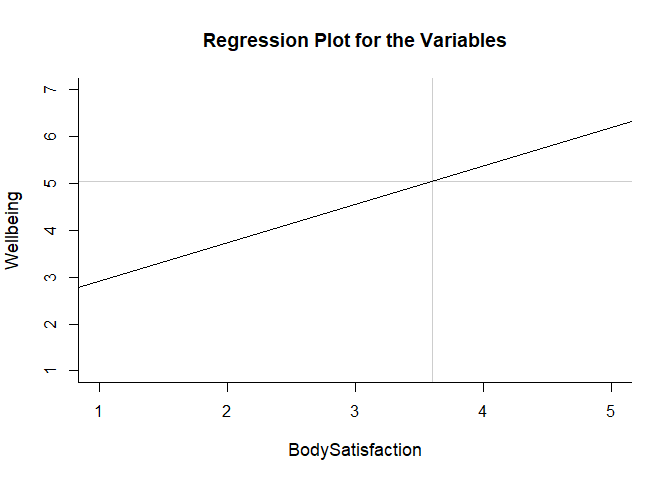
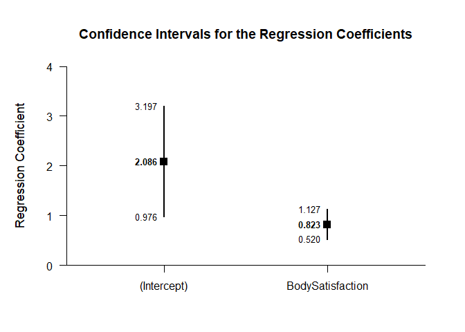
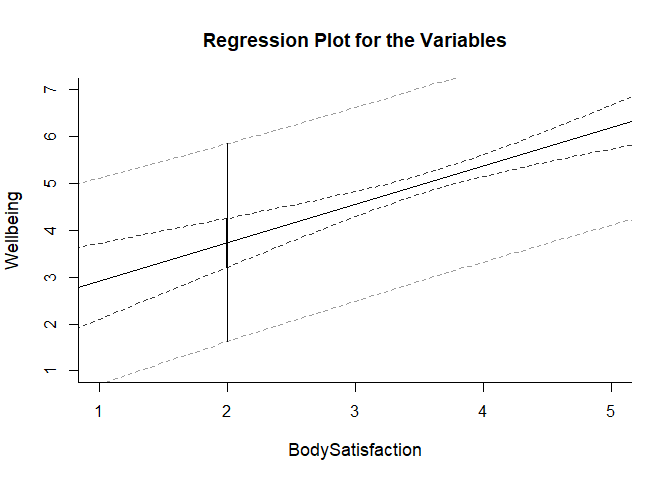

## BodyWell Regression Summary Statistics Example

### Data Management

This code inputs the variable summaries and creates a summary table.

```r
BodySatisfaction <- c(N=106,M=3.605,SD=0.659)
Wellbeing <- c(N=106,M=5.055,SD=1.162)
BodyWellOneSummary <- rbind(BodySatisfaction,Wellbeing)
class(BodyWellOneSummary) <- "wss"
```

This code creates a correlation matrix and enters single correlation.

```r
BodyWellOneCorr <- declareCorrelations("BodySatisfaction","Wellbeing")
BodyWellOneCorr["BodySatisfaction","Wellbeing"] <- .467
BodyWellOneCorr <- fillCorrelations(BodyWellOneCorr)
```

### Analyses of the Regression Line

Importantly, we can get a display of the regression line (with the confidence interval suppressed).

```r
plotRegression(BodyWellOneSummary,BodyWellOneCorr,interval="none",xlim=c(1,5))
```

<!-- -->

We can then determine the slope and intercept of the line and get confidence intervals for them.

```r
estimateRegressionCoefficients(BodyWellOneSummary,BodyWellOneCorr)
```

```
## $`Confidence Intervals for the Regression Coefficients`
##                      Est      SE      LL      UL
## (Intercept)        2.086   0.560   0.976   3.197
## BodySatisfaction   0.823   0.153   0.520   1.127
```

```r
plotRegressionCoefficients(BodyWellOneSummary,BodyWellOneCorr)
```

<!-- -->

### Analyses of Regression Values

Finally, we get the confidence and prediction intervals of Wellbeing at a BodySatisfaction score of 2.

```r
estimateRegression(BodyWellOneSummary,BodyWellOneCorr,value=2)
```

```
## $`Confidence and Prediction Intervals for the Regression Value`
##       Est   CI.LL   CI.UL   PI.LL   PI.UL
## 2   3.733   3.208   4.259   1.620   5.847
```

```r
plotRegression(BodyWellOneSummary,BodyWellOneCorr,interval="both",value=2,xlim=c(1,5))
```

<!-- -->
