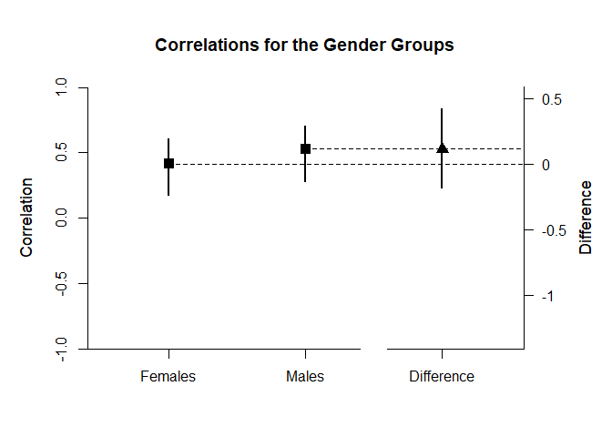

## BodyWell Two Sample Data Example

### Data Management

#### Data Entry

First, enter the data.

```r
Gender <- c(1,1,1,1,1,1,1,1,1,1,1,1,1,1,1,1,1,1,1,1,1,1,1,1,1,1,1,1,1,1,1,1,1,1,1,1,1,1,1,1,1,1,1,1,1,1,1,1,1,1,1,1,1,1,1,1,1,1,1,2,2,2,2,2,2,2,2,2,2,2,2,2,2,2,2,2,2,2,2,2,2,2,2,2,2,2,2,2,2,2,2,2,2,2,2,2,2,2,2,2,2,2,2,2,2,2)
BodySatisfaction <- c(4,2.4,3,3,3.1,2.4,2.9,3.1,3,3.3,2,3.1,2.4,3.1,3.3,3.4,3.3,3.6,2.7,3.3,3.6,2.3,3.7,4,2.7,3.1,3.3,3.4,4.4,3.3,3.3,4,4.1,3.3,3.6,3.9,4,5,3,3,3.3,3.9,3.9,4.7,5,2.6,2.9,3.4,3.4,3.9,4.3,2.6,3.1,3.4,3.7,4,4.1,4,5,4,2.4,3.7,3,3.6,2.9,2.7,3.3,4.3,3.1,4.3,4.4,4,3.3,3.7,2.9,3.4,3.6,4.7,4.1,3,4.1,3.7,4.1,4,3.1,3.7,3.3,4.4,4.3,4,4,4,3.4,4.9,3.7,3.3,3.9,4.6,4,3.9,4.7,4.3,4.4,4.4,4.6,4.3)
Wellbeing <- c(1,2.4,2.3,2.4,2.8,3.2,3.4,3.4,3.6,3.6,3.8,3.8,4,4,4.2,4.2,4.4,4.4,4.6,4.6,4.6,4.8,4.8,4.8,5,5,5,5,5,5.2,5.3,5.2,5.2,5.6,5.6,5.6,5.6,5.6,5.8,5.7,5.8,5.8,5.9,5.8,5.8,6,6,6,6.1,6,6,6.2,6.2,6.2,6.4,6.4,6.4,6.6,7,2.8,3,3.2,3.2,3.4,3.4,3.8,4.2,4.4,4.4,4.6,4.6,4.6,4.8,4.8,4.8,5,5,5.2,5.2,5.4,5.6,5.6,5.5,5.6,5.6,5.7,5.6,5.6,5.6,5.8,5.8,6,6,6,6,6,6,6,6.1,6.2,6.2,6.2,6.2,6.4,6.6,7)
BodyWellTwoData <- data.frame(Gender,BodySatisfaction,Wellbeing)
```

This code subsets the data into two different data frames for use in analyzing the two Gender groups separately.

```r
BodyWellTwoDataL1 <- subset(BodyWellTwoData,Gender=="1")
BodyWellTwoDataL2 <- subset(BodyWellTwoData,Gender=="2")
```

#### Descriptive Statistics

This code obtains the descriptive statistics for the Gender groups.

```r
with(BodyWellTwoDataL1,describeMeans(cbind(BodySatisfaction,Wellbeing)))
```

```
## $`Descriptive Statistics for the Data`
##                        N       M      SD    Skew    Kurt
## BodySatisfaction  59.000   3.434   0.668   0.395   0.147
## Wellbeing         59.000   4.934   1.250  -0.928   0.626
```

```r
with(BodyWellTwoDataL2,describeMeans(cbind(BodySatisfaction,Wellbeing)))
```

```
## $`Descriptive Statistics for the Data`
##                        N       M      SD    Skew    Kurt
## BodySatisfaction  47.000   3.819   0.587  -0.377  -0.514
## Wellbeing         47.000   5.206   1.033  -0.804  -0.138
```

This code obtains a table of correlations for the two groups.

```r
with(BodyWellTwoDataL1,describeCorrelations(cbind(BodySatisfaction,Wellbeing)))
```

```
## $`Correlation Matrix for the Variables`
##                  BodySatisfaction Wellbeing
## BodySatisfaction            1.000     0.415
## Wellbeing                   0.415     1.000
```

```r
with(BodyWellTwoDataL2,describeCorrelations(cbind(BodySatisfaction,Wellbeing)))
```

```
## $`Correlation Matrix for the Variables`
##                  BodySatisfaction Wellbeing
## BodySatisfaction            1.000     0.528
## Wellbeing                   0.528     1.000
```

### Analyses of a Correlation Comparison

The main question is whether the correlation between Body Satisfaction and Wellbeing is different in the two groups.

First it is necessary to estimate the confidence intervals for each of the correlations.

```r
CorrEstimateL1 <- with(BodyWellTwoDataL1,estimateCorrelations(cbind(BodySatisfaction,Wellbeing)))
CorrEstimateL2 <- with(BodyWellTwoDataL2,estimateCorrelations(cbind(BodySatisfaction,Wellbeing)))
```

Then we can estimate the correlations and the difference in the correlations.

```r
estimateCorrelationComparison(CorrEstimateL1,CorrEstimateL2,main="Correlations for the Gender Groups",labels=c("Females","Males"))
```

```
## $`Correlations for the Gender Groups`
##               R      SE      LL      UL
## Females   0.415   0.134   0.177   0.606
## Males     0.528   0.151   0.284   0.708
## 
## $<NA>
##               Diff      LL      UL
## Difference   0.113  -0.185   0.423
```

Finally, we get a difference plot using the confidence intervals for the correlations and the correlation difference.

```r
plotCorrelationComparison(CorrEstimateL1,CorrEstimateL2,main="Correlations for the Gender Groups",labels=c("Females","Males"),ylim=c(-1,1))
```

<!-- -->
