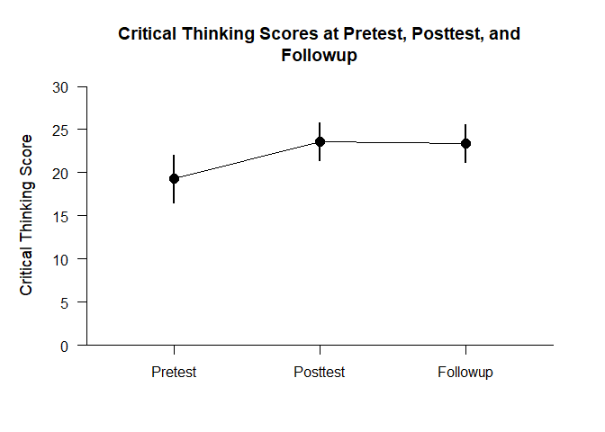
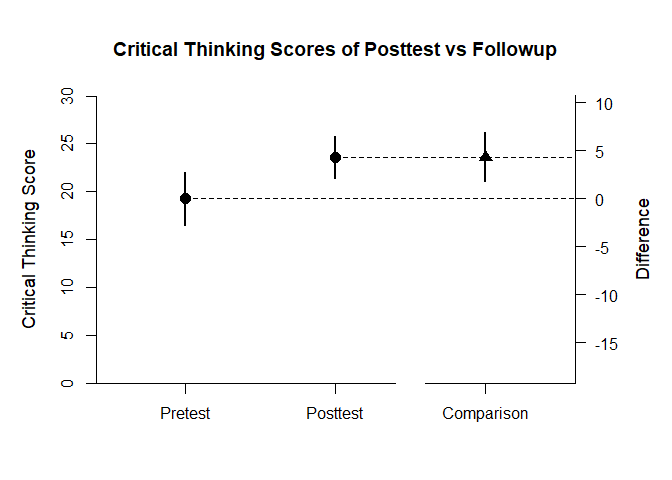
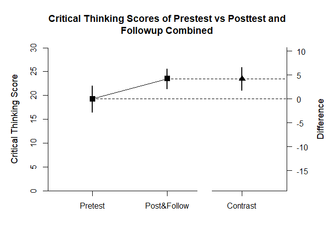

## Donohue Data Example

This page analyzes a single-factor within-subjects (repeated measures)
design using raw data input.

- [Data Management](#data-management)
- [Analyses of the Different
  Variables](#analyses-of-the-different-variables)
- [Analysis of a Variable
  Difference](#analysis-of-a-variable-difference)
- [Analysis of a Variable Contrast](#analysis-of-a-variable-contrast)

------------------------------------------------------------------------

### Data Management

Prior to analyses, enter the data.

``` r
Pretest <- c(7,11,11,13,15,17,18,18,19,19,19,19,21,22,25,25,25,26,27,29)
Posttest <- c(16,20,25,22,28,12,16,26,21,22,26,30,23,27,23,27,28,24,28,28)
Followup <- c(16,18,23,21,27,21,18,21,24,21,27,28,18,27,23,28,31,18,31,27)
DonohueData <- data.frame(Pretest,Posttest,Followup)
```

### Analyses of the Different Variables

With multiple variables, it is useful to get descriptive statistics and
confidence intervals for each variable.

``` r
estimateMeans(DonohueData)
```

    ## $`Confidence Intervals for the Means`
    ##                M      SE      df      LL      UL
    ## Pretest   19.300   1.320  19.000  16.537  22.063
    ## Posttest  23.600   1.065  19.000  21.371  25.829
    ## Followup  23.400   1.032  19.000  21.240  25.560

``` r
plotMeans(DonohueData,main="Critical Thinking Scores at Pretest, Posttest, and Followup",ylab="Critical Thinking Score",ylim=c(0,30),values=FALSE)
```

<!-- -->

### Analysis of a Variable Difference

The first research question is whether there is a difference between the
posttest and followup occasions.

First, set the comparison and obtain the difference plot for that
comparison.

``` r
estimateMeanComparison(DonohueData)
```

    ## $`Confidence Intervals for the Means`
    ##                M      SE      df      LL      UL
    ## Pretest   19.300   1.320  19.000  16.537  22.063
    ## Posttest  23.600   1.065  19.000  21.371  25.829
    ## 
    ## $`Confidence Interval for the Mean Difference`
    ##               Diff      SE      df      LL      UL
    ## Comparison   4.300   1.221  19.000   1.745   6.855

``` r
plotMeanComparison(DonohueData,main="Critical Thinking Scores of Posttest vs Followup",ylab="Critical Thinking Score",ylim=c(0,30),values=FALSE)
```

<!-- -->

Then, obtain the standardized effect size for that comparison.

``` r
estimateStandardizedMeanDifference(DonohueData)
```

    ## $`Confidence Interval for the Standardized Mean Difference`
    ##                  d      SE      LL      UL
    ## Comparison   0.802   0.256   0.301   1.303

### Analysis of a Variable Contrast

The second research question is whether the pretest differs from the
posttest and followup combined.

First, set the contrast and obtain a difference plot for the contrast.

``` r
PrevsPostFollow <- c(-1,.5,.5)
estimateMeanSubsets(DonohueData,contrast=PrevsPostFollow)
```

    ## $`Confidence Intervals for the Mean Subsets`
    ##                  Est      SE      df      LL      UL
    ## Neg Weighted  19.300   1.320  19.000  16.537  22.063
    ## Pos Weighted  23.500   0.979  19.000  21.452  25.548
    ## 
    ## $`Confidence Interval for the Mean Contrast`
    ##              Est      SE      df      LL      UL
    ## Contrast   4.200   1.130  19.000   1.835   6.565

``` r
plotMeanSubsets(DonohueData,contrast=PrevsPostFollow,labels=c("Pretest","Post&Follow"),main="Critical Thinking Scores of Prestest vs Posttest and Followup Combined",ylab="Critical Thinking Score",ylim=c(0,30),values=FALSE)
```

<!-- -->

Then, estimate the standardized contrast.

``` r
estimateStandardizedMeanContrast(DonohueData,contrast=PrevsPostFollow)
```

    ## $`Confidence Interval for the Standardized Mean Contrast`
    ##              Est      SE      LL      UL
    ## Contrast   0.819   0.214   0.399   1.239
