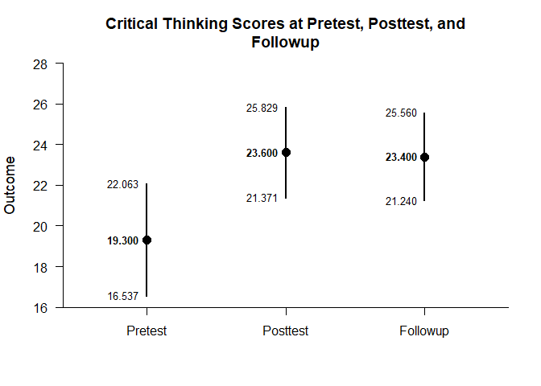
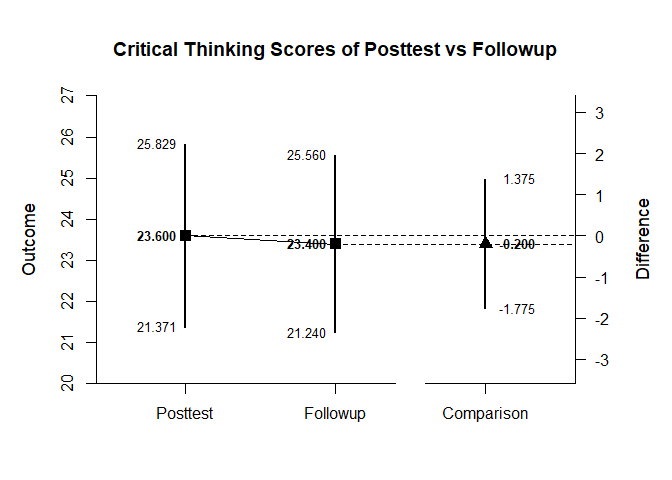
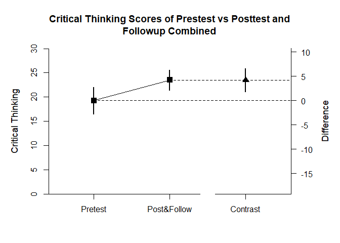

## Repeated Measures (Within-Subjects) Example with Donohue Data

### Data Management

Prior to analyses, enter the data.


```r
Pretest <- c(7,11,11,13,15,17,18,18,19,19,19,19,21,22,25,25,25,26,27,29)
Posttest <- c(16,20,25,22,28,12,16,26,21,22,26,30,23,27,23,27,28,24,28,28)
Followup <- c(16,18,23,21,27,21,18,21,24,21,27,28,18,27,23,28,31,18,31,27)
DonohueData <- data.frame(Pretest,Posttest,Followup)
```

### Analyses of the Different Variables

With multiple variables, it is useful to get descriptive statistics and confidence intervals for each variable.


```r
estimateMeans(Pretest,Posttest,Followup)
```

```
## $`Confidence Intervals for the Means`
##                M      SE      df      LL      UL
## Pretest   19.300   1.320  19.000  16.537  22.063
## Posttest  23.600   1.065  19.000  21.371  25.829
## Followup  23.400   1.032  19.000  21.240  25.560
```

It is also useful to view the means and confidence intervals of the groups in a plot.


```r
plotMeans(Pretest,Posttest,Followup,main="Critical Thinking Scores at Pretest, Posttest, and Followup",ylab="Critical Thinking Score")
```

<!-- -->
 
### Analysis of a Variable Difference

The first research question is whether there is a difference between the posttest and followup occasions.

First, set the comparison and obtain the difference plot for that comparison.


```r
plotMeanComparison(Posttest,Followup,main="Critical Thinking Scores of Posttest vs Followup",ylab="Critical Thinking Score")
```

<!-- -->

Then, obtain the standardized effect size for that comparison.


```r
estimateStandardizedMeanDifference(Posttest,Followup)
```

```
## $`Confidence Interval for the Standardized Mean Difference`
##                  d      SE      LL      UL
## Comparison  -0.043   0.165  -0.365   0.280
```

### Analysis of a Variable Contrast

The second research question is whether the pretest differs from the posttest and followup combined.

First, set the contrast and obtain a difference plot for the contrast.


```r
PrevsPostFollow <- c(-1,.5,.5)
plotMeanSubsets(Pretest,Posttest,Followup,contrast=PrevsPostFollow,labels=c("Pretest","Post&Follow"),main="Critical Thinking Scores of Prestest vs Posttest and Followup Combined",ylab="Critical Thinking Score")
```

<!-- -->

Then, estimate the standardized contrast.


```r
estimateStandardizedMeanContrast(Pretest,Posttest,Followup,contrast=PrevsPostFollow)
```

```
## $`Confidence Interval for the Standardized Mean Contrast`
##              Est      SE      LL      UL
## Contrast   0.819   0.214   0.399   1.239
```
