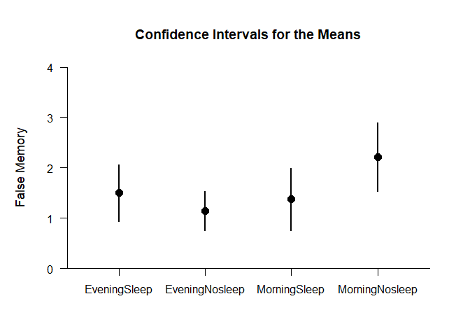
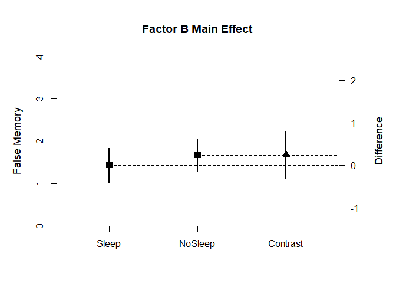
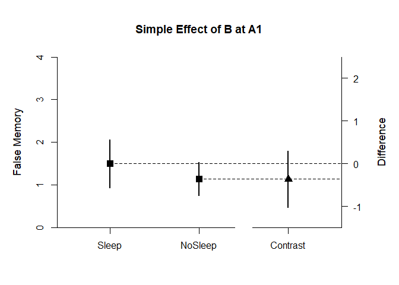
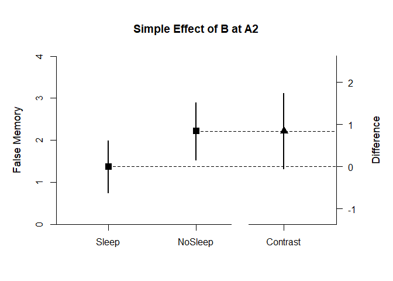

## Frenda Summary Statistics Example

This page analyzes a two-factor between-subjects (factorial) design
using summary statistics input.

- [Data Management](#data-management)
- [Analyses of the Different Groups](#analyses-of-the-different-groups)
- [Analyses of the Marginal Means](#analyses-of-the-marginal-means)
- [Analyses of Main Effects](#analyses-of-main-effects)
  - [Analyses of the Factor A Main
    Effect](#analyses-of-the-factor-a-main-effect)
  - [Analyses of the Factor B Main
    Effect](#analyses-of-the-factor-b-main-effect)
- [Analyses of the Interaction](#analyses-of-the-interaction)
  - [Analyses of the Factor B at A1 Simple
    Effect](#analyses-of-the-factor-b-at-a1-simple-effect)
  - [Analyses of the Factor B at A2 Simple
    Effect](#analyses-of-the-factor-b-at-a2-simple-effect)

------------------------------------------------------------------------

### Data Management

Create a table of summary statistics for the study. Though the study is
a factorial design, treat each level of the two factors as independent
groups in a single factor.

``` r
EveningSleep <- c(N=26,M=1.50,SD=1.38)
EveningNosleep <- c(N=26,M=1.14,SD=0.96)
MorningSleep <- c(N=25,M=1.38,SD=1.50)
MorningNosleep <- c(N=26,M=2.22,SD=1.68)
FrendaSummary <- rbind(EveningSleep,EveningNosleep,MorningSleep,MorningNosleep)
class(FrendaSummary) <- "bss"
```

### Analyses of the Different Groups

First, estimate the descriptive statistics and confidence intervals for
all levels.

``` r
estimateMeans(FrendaSummary)
```

    ## $`Confidence Intervals for the Means`
    ##                      M      SE      df      LL      UL
    ## EveningSleep     1.500   0.271  25.000   0.943   2.057
    ## EveningNosleep   1.140   0.188  25.000   0.752   1.528
    ## MorningSleep     1.380   0.300  24.000   0.761   1.999
    ## MorningNosleep   2.220   0.329  25.000   1.541   2.899

``` r
plotMeans(FrendaSummary,ylab="False Memory",ylim=c(0,4),values=FALSE)
```

<!-- -->

### Analyses of the Marginal Means

Then, use contrast codes to estimate the marginal means for each factor.

First, for the Evening condition:

``` r
Evening <- c(.5,.5,0,0)
estimateMeanContrast(FrendaSummary,contrast=Evening)
```

    ## $`Confidence Interval for the Mean Contrast`
    ##              Est      SE      df      LL      UL
    ## Contrast   1.320   0.165  44.605   0.988   1.652

Then for the Morning condition:

``` r
Morning <- c(0,0,.5,.5)
estimateMeanContrast(FrendaSummary,contrast=Morning)
```

    ## $`Confidence Interval for the Mean Contrast`
    ##              Est      SE      df      LL      UL
    ## Contrast   1.800   0.223  48.740   1.352   2.248

Then for the Sleep condition:

``` r
Sleep <- c(.5,0,.5,0)
estimateMeanContrast(FrendaSummary,contrast=Sleep)
```

    ## $`Confidence Interval for the Mean Contrast`
    ##              Est      SE      df      LL      UL
    ## Contrast   1.440   0.202  48.269   1.034   1.846

Finally for the NoSleep condition:

``` r
Nosleep <- c(0,.5,0,.5)
estimateMeanContrast(FrendaSummary,contrast=Nosleep)
```

    ## $`Confidence Interval for the Mean Contrast`
    ##              Est      SE      df      LL      UL
    ## Contrast   1.680   0.190  39.753   1.296   2.064

### Analyses of Main Effects

#### Analyses of the Factor A Main Effect

To analyze the main effect of Factor A, set a contrast code and plot the
marginal means and the difference between them.

``` r
mainFactorA <- c(-.5,-.5,.5,.5)
estimateMeanSubsets(FrendaSummary,contrast=mainFactorA)
```

    ## $`Confidence Intervals for the Mean Subsets`
    ##                  Est      SE      df      LL      UL
    ## Neg Weighted   1.320   0.165  44.605   0.988   1.652
    ## Pos Weighted   1.800   0.223  48.740   1.352   2.248
    ## 
    ## $`Confidence Interval for the Mean Contrast`
    ##              Est      SE      df      LL      UL
    ## Contrast   0.480   0.277  87.919  -0.071   1.031

``` r
plotMeanSubsets(FrendaSummary,contrast=mainFactorA,labels=c("Evening","Morning"),main="Factor A Main Effect",ylab="False Memory",ylim=c(0,4),values=FALSE)
```

<!-- -->

Then estimate the standardized effect size for the main effect.

``` r
estimateStandardizedMeanContrast(FrendaSummary,contrast=mainFactorA)
```

    ## $`Confidence Interval for the Standardized Mean Contrast`
    ##              Est      SE      LL      UL
    ## Contrast   0.342   0.203  -0.056   0.739

#### Analyses of the Factor B Main Effect

To analyze the main effect of Factor B, set a contrast code and plot the
marginal means and the difference between them.

``` r
mainFactorB <- c(-.5,.5,-.5,.5)
estimateMeanSubsets(FrendaSummary,contrast=mainFactorB)
```

    ## $`Confidence Intervals for the Mean Subsets`
    ##                  Est      SE      df      LL      UL
    ## Neg Weighted   1.440   0.202  48.269   1.034   1.846
    ## Pos Weighted   1.680   0.190  39.753   1.296   2.064
    ## 
    ## $`Confidence Interval for the Mean Contrast`
    ##              Est      SE      df      LL      UL
    ## Contrast   0.240   0.277  87.919  -0.311   0.791

``` r
plotMeanSubsets(FrendaSummary,contrast=mainFactorB,labels=c("Sleep","NoSleep"),main="Factor B Main Effect",ylab="False Memory",ylim=c(0,4),values=FALSE)
```

<!-- -->

Then estimate the standardized effect size for the main effect.

``` r
estimateStandardizedMeanContrast(FrendaSummary,contrast=mainFactorB)
```

    ## $`Confidence Interval for the Standardized Mean Contrast`
    ##              Est      SE      LL      UL
    ## Contrast   0.171   0.202  -0.224   0.566

### Analyses of the Interaction

To analyze the interaction, set a contrast code and estimate the effect.

``` r
Interaction <- c(1,-1,-1,1)
estimateMeanContrast(FrendaSummary,contrast=Interaction)
```

    ## $`Confidence Interval for the Mean Contrast`
    ##              Est      SE      df      LL      UL
    ## Contrast   1.200   0.554  87.919   0.098   2.302

#### Analyses of the Factor B at A1 Simple Effect

More helpfully, analyze the simple effect by setting the appropriate
contrast and plotting.

``` r
simpleBatA1 <- c(-1,1,0,0)
estimateMeanSubsets(FrendaSummary,contrast=simpleBatA1)
```

    ## $`Confidence Intervals for the Mean Subsets`
    ##                  Est      SE      df      LL      UL
    ## Neg Weighted   1.500   0.271  25.000   0.943   2.057
    ## Pos Weighted   1.140   0.188  25.000   0.752   1.528
    ## 
    ## $`Confidence Interval for the Mean Contrast`
    ##              Est      SE      df      LL      UL
    ## Contrast  -0.360   0.330  44.605  -1.024   0.304

``` r
plotMeanSubsets(FrendaSummary,contrast=simpleBatA1,labels=c("Sleep","NoSleep"),main="Simple Effect of B at A1",ylab="False Memory",ylim=c(0,4),values=FALSE)
```

<!-- -->

Then estimate the standardized effect size for the simple effect.

``` r
estimateStandardizedMeanContrast(FrendaSummary,contrast=simpleBatA1)
```

    ## $`Confidence Interval for the Standardized Mean Contrast`
    ##              Est      SE      LL      UL
    ## Contrast  -0.256   0.240  -0.727   0.214

#### Analyses of the Factor B at A2 Simple Effect

Next, analyze the other simple effect by setting the appropriate
contrast and plotting.

``` r
simpleBatA2 <- c(0,0,-1,1)
estimateMeanSubsets(FrendaSummary,contrast=simpleBatA2)
```

    ## $`Confidence Intervals for the Mean Subsets`
    ##                  Est      SE      df      LL      UL
    ## Neg Weighted   1.380   0.300  24.000   0.761   1.999
    ## Pos Weighted   2.220   0.329  25.000   1.541   2.899
    ## 
    ## $`Confidence Interval for the Mean Contrast`
    ##              Est      SE      df      LL      UL
    ## Contrast   0.840   0.446  48.740  -0.056   1.736

``` r
plotMeanSubsets(FrendaSummary,contrast=simpleBatA2,labels=c("Sleep","NoSleep"),main="Simple Effect of B at A2",ylab="False Memory",ylim=c(0,4),values=FALSE)
```

<!-- -->

Then estimate the standardized effect size for the simple effect.

``` r
estimateStandardizedMeanContrast(FrendaSummary,contrast=simpleBatA2)
```

    ## $`Confidence Interval for the Standardized Mean Contrast`
    ##              Est      SE      LL      UL
    ## Contrast   0.598   0.327  -0.042   1.238
